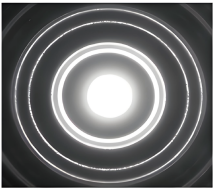
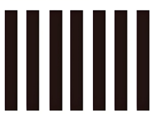
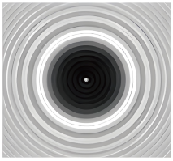

## 讲解

### 是什么

光经过孔、缝或障碍物边缘后，传播进入几何光线本应遮挡的区域，叫光的衍射。它反映波的性质；光沿直线传播是尺寸远大于波长等条件下的近似。

光波长λ和孔、缝、圆板的特征尺寸a都用m。a与λ相近或更小时侧向展开容易明显；a远大于λ时也有边缘衍射，只是相对不明显。

### 怎么来的

同一个开口内不同位置的光继续向后传播，往某一观察方向走的路程不同。它们在屏上的相位关系造成加强或减弱，形成亮暗分布。衍射中也有各部分光的叠加，不能把干涉与衍射理解为彼此毫无关系的两套物理规律。

单缝的中央方向各部分近乎同相，形成最强中央亮纹；偏离中央后，相位差增加，出现暗纹和较弱侧亮纹。同光源、同屏距下，缝越窄或λ越大，图样向两侧展开越多。

圆孔后的中央亮斑由透过孔的光形成，周围有圆环；不透明圆板后的几何阴影中心也可出现小亮斑，即泊松亮斑，是绕板边缘光叠加的结果，不能说中心有一个透光小孔。

### 什么时候能用

判断图样同时看障碍物与明暗分布：单缝中央亮纹较宽、侧纹较弱；双缝在近轴区有近似等距细条纹，通常还受单缝包络调制；圆孔和圆板都可有圆环，但亮斑所处背景不同。

泊松亮斑需适当相干照明、圆形遮挡与观察几何；不是任何粗大圆板、任何距离和光源都一定出现清晰中心亮斑。小孔成像按几何光路形成物体倒像，与圆孔的波动衍射图样分开。

图样只能在给定模型内辨认：实际强度分布受缝宽、源、屏距与器件影响，不能只凭“看见条纹”就断定双缝干涉。

## 例题

> 题目与解析：第四章 光（专项训练）（解析版）.docx，来源ID S02，第379—387段。分段选取时保留该子问的完整题干、答案与解析；题目背景和原资料标注照录。

30．（25-26高二下·福建三明·期末）下列图样属于光的干涉现象的是（    ）

A．

B．

C．

D．

**原资料答案：** B

**原资料详解：** 

A．图为圆孔衍射图样，属于光的衍射现象，故A错误；

B．图为双缝干涉产生的等间距明暗相间直条纹，属于光的干涉现象，故B正确；

C．图为泊松亮斑，是圆板阻挡光产生的衍射现象，证明光的波动性，故C错误；

D．图为单缝衍射图样，属于光的衍射现象，故D错误；

故选B。

### 顺着本题再看清一步

比较A和C，先找“亮斑位于整个透光区域中心”还是“亮斑位于遮挡的暗影中心”；比较B和D，先找中央亮纹是否显著比旁边宽。保留四幅原选项图，学生可直接逐项比对。

## 易错

- A圆孔中央大亮斑与圆环是衍射，C圆板阴影中心泊松亮斑也是衍射。
- D中央条纹较宽、两侧较弱，属于单缝衍射。
- B近似等距细条纹是本题的双缝干涉图样，答案B；共同有亮暗并非充分分类依据。
