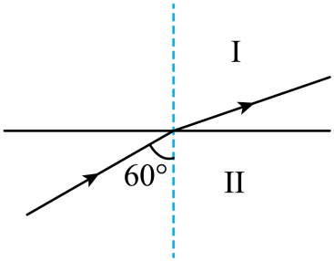
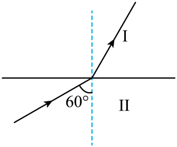
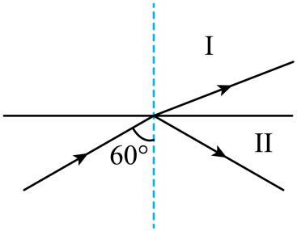
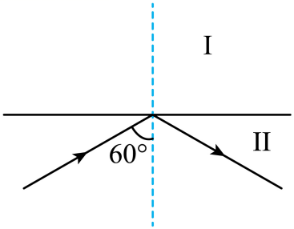

## 讲解

### 是什么

光从折射率较大的介质射向较小的介质，当入射角足够大而不再有进入第二介质内部的传播折射光线时，发生全反射。光密、光疏描述折射率的相对大小，不描述物质质量密度。

临界角C是折射角达到90°的入射角：

$$\sin C=\frac{n_2}{n_1},\qquad n_1>n_2.$$

从玻璃射向空气、空气n≈1时简化为sin C=1/n。C用角度表示，n无单位。换一种出射介质，就必须用新折射率比。

### 怎么来的

由n₁sin i=n₂sin r，固定n₁>n₂并增大i，r比i更大且逐渐接近90°。把r=90°、sin r=1代入折射定律，得到n₁sin C=n₂，也就是临界角式。

若i再超过C，折射定律会要求sin r>1，实数角无法满足，因此几何光学中不再有向第二介质内部传播的折射光线。反射光仍遵守反射角等于入射角，并返回原介质。

临界角越小，越容易达到全反射条件。在出射为空气且色光固定时，n越大，1/n越小，C越小；在普通透明介质的正常色散范围，紫光常比红光n大，因此临界角较小。

### 什么时候能用

两个条件一起检查：先由光密到光疏，再比较i与C。严格区分i=C的临界掠射状态与i>C；高中题常将临界状态一起写作i≥C，表示没有进入外侧内部的折射光束。

空气斜射入普通玻璃或水，方向是光疏到光密，无论入射角多大都不能按这个模型发生全反射。不能仅看“大角度”或“反射光很强”就下结论。

全反射讨论理想透明无吸收界面的光路，不意味着真实器件没有损耗，也不意味着第二介质近界面电磁场在所有意义上为零。本章不展开近场效应，避免把光线模型过度解释。

## 例题

> 题目与解析：高二上物理第四章  光·基础通关卷（解析版）.docx，来源ID S13，第52—61段。分段选取时保留该子问的完整题干、答案与解析；题目背景和原资料标注照录。

6．岫岩玉产自辽宁省鞍山市岫岩满族自治县，为中国四大名玉之一，其玉质温润，透明度高，对钠黄光（波长为589.3纳米）的折射率约为1.55~1.62，一束钠黄光从某块透明度很高的岫岩玉射向空气。如下图，Ⅰ为空气，Ⅱ为岫岩玉，入射角是$60^\circ$，则下列光路图可能正确的是（$\sqrt3\approx1.73$）（    ）

A．

B．

C．

D．

**原资料答案：** D

**原资料详解：** 设该介质的临界角为C，则$\sin C=\frac1n$

当n取1.55时，$\sin C_1=\frac1{1.55}\approx0.645$

当n取1.62时，$\sin C_2=\frac1{1.62}\approx0.617$

因为$\sin60^\circ=\frac{\sqrt3}{2}\approx0.865>0.645$

可知$\sin60^\circ$大于$\sin C$的最大值，且光从介质射向空气，入射角大于临界角，所以发生全反射，光线全部被反射回原介质，D选项符合题意。

故选D。

### 顺着本题再看清一步

不必逐个求C的角度值。0～90°内正弦单调增，直接比较sin60°与sin C的最大可能值即可判定：对给出的任何n，60°都大于C。A中方向虽像由密到疏折射，但此角已不能有那条折射光线。

## 易错

- 给定n在1.55～1.62，临界角最大的情况为n=1.55，其sin C约0.645。入射60°的正弦约0.866，已超过整个范围的临界条件。
- A、B、C画有传播折射光，与全反射条件不符；D只有反射光返回玉石，正确。
- 入射角是图中与法线的60°，不是与界面的30°。
