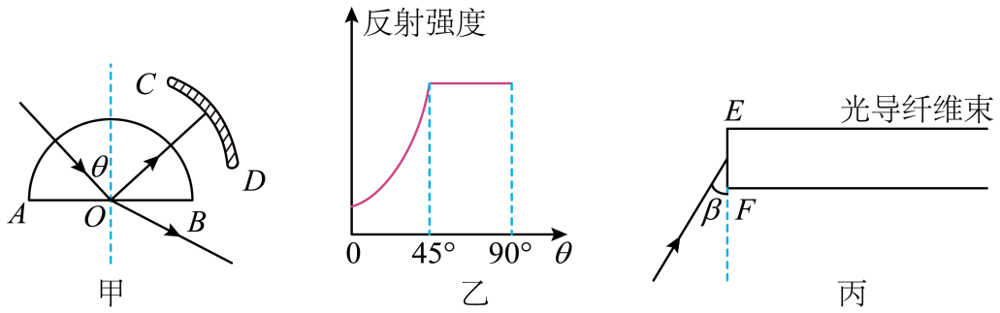

## 讲解

### 判据

全反射要求入射侧n₁大于出射侧n₂，并且入射角达到临界状态或更大。临界角从局部法线量起：

$$\sin C=\frac{n_2}{n_1}.$$

光纤题还须把端面入射角与侧壁入射角分开。端面法线沿轴线，侧壁法线通常垂直于轴线，它们不是同一根法线。

### 流程

1. **先确认介质顺序。** 在芯内射向包层才可能全反射；从空气进入芯的端面一般是折射。
2. **用已知数据求n或C。** 若半圆柱沿半径射入，不在曲面偏折，平面处反射强度进入平台的临界角可用于求n。原图平台从45°开始，C=45°。
3. **在端面列折射定律。** 取外界入射角i、芯内轴角θ，n₀sin i=n₁sinθ，确保实际能进入端面。
4. **将θ换成侧壁角。** 直纤维子午光线的侧壁入射角j=90°−θ，要求j≥C。不要把i直接与侧壁C比较。
5. **判断可接收角范围。** 把最大θ=90°−C代入，可得n₀sin i≤√(n₁²−n₂²)。若右侧大于等于n₀，则所有非掠射入端面的方向都满足这个理想导光条件。
6. **写出模型限制。** 纤维弯曲、包层更换、色光更换都可能改变条件。原例为空气包围的均匀纤维，结论不直接替代真实芯—包层的参数。

频率跨静止界面保持，介质内λ=λ₀/n；求临界角使用同一色光对应的n，不能把红光、紫光的折射率混用。

## 例题

> 题目与解析：高二上物理第四章  光·基础通关卷（解析版）.docx，来源ID S13，第93—107段。分段选取时保留该子问的完整题干、答案与解析；题目背景和原资料标注照录。

9．为了研究某种透明新材料的光学性质，将其压制成半圆柱形，如图甲所示。一束激光由真空沿半圆柱体的径向与其底面过O的法线成θ角射入。CD为光学传感器，可以探测光的强度，从AB面反射回来的光强随角θ变化的情况如图乙所示。现将这种新材料制成的一根光导纤维束暴露于空气中（假设空气中的折射率与真空相同），用同种激光从光导纤维束端面EF射入，且光线与EF夹角为β，如图丙所示。则（     ）

A．图甲中若减小入射角θ，则反射光线和折射光线之间的夹角也将变小

B．该新材料的折射率为$\sqrt2$

C．若该激光在真空中波长为λ，则射入该新材料后波长变为$\sqrt2\lambda$

D．若该束激光不从光导纤维束侧面外泄，则β角需满足0°＜β＜180°

**原资料答案：** BD

**原资料详解：** 

A．图甲中若减小入射角θ，则反射角减小，折射角也减小，根据几何关系可知反射光线和折射光线之间的夹角将变大，故A错误；

B．由图乙可知，当入射角大于45°时，反射光线的强度不再变化，可知临界角为45°，则该新材料的折射率为$n=\frac1{\sin C}=\sqrt2$，故B正确；

C．该激光在真空中波长为$\lambda$，有$c=\lambda f$

则射入该新材料后波长变为$\lambda^\prime=\frac vf=\frac c{nf}=\frac{\sqrt2}{2}\lambda$，故C错误；

D．若该束激光恰好不从光导纤维束侧面外泄，则β角需满足$n=\frac{\sin(90^\circ-\beta)}{\sin(90^\circ-C)}$

解得$\beta=0^\circ$

则若该束激光不从光导纤维束侧面外泄有0°＜β＜180°，故D正确。

故选BD。

### 顺着本题再看清一步

A项减小平面入射角，同时减小反射角和折射角；反射与折射两线夹角180°−i−r变大，所以A错。D按原题朝端面入射的方向角口径成立；若把β叫通常光线与平面的小夹角，其范围写0°<β≤90°更清楚，不能把0°～180°不加说明当成所有实际光纤的接收角。

## 易错

- 原图θ是半圆材料内的平面入射角，曲面沿径向入射没有先改变它。
- C=45°给n=√2，B正确；λ材料=λ真空/√2，C错误。
- 端面折射后的轴角θ至多45°，侧壁入射角至少45°，满足本题理想全反射。β的方向角范围按原图理解。
