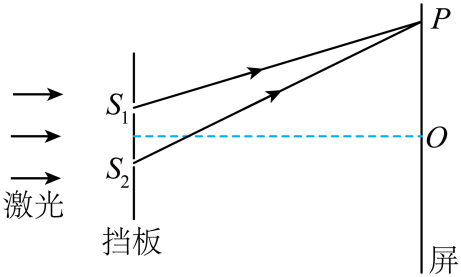

## 讲解

### 是什么

激光是电磁波，在通常双缝实验中可提供方向性较好、频谱较窄、相干性较好的光。这里“相干”指两路在观察时间内的相位差足够稳定，使干涉条纹不会被快速平均抹掉。

同一束激光照到双缝，相当于把同一个光场分成两路；不是拿两台激光器照在一起就自动保证固定相位差。波长λ单位m、频率f单位Hz，在真空中c=λf。

### 怎么来的

普通独立光源即使平均颜色相同，也可能有互不相关、快速变化的发光相位。某一瞬间能叠加，长时间观察却没有固定加强和减弱位置。

双缝从同一束光取出两路，保留共同的频率和相位联系。激光的较好相干性使这类实验更易形成清晰条纹；资料所说“利用激光获得相干光”按同一光束分路来理解。

在同相双缝模型中，到屏某点的两路差δ决定亮暗：

$$\delta=m\lambda\text{为亮纹},\qquad \delta=\left(m+\frac12\right)\lambda\text{为暗纹}.$$

改波长会改变满足条件的位置和条纹间距；改亮度主要改变光强，不等于波长也变了。光仍需具体装置提供双路叠加，单束直行激光不会因为“相干”就在任意屏上自行出现双缝条纹。

### 什么时候能用

实际激光相干性有限，分路路径差过大、光源频率不稳定、环境引起相位扰动，都可能降低条纹可见度。“单色”和“相干”相关但不等价；两独立窄谱源也需检查相位是否稳定。

本条按高中实验特点讲相干用途，不补未给资料的激光器型号、谱宽、相干长度数值或受激辐射器件细节。激光传播不需要机械介质，不能与超声波的传播条件混淆。

## 例题

> 题目与解析：第四章 光（复习讲义）（解析版）.docx，来源ID S04，第272—286段。分段选取时保留该子问的完整题干、答案与解析；题目背景和原资料标注照录。

1．如图所示，某同学做双缝干涉实验，激光通过双缝后，到达光屏上的$P$点。已知激光的波长为$\lambda$，$PS_2-PS_1=3.6\lambda$，$O$点为双缝中垂线与光屏的交点，下列说法正确的是（　　）

A．$O$、$P$间有2条暗条纹

B．若将光屏向左移动少许，则光屏上的条纹间距增大

C．若将激光改为白光，则$O$处为白色亮纹

D．若用波长为$2\lambda$的单色光做该实验，则$O$、$P$间暗条纹数增加

**原资料答案：** C

**原资料详解：** 

A．暗纹条件是光程差满足$\Delta s=(2n+1)\frac\lambda2\quad(n=0,1,2,3,\ldots)$

O点光程差为0，是中央亮纹，P点光程差为$3.6\lambda$，故暗纹对应的光程差为$0.5\lambda$、$1.5\lambda$、$2.5\lambda$、$3.5\lambda$共四条，故A错误；

B．根据$\Delta x=\frac{L}{d}\lambda$

可知若将光屏向左移动少许，则L减小，则光屏上的条纹间距减小，故B错误；

C．O点是双缝中垂线与光屏的交点，光程差为0，各种颜色的光在O点都形成亮纹，叠加后为白色亮纹，故C正确；

D．用波长$2\lambda$的光照射时，暗纹条件是光程差满足$\Delta s=(2n+1)\frac{2\lambda}{2}=(2n+1)\lambda\quad(n=0,1,2,3,\ldots)$

可知k可取0、1，即O、P间暗条纹数为2条，可知暗条纹数减少了，故D错误。

故选C。

### 顺着本题再看清一步

此处路径差3.6λ用原激光波长λ作为固定长度单位；换成2λ的光后，几何路径差并没有随波长自动加倍。先固定几何再改暗纹条件，才能正确数出2条。

## 易错

- OP间路径差从0增至3.6λ，原波长的暗纹对应0.5λ、1.5λ、2.5λ、3.5λ，共4条，A错。
- 屏左移使L减小，间距减小，B错；白光中央各色均加强，C对。
- 波长改成2λ，暗纹路径差为λ、3λ，只有2条，D说增加而错。
