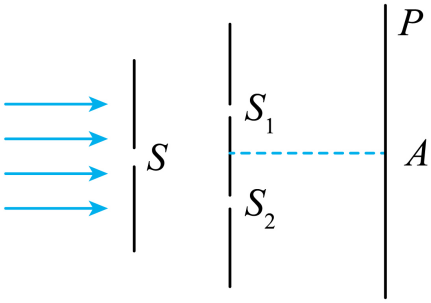

## 讲解

### 判据

同一束激光或满足相干条件的单色光照双缝，在近轴屏上测同类条纹间距，可由几何间距反求波长：

$$\lambda\approx\frac{d}{L}\Delta x.$$

d为双缝中心距、L为双缝到屏距离、Δx为相邻亮纹或相邻暗纹的中心间距。用激光不会改变这条几何关系，关键是相干照明和模型成立。

### 流程

1. **确认两缝由同一束光照明。** 稳定相位关系先于数值公式；两独立激光束不自动满足。
2. **记录d与L。** d不是单缝宽，L不包括源到单缝的距离。按测量要求量双缝平面到屏平面。
3. **跨多条纹测间距。** 第1到第n条位置差s，Δx=s/(n−1)。看准同类条纹中心，不能选亮到暗仍用同类间距。
4. **统一长度单位。** 可全部用m，也可全部用mm；d/L无单位，λ单位随Δx。最后把m、mm、nm按需要换算。
5. **检查波长与条件。** 同装置λ越大Δx越大，频率与波长反比。源更亮不意味着λ变长；条纹平移也不意味着间距变大。

下面原例题使用绿色单色光、单缝照明，和激光双缝测量采用同一条纹公式；题干原样保留，其光源类型不另改写。

## 例题

> 题目与解析：第四章 光（专项训练）（解析版）.docx，来源ID S02，第308—320段。分段选取时保留该子问的完整题干、答案与解析；题目背景和原资料标注照录。

24．（24-25高二下·广东清远·期中）如图是双缝干涉实验装置的示意图，$S$为单缝，双缝$S_1$、$S_2$之间的距离是0.2mm，P为光屏，A为光屏的中央处，双缝到屏的距离为1.2m。用绿色光照射单缝$S$时，可在光屏P上观察到第1条亮纹中心与第6条亮纹中心间距为1.500cm。若相邻两条亮条纹中心间距为$\Delta x$，则下列说法正确的是（　　）

A．$\Delta x$为0.250cm

B．增大双缝到屏的距离，$\Delta x$将变大

C．改用间距为0.3mm的双缝，$\Delta x$将变大

D．换用紫光照射，光屏的中央处可能出现暗纹

**原资料答案：** B

**原资料详解：** 

A．由于第1条亮纹中心与第6条亮纹中心间距为1.500cm，则有$\Delta x=\frac{1.500}{6-1}\,\mathrm{cm}=0.300\,\mathrm{cm}$，故A错误；

B．根据双缝干涉公式有$\Delta x=\frac{L}{d}\lambda$

可知，增大双缝到屏的距离，$\Delta x$将变大，故B正确；

C．改用间距为0.3mm的双缝，即增大双缝的间距，结合上述可知，$\Delta x$将变小，故C错误；

D．屏的中央位置到双缝间距相等，光程差为0，可知，换用紫光照射，光屏的中央处仍然出现明条纹，故D错误。

故选B。

### 顺着本题再看清一步

先数五个间隔，得到3mm；再将1.2m换成1200mm，λ=(0.2/1200)×3mm=5.0×10⁻⁴mm。若把1.500cm直接当Δx，计算会放大五倍；若把L的1.2直接与mm相除，会产生千倍单位错误。

## 易错

- 六条亮纹中心跨度有五个间距，Δx=1.500cm/5=0.300cm；A的0.250cm把条数当间隔数。
- B增L使Δx大；C增d使Δx小；D中央等光程仍亮，所以选B。
- 若从该题数据反求λ，d=0.2mm、L=1200mm、Δx=3mm，得0.0005mm=500nm。这是原题数据推论。
