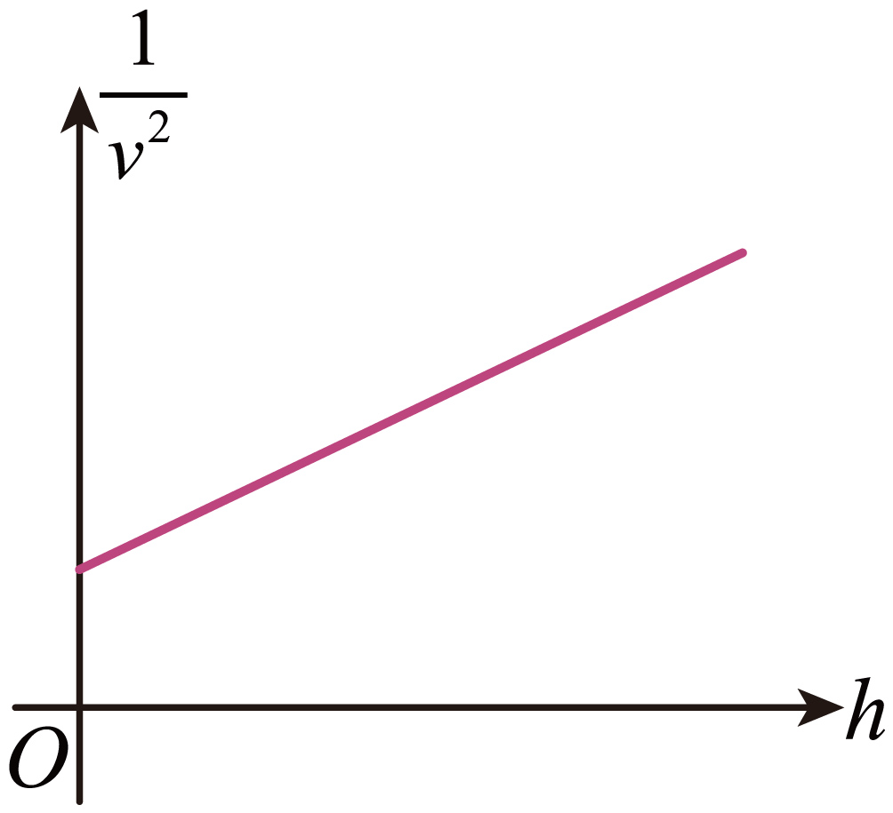

## 错法

题目写“轨道高度 $h$”，学生把 $h$ 直接填到 $F=GMm/r^2$ 或 $v^2=GM/r$ 里的 $r$：

$$\text{错误代入：}\quad v^2=\frac{GM}{h}$$

容易这样想，是因为高度和轨道半径都是长度，而且图里常只标一个 $h$。错不在长度的单位，而在**从哪里起算**：高度从地表量起，引力公式的距离从地心量起。

这个错法在图像题里尤其明显：取倒数后会得到 $1/v^2=h/(GM)$，误判图线经过原点。但题图有非零纵截距，它对应的正是被漏掉的地球半径。

## 正解

设地球质量为 $M$，卫星质量为 $m$，单位千克；地球半径为 $R$，距地面高度为 $h$，到地心的轨道半径为 $r$，单位米。先把两段长度相加：

$$r=R+h$$

圆轨道中，引力提供向心力，应列：

$$G\frac{Mm}{(R+h)^2}=m\frac{v^2}{R+h}$$

两边约去 $m$，再乘以 $R+h$：

$$v^2=\frac{GM}{R+h}$$

两边取倒数，然后分开分子中的两项：

$$\frac1{v^2}=\frac{R+h}{GM}=\frac{1}{GM}h+\frac{R}{GM}$$

因此 $1/v^2$ 对 $h$ 的图线是直线，斜率反映 $1/(GM)$，纵截距反映 $R/(GM)$。在理想的 $h=0$ 处，圆轨道半径仍是 $R$，速率倒数平方不为零。

这套关系要求卫星主要受球形地球引力、做匀速圆周运动。椭圆轨道不能沿途照套；单位不同也必须先换算。

## 例题

> 题目与原详解：本章《知识清单（答案版）》第434—443段，来源ID S06。原图与A—D公式已逐项对照DOCX；无自编题。

卫星在不同轨道上绕地球做匀速圆周运动，卫星速率平方的倒数 $1/v^2$ 与轨道到地面的高度 $h$ 的关系图像如图所示。已知图线的纵截距为 $b$，斜率为 $k$，引力常量为 $G$，则地球的密度可表示为（　　）

A．$\displaystyle\frac{3b^3}{4\pi Gk^4}$

B．$\displaystyle\frac{3k^2}{4\pi Gb^3}$

C．$\displaystyle\frac{3Gk^2}{4\pi b^3}$

D．$\displaystyle\frac{3k^3}{4\pi Gb^2}$

**答案：B。**

**第一步：从纵轴形式想到取倒数，把高度换成球心距。** 上面的圆轨道动力学给出：

$$\frac1{v^2}=\frac1{GM}h+\frac{R}{GM}$$

与直线式 $y=kh+b$ 比较，横轴是 $h$，纵轴是 $1/v^2$，所以：

$$k=\frac1{GM},\qquad b=\frac{R}{GM}$$

**第二步：分别解出质量与半径。** 由 $k=1/(GM)$，两边乘以 $GM$，再除以 $Gk$，得：

$$M=\frac1{Gk}$$

用截距式除以斜率式，约去共同的 $1/(GM)$：

$$\frac bk=\frac{R/(GM)}{1/(GM)}=R$$

**第三步：求密度，要把地球自身半径代入体积。** 地球近似球形，$V=4\pi R^3/3$，因此：

$$\rho=\frac{M}{V}=\frac{3M}{4\pi R^3}$$

把刚求得的 $M=1/(Gk)$、$R=b/k$ 分别代入：

$$\rho=\frac{3}{4\pi Gk(b/k)^3}$$

先展开立方 $(b/k)^3=b^3/k^3$，再约去分母中的一个 $k$：

$$\rho=\frac{3}{4\pi Gk\,b^3/k^3}=\frac{3k^2}{4\pi Gb^3}$$

**第四步：逐项核对。** A中的 $b^3/k^4$ 不符合以上代入结果；B完全一致；C把分母中的 $G$ 换到了分子，既不符合质量 $M=1/(Gk)$ 的关系，也不具有密度的正确量纲；D中 $k$、$b$ 的幂次分别为3、2，而半径立方和质量代入要求的是2、3。后三个错误表达式的排除依据是原详解的公式链，不另行假定出题者为它们设计了哪一种错算。

回看这个坑：如果第一步漏掉 $R$，图线的截距会被算成零，后面就无法由非零截距求地球半径，也无法正确求密度。必须在列动力学方程之前补上 $R$。
