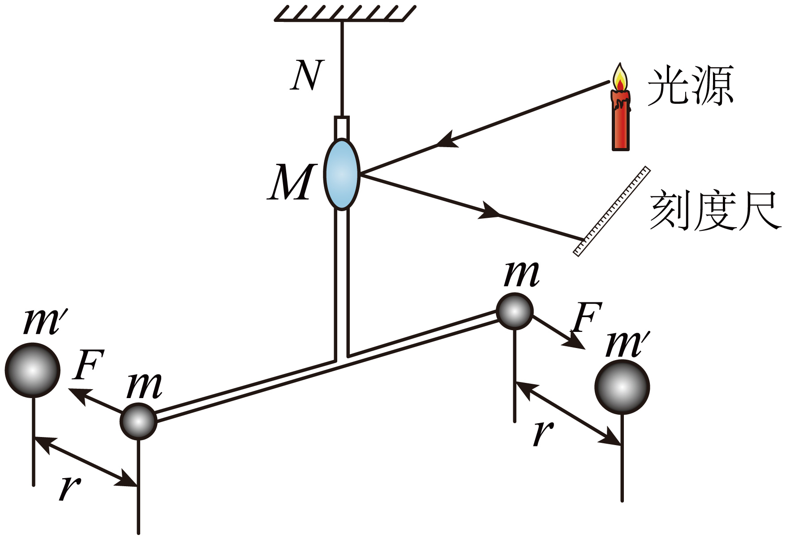

## 讲解

### 是什么

任意两个有质量的物体之间都存在**相互吸引**的力。对两个质点，引力方向沿两质点连线，大小与两物体质量的乘积成正比、与它们距离的平方成反比：

$$F = G\frac{m_1 m_2}{r^2}$$

- $F$ 是引力大小，单位为牛顿；$m_1$、$m_2$ 是两个物体的质量，单位为千克；$r$ 的单位为米
- $G$ 叫**引力常量**，$G = 6.67\times10^{-11}\ \mathrm{N\cdot m^2/kg^2}$
- $r$ 是两**质点**之间的距离；对**均匀球体**，$r$ 取两球心之间的距离

### 怎么来的

牛顿结合行星观测规律、动力学推理与对地面落体的研究，建立了统一的引力定律：

1. 开普勒定律先给出了行星运动的规律（椭圆轨道、周期与半长轴的关系）
2. 牛顿认为，使行星转弯的力与使苹果下落的力是**同一种力**（"月—地检验"的思路）
3. 对固定中心天体，圆周运动与开普勒第三定律先推出引力与环绕物体质量成正比、与距离平方成反比；再结合相互作用的对称性和经验推广，得到质量乘积的普遍形式。圆轨道这一步本身不能单独证明完整的质量乘积形式
4. 卡文迪许用**扭秤**测量微弱引力，中学教材将其表述为测定引力常量；知道 $G$ 后，才能由质量和距离计算引力的具体数值

月—地检验比较的是同一种引力作用在不同距离处的加速度。资料给出月球轨道半径约为地球半径的60倍；如果引力随距离平方反比变化，则月球的引力加速度约是地表的 $1/60^2=1/3600$，与月球圆周运动的加速度相符。

在圆轨道近似下，设中心天体固定，环绕物体质量为 $m$（千克）、轨道半径为 $r$（米）、周期为 $T$（秒）。开普勒第三定律给出 $r^3/T^2=k$，$k$ 为固定中心对应的常量，牛顿第二定律给出：

$$F=m\frac{4\pi^2r}{T^2}$$

先把 $1/T^2=k/r^3$ 代入，再约去一个 $r$：

$$F=m\,4\pi^2r\frac{k}{r^3}=\frac{4\pi^2km}{r^2}$$

这一步具体说明了“平方反比”怎样由运动规律出现；中心天体质量的信息包含在 $k$ 中。

### 什么时候能用

- 两个**质点**之间；当物体间距远大于自身大小时，也可近似看成质点
- 两个不重叠的**均匀球体**之间，或球对其外部质点（$r$ 取球心距或球心到质点的距离）
- **不能**对"形状不规则、距离又近"的物体直接用
- 不能把两个有体积物体的球心距取到 $r \to 0$，仍套用不重叠球体的公式：此时失效的是这个简化模型，不能据此宣布引力趋于无穷大，更不能说引力现象不存在

## 例题

> 题目与原逐项详解：本章《专项训练（解析版）》第4题，来源ID S02，第59—70段。原资料标注“24-25高一下·湖北·期中”。原文第70段末句误写“故选D”，本条按第65段答案及第66—69段逐项解析采用B。

牛顿发现了万有引力定律，并给出了物体间引力大小表达式 $F=Gm_1m_2/r^2$，但没有给出引力常量 $G$ 的具体取值。如图为人类第一次在实验室测量出万有引力常量的实验示意图，通过此套装置比较精确测量出了万有引力常量数值，引力常量的精确测定对深入研究物体之间相互作用规律更有意义。以下说法正确的是（　　）

A．伽利略首先测量出了万有引力常量数值

B．图示引力常量测量实验中运用了放大法

C．图示实验中的大球对小球引力大于小球对大球引力

D．根据万有引力定律表达式，当 $r\to0$ 时，物体间引力将趋于无穷大

**答案：B**

- **A 错**：首先测出 $G$ 的是**卡文迪许**，不是伽利略
- **B 对**：微小引力使细杆和悬丝发生很小的扭转，镜面的转动又使反射光在刻度尺上产生较明显的位移，便于测量。放大的是可观察的位移效应，不是把引力本身变大
- **C 错**：大球对小球的引力**等于**小球对大球的引力——牛顿第三定律，作用力与反作用力大小相等
- **D 错**：对图中的有体积球体，不能在球心距趋于零、球体重叠时仍使用不重叠均匀球体的球心距公式。错在超出了该公式模型的适用范围，并非万有引力现象本身消失

## 易错

- **引力常量不是牛顿测的**：牛顿给出定律的**形式**，**卡文迪许**测出 $G$
- **作用力与反作用力大小相等**：大球吸引小球，小球也以同样大的力吸引大球，别被"大球更重"骗了
- **$r \to 0$ 不等于力无穷大**：是模型失效，不是公式算出无穷
