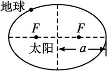
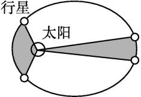

## 讲解

### 是什么

开普勒定律描述行星绕太阳运动的三个规律：**轨道是什么形状、同一颗行星沿轨道怎样快慢变化、不同轨道的周期怎样比较**。它们先描述运动，再由万有引力解释运动的原因。

**第一定律：椭圆轨道。** 行星的轨道是椭圆，太阳位于椭圆的一个焦点。椭圆有两个焦点，太阳只占其中一个；焦点通常不在椭圆中心。下面图中的 $a$ 是从椭圆中心到长轴端点的距离，叫半长轴，单位为米。

**第二定律：等时扫过等面积。** 对同一颗行星，太阳与行星的连线在相等时间内扫过的面积相等。这里的“面积”是连线转动扫出的区域，不是行星走过的路程。

靠近太阳时，连线较短，要在同样时间里扫过同样面积，行星就要走得更快；远离太阳时相反。因此椭圆轨道上的速率不是常量，近日点最快，远日点最慢。

**第三定律：周期与半长轴的关系。** 绕同一个中心天体运动、且环绕天体质量可忽略时：

$$\frac{a^3}{T^2}=k$$

$a$ 是椭圆半长轴，$T$ 是完成一周的周期，单位为秒；$k$ 是该中心天体对应的常量，单位为 $\mathrm{m^3/s^2}$。圆是椭圆的特殊情形，圆轨道的半长轴就是半径，此时才可以写成 $r^3/T^2=k$。

### 怎么来的

开普勒根据行星观测资料归纳出这些规律。它们不是把匀速圆周运动公式改个字母得到的：第一、第二定律允许轨道是椭圆、速率随位置变化。

在高中常用的**圆轨道近似**下，可以用万有引力和牛顿第二定律解释第三定律。设中心天体质量为 $M$，卫星质量为 $m$，轨道半径为 $r$。一周路程是圆周长，因而：

$$v=\frac{2\pi r}{T}$$

引力承担使速度方向不断改变的作用，提供圆周运动所需的向心力：

$$G\frac{Mm}{r^2}=m\frac{v^2}{r}$$

把上面的速度表达式代入右边：

$$G\frac{Mm}{r^2}=m\frac{(2\pi r/T)^2}{r}=m\frac{4\pi^2r}{T^2}$$

两边除以 $m$，再乘以 $r^2$：

$$GM=\frac{4\pi^2r^3}{T^2}$$

两边除以 $4\pi^2$，得到：

$$\frac{r^3}{T^2}=\frac{GM}{4\pi^2}$$

这说明 $k$ 由中心天体的质量决定，同一中心天体的不同圆轨道共用同一个 $k$。椭圆轨道对应 $a^3/T^2=GM/(4\pi^2)$，其完整动力学推导不属于这里的圆周运动推导，不能把某一点到太阳的距离直接换成 $a$。

### 什么时候能用

比较两个周期，先确认它们绕的是**同一个中心天体**。例如金星和地球都绕太阳，可以约去 $k$；木卫二绕木星、月球绕地球，中心天体不同，不能直接说两者的 $k$ 相同。

圆轨道用半径，椭圆轨道用半长轴。设椭圆近地点、远地点到中心天体的距离分别为 $r_{\text{近}}$、$r_{\text{远}}$，它们沿长轴的总长度是 $2a$，所以：

$$a=\frac{r_{\text{近}}+r_{\text{远}}}{2}$$

第二定律中的“相等时间、相等面积”比较的是**同一颗行星在不同位置**。不同的行星各有自己的扫面积快慢，不能仅凭时间相同就说面积相同。

使用上述 $k=GM/(4\pi^2)$ 时，还默认中心天体近似固定、环绕天体质量远小于它，主要受中心天体引力。多个天体强烈干扰的情形不能直接套用这个简化模型。

## 例题

> 题目与原逐项详解：本章《单元测试·基础卷（解析版）》，来源ID S10，第17—28段。图取自《知识清单（答案版）》S06，第174、177段。

金星和地球沿各自的椭圆轨道绕太阳运动，根据开普勒行星运动的规律，下列说法正确的是（　　）

A．太阳位于两个椭圆轨道的正中心

B．地球的运动方向总是与它和太阳的连线垂直

C．在相同时间内，金星与太阳连线扫过的面积等于地球与太阳连线扫过的面积

D．金星与地球的公转周期之比的平方等于它们轨道半长轴之比的三次方

**答案：D。**

**A错误：把焦点当成中心。** 第一律说明太阳在椭圆的一个焦点，图中焦点与椭圆中心不同。题干已经指定椭圆轨道，不能把它按圆轨道处理。

**B错误：把圆轨道的几何关系推广到整个椭圆。** 行星瞬时运动方向沿轨道切线。椭圆切线一般不垂直于太阳到行星的连线，只有在近日点、远日点才具有这里的垂直关系。因此“总是”不成立。

**C错误：跨行星使用等面积。** 第二定律保证地球在两段相等时间里扫过的面积相等，也保证金星自身的这一规律；它不保证金星的扫面积速率等于地球的扫面积速率。原详解据此排除C，不能从“都绕太阳”推出等时等面积。

**D正确：两个轨道共用同一个中心天体常量。** 先分别列第三定律：

$$\frac{a_{\text{金}}^3}{T_{\text{金}}^2}=\frac{a_{\text{地}}^3}{T_{\text{地}}^2}$$

两边乘以 $T_{\text{金}}^2T_{\text{地}}^2$，得到：

$$a_{\text{金}}^3T_{\text{地}}^2=a_{\text{地}}^3T_{\text{金}}^2$$

两边除以 $a_{\text{地}}^3T_{\text{地}}^2$：

$$\left(\frac{T_{\text{金}}}{T_{\text{地}}}\right)^2=\left(\frac{a_{\text{金}}}{a_{\text{地}}}\right)^3$$

这就是D中的关系。

## 易错

- **中心与焦点混用**：椭圆中的太阳在一个焦点；圆轨道近似下才把中心天体放在圆心。对应例题A。
- **“扫面积相等”写成“路程相等”**：等面积不保证等弧长，椭圆上靠近太阳的运动更快。依据S06第10、177—180段。
- **等面积跨行星比较**：先确认是不是同一颗行星的不同时间段。对应例题C。
- **椭圆用瞬时距离代替半长轴**：第三定律联系的是整条轨道与周期，要用固定的 $a$，不能用沿途变化的 $r$。依据S04第133—141段。
