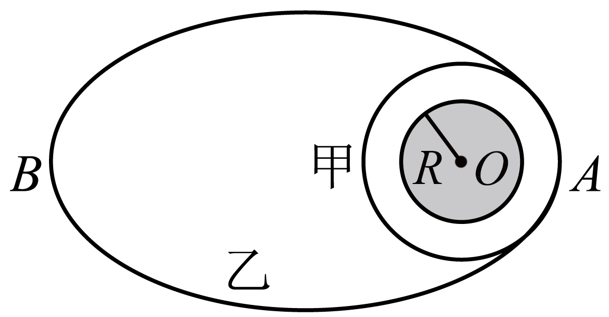

## 讲解

### 判据

题目给出“距地面高度”“距天体表面距离”“两球表面间距”时，不要立刻把这个距离填进万有引力公式。先问：**公式中的距离从哪里量到哪里，题目给的又从哪里量到哪里？**

对球形中心天体外的卫星，引力公式为：

$$F=G\frac{Mm}{r^2}$$

$M$、$m$ 分别为中心天体和卫星质量，单位千克；$r$ 是中心天体球心到卫星的距离，单位米。天体半径 $R$ 和距表面高度 $h$ 都是长度，但只有 $r=R+h$ 才是这里的轨道半径。

同一专题还会用开普勒第三定律。圆轨道用 $r$；椭圆轨道用半长轴 $a$。因此“已经把高度加上天体半径”不代表任何公式都能使用这个瞬时距离。

### 流程

**第一步：认清天体和轨道模型。** 在图上标出中心天体球心。中心天体可以近似为球，卫星在球外并主要受它的引力时，才把引力等效为球心处质量产生的引力；形状不规则且相距很近的物体不能直接照搬。

**第二步：把题给的表面距离变成球心距。** 从球心走到表面是 $R$，从表面走到卫星是 $h$，两段沿同一径向相加：

$$r=R+h$$

如果是两个不重叠的均匀球体，表面间最近间距为 $d$，沿两球心连线从一球心走到另一球心，须依次经过第一球半径、表面间距、第二球半径：

$$r=R_1+d+R_2$$

这里 $R_1$、$R_2$ 是两球半径。不能因为题目给了一个长度，就默认它已经是质点间的距离。

**第三步：按要计算的量选长度。** 计算某一点的引力，用该点到中心天体的 $r$；比较圆轨道周期，用圆轨道半径；比较椭圆轨道周期，需先求半长轴。

椭圆的中心天体位于焦点，近地点、远地点到焦点的两段距离加起来正好等于长轴长 $2a$：

$$2a=r_{\text{近}}+r_{\text{远}}$$

两边除以2，才得到周期公式所需的长度：

$$a=\frac{r_{\text{近}}+r_{\text{远}}}{2}$$

**第四步：统一单位，再代入。** 如果 $G$ 使用 $\mathrm{N\cdot m^2/kg^2}$，质量用千克、距离用米。仅作长度比且分子分母单位一致时，才可以直接约掉相同单位。

**第五步：检查量的意义。** 近地卫星 $h\ll R$ 时，$r\approx R$，不是 $r\approx h$。如果代入后在 $h=0$ 处算出无穷大引力，先检查是不是漏掉了 $R$。

## 例题

> 题目与原详解：本章《复习讲义（解析版）》变式1-2，来源ID S04，第133—141段。原题“相切与”校为“相切于”，数值与选项已对照DOCX公式图。

如图所示，火星的半径为 $R$，甲、乙两种探测器分别绕火星做匀速圆周运动与椭圆轨道运动，两种轨道相切于椭圆轨道的近地点A，圆轨道距火星表面的高度为 $R/2$，椭圆轨道的远地点B距火星表面的高度为 $7R/2$。若甲的运动周期为 $T$，则乙的运动周期为（　　）

A．$2\sqrt{2}\,T$

B．$2T$

C．$3\sqrt{2}\,T$

D．$3T$

**答案：A。**

**看到“距表面的高度”，先补上火星半径。** 甲的圆轨道半径也是乙在A点到火星中心的距离：

$$r_{\text{甲}}=r_A=R+\frac{R}{2}=\frac{3R}{2}$$

同样，B点到火星中心的距离为：

$$r_B=R+\frac{7R}{2}=\frac{9R}{2}$$

**看到“乙是椭圆轨道、求一周时间”，改用半长轴。** A、B是近地点和远地点，不能只取其中某一点的距离：

$$a_{\text{乙}}=\frac{r_A+r_B}{2}=\frac{3R/2+9R/2}{2}=3R$$

甲、乙都绕火星，第三定律的常量相同：

$$\frac{r_{\text{甲}}^3}{T^2}=\frac{a_{\text{乙}}^3}{T_{\text{乙}}^2}$$

交叉相乘，再除以 $T^2r_{\text{甲}}^3$：

$$\left(\frac{T_{\text{乙}}}{T}\right)^2=\left(\frac{a_{\text{乙}}}{r_{\text{甲}}}\right)^3=\left(\frac{3R}{3R/2}\right)^3=2^3=8$$

周期为正，取正平方根：

$$T_{\text{乙}}=\sqrt{8}\,T=2\sqrt{2}\,T$$

**逐项核对。** A与上式相符；B的周期比为2，平方是4；C的周期比为 $3\sqrt2$，平方是18；D的周期比为3，平方是9。后三项都不满足必须等于8的周期比平方，因此不能选。原详解只给出计算链，本条按这条链补写选项核对，不替原资料虚构每个数值的错误来源。

## 易错

- **$h$ 直接代 $r$**：题给的是表面距离，正确关系是 $r=R+h$。本题 $R/2$ 不是甲的轨道半径。
- **近地点距离直接代椭圆半长轴**：乙在A点与甲圆轨道相切，不代表两条轨道相同；乙的半长轴是 $3R$。
- **求周期比后忘开平方**：第三定律先给出周期比的平方为8，周期比是 $2\sqrt2$，不是8。
- **把球心距公式用于任意近距离物体**：点质量或球对外部物体的近似条件必须先成立；这一步不能由“存在引力”替代。依据本章S06第34—38段。
