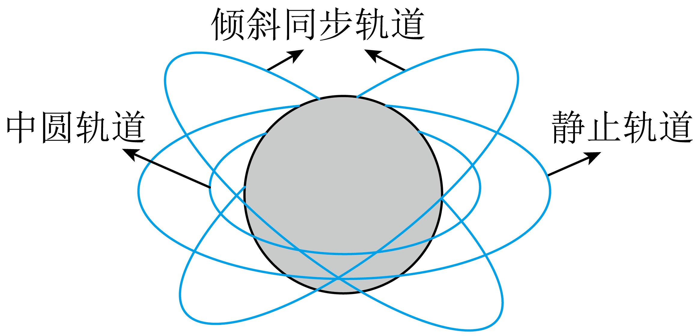

## 讲解

### 判据

题目出现“相对地面静止”“地球静止轨道”“同步轨道”“倾斜同步轨道”时，先把它们区分开：**同周期解决时间同步，轨道平面和方向决定能否相对地面静止。**

中学题常把地球静止卫星简称“同步卫星”；本章原资料同时出现G4静止轨道、IGSO2倾斜同步轨道，因此不能只看到“同步”二字就直接判断相对地面静止。

### 流程

**第一步：看题目要求的是周期相同，还是位置不变。** 地球同步要求 $T=T_{\text{地}}$。若要求相对地面某点静止，还必须是赤道平面内、由西向东的圆轨道。

轨道平面要经过地心，是因为仅有地球引力时力朝向地心。倾斜轨道即使与地球同周期，卫星仍会在赤道两侧运动，不能始终位于同一地面位置上方。轨道方向也要同地球一致，否则卫星与地面的相对经度不断变化。

**第二步：由周期判断理想圆轨道半径。** 设地球质量 $M$、卫星质量 $m$、到地心的半径 $r$，周期 $T$，引力常量 $G$。引力提供向心力：

$$G\frac{Mm}{r^2}=m\frac{4\pi^2r}{T^2}$$

约去 $m$，乘以 $r^2T^2$，再除以 $4\pi^2$：

$$r^3=\frac{GMT^2}{4\pi^2}$$

所以同一地球周围、周期相同的**圆轨道**有相同的半径，与卫星质量无关。若是椭圆轨道，则相同周期对应相同半长轴，不能据此断言各处距离相等。

**第三步：分清地心距离与地面高度。** 地球半径为 $R$、轨道高度为 $h$，有 $r=R+h$。两颗圆轨道卫星绕同一地球时：

$$\frac{T_1^2}{T_2^2}=\frac{r_1^3}{r_2^3}=\frac{(R+h_1)^3}{(R+h_2)^3}$$

不能删掉 $R$ 写成高度比的立方，除非题目另给允许忽略 $R$ 的近似条件。本章通常不作这种近似。

**第四步：比较速度时使用圆轨道关系。** 引力提供向心力，约去卫星质量后有 $GM/r^2=v^2/r$；乘以 $r$ 并取正平方根：

$$v=\sqrt{\frac{GM}{r}}$$

同一地球周围，半径较小的圆轨道卫星速度较大。两颗同周期的圆轨道卫星即使轨道倾角不同，速率也相同，但速度方向并不总相同。

**第五步：遇到地球自转变化，用新的同步条件重算。** $T_{\text{地}}$ 改变时，静止轨道半径必须按 $r^3=GMT_{\text{地}}^2/(4\pi^2)$ 改变，不能固定旧高度。通常题目用约24小时；严格应使用地球自转的恒星日，[ESA的静止轨道说明](https://www.esa.int/Enabling_Support/Space_Transportation/Types_of_orbits)对此作了区分。

## 例题

> 题目与原逐项详解：本章《知识清单（答案版）》针对训练5，来源ID S06，第318—328段。按原详解采用各卫星圆轨道近似。

北斗卫星导航系统是中国自行研制的全球卫星导航系统。其中北斗—G4为一颗地球静止轨道卫星，北斗—IGSO2为一颗倾斜同步轨道卫星，北斗—M3为一颗中圆地球轨道卫星（轨道半径小于静止轨道半径），下列说法正确的是（　　）

A．北斗—G4和北斗—IGSO2都相对地面静止

B．北斗—G4和北斗—IGSO2的轨道半径相等

C．北斗—M3与北斗—G4的周期平方之比等于高度立方之比

D．北斗—M3的线速度比北斗—IGSO2的线速度小

**答案：B。**

**先标明三颗卫星的条件。** G4有“静止”条件，IGSO2只有周期同步而平面倾斜；M3明确半径更小。这三条信息分别决定位置、半径比较、速度比较，不能用一个“同步”词包办。

**A错误：IGSO2缺少静止轨道的赤道平面条件。** G4相对地面静止；IGSO2虽然一周时间等于地球自转周期，但轨道倾斜，会改变相对于地面的纬度位置。因此“都相对地面静止”错误。

**B正确：周期相同，理想圆轨道半径相同。** 对G4和IGSO2分别列 $r^3=GMT^2/(4\pi^2)$。两者的 $G$、$M$、$T$ 都相同，所以半径相同；轨道平面倾斜不改变此式的半径结论。

**C错误：把高度当成半径。** 正确关系是：

$$\frac{T_{\text{M3}}^2}{T_{\text{G4}}^2}=\left(\frac{r_{\text{M3}}}{r_{\text{G4}}}\right)^3=\left(\frac{R+h_{\text{M3}}}{R+h_{\text{G4}}}\right)^3$$

它不是 $h_{\text{M3}}^3/h_{\text{G4}}^3$。共同加上的 $R$ 不能在两个和式之比中约掉。

**D错误：圆轨道半径较小，速度较大。** B已确定 $r_{\text{IGSO2}}=r_{\text{G4}}$，题干又给 $r_{\text{M3}}<r_{\text{G4}}$。于是：

$$\frac{v_{\text{M3}}}{v_{\text{IGSO2}}}=\sqrt{\frac{r_{\text{IGSO2}}}{r_{\text{M3}}}}>1$$

M3的线速度更大，故D不能选。

## 易错

- **“同步”自动理解为“静止”**：需要进一步核查圆轨道、赤道平面、同向运行。对应A。
- **周期相同就认为轨道完全相同**：题中的半径相同，但轨道平面可以不同。对应B。
- **周期比用高度立方比**：共同的地球半径不能从 $(R+h_1)/(R+h_2)$ 里消去。对应C。
- **认为较高轨道速度更大**：同一中心天体的稳定圆轨道是半径越大、速率越小。对应D。
