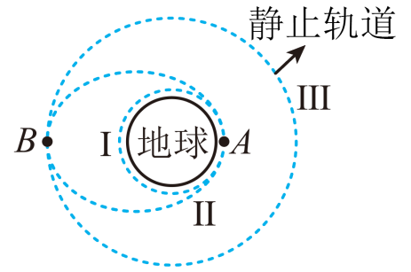

## 讲解

### 判据

题目给出“低圆轨道 → 椭圆转移轨道 → 高圆轨道”，并问在交点的速度、加速度或最终轨道动能时，要先分清比较的是：**同一点点火前后的速度，还是不同半径上两个稳定圆轨道的速度**。

对理想瞬时变轨，位置来不及发生明显变化，发动机改变的是当时的速度。点火后的轨道可以是椭圆，不能因为当时仍在原来的半径，就把速度重新限定为该半径的圆轨道速度。

### 流程

**第一步：标出A、B和轨道身份。** A为转移椭圆近地点，与低圆轨道相切；B为远地点，与高圆轨道相切。设到地心的距离分别为 $r_A$、$r_B$，有 $r_A<r_B$。同一颗卫星的质量 $m$ 不变，中心天体质量记为 $M$；质量单位为千克，$r_A$、$r_B$ 的单位为米。

**第二步：先只比较两个圆轨道。** 引力提供圆轨道向心力，约去 $m$ 后得到 $v^2=GM/r$，所以：

$$v_{\mathrm{I}}=\sqrt{\frac{GM}{r_A}},\qquad v_{\mathrm{III}}=\sqrt{\frac{GM}{r_B}}$$

因为 $r_A<r_B$，有 $v_{\mathrm{I}}>v_{\mathrm{III}}$。这比较的是两条圆轨道的最终速度，不是在A点点火时的变化。

**第三步：再看A点如何进入转移椭圆。** 由低圆轨道升到以A为近地点的椭圆，需要在A点沿运动方向加速，使轨道向外扩展。因此：

$$v_{\mathrm{II},A}>v_{\mathrm{I}}>v_{\mathrm{III}}$$

不能从“高圆轨道速度更小”反推A点应该减速。圆轨道速度关系只描述最终稳定圆轨道，不能替代点火后椭圆轨道的速度。

**第四步：看B点如何进入高圆轨道。** 转移椭圆在B点速度较低，需要再次沿运动方向加速，才能圆化为高圆轨道。因此：

$$v_{\mathrm{II},B}<v_{\mathrm{III}}$$

结合两次点火和圆轨道比较，得到本章资料中的顺序：

$$v_{\mathrm{II},A}>v_{\mathrm{I}}>v_{\mathrm{III}}>v_{\mathrm{II},B}$$

在椭圆上，A点近、速度大，B点远、速度小，与开普勒第二定律一致。两次加速发生在不同位置，不能理解为全程速度只增不减；A到B的无动力飞行阶段，速度会减小。

**第五步：加速度看当地受力，别只看速度。** 发动机关闭后，主要只有引力，加速度大小由当前位置决定：

$$a_{\text{引}}=\frac{F_{\text{引}}}{m}=\frac{GM}{r^2}$$

在同一个B点，椭圆与圆轨道到地心的距离相同，因此引力加速度相同，尽管速度不同。**正在点火时**还要算推力，不能说总加速度一定相同；原题比较的是变轨前后无动力的轨道状态。

**第六步：动能与机械能分开。** 同一卫星在高圆轨道速率较低，$E_k=mv^2/2$ 较小；升轨过程中发动机做功，使机械能增加。动能降低与机械能增加可以同时成立，因为引力势能也改变。

## 例题

> 题目与原逐项详解：本章《复习讲义（解析版）》多选第9题，来源ID S04，第840—858段。轨道图直接取自DOCX。

（多选）如图所示，人造卫星的发射过程要经过多次变轨后方可到达预定轨道。在发射地球静止轨道卫星的过程中，卫星从近地圆形轨道Ⅰ的A点先变轨到椭圆轨道Ⅱ，然后在远地点B变轨进入地球静止轨道Ⅲ。下列说法正确的是（　　）

A．卫星在Ⅱ轨道上经过A点的速度小于在Ⅲ轨道上的速度

B．卫星在Ⅱ轨道和Ⅲ轨道上经过B点时的加速度大小相等

C．若地球自转加快，静止轨道Ⅲ离地面的高度应增大

D．卫星在Ⅲ轨道上运行的动能小于在Ⅰ轨道上的动能

**答案：BD。**

**A错误：把椭圆近地点与高圆轨道混比。** 先比较两个圆轨道，Ⅰ较低，故 $v_{\mathrm{I}}>v_{\mathrm{III}}$；再看A点由Ⅰ进入Ⅱ必须加速，故 $v_{\mathrm{II},A}>v_{\mathrm{I}}$。两条关系接起来，Ⅱ在A点的速度大于Ⅲ的速度，选项方向反了。

**B正确：同一点的引力加速度由距离决定。** 两条轨道均经过B，到地心距离均为 $r_B$。关闭发动机后，都有 $a=GM/r_B^2$，故加速度大小相等；不能因为Ⅱ、Ⅲ上的速率不同就说加速度必然不同，也不能把Ⅰ的公式 $v^2/r_A$ 代入B点。

**C错误：自转加快，所需同步周期减小。** 对静止圆轨道有：

$$G\frac{Mm}{(R+h)^2}=m\frac{4\pi^2(R+h)}{T^2}$$

约去 $m$，乘以 $(R+h)^2T^2$，再除以 $4\pi^2$：

$$(R+h)^3=\frac{GMT^2}{4\pi^2}$$

取立方根，再减去 $R$：

$$h=\sqrt[3]{\frac{GMT^2}{4\pi^2}}-R$$

$T$ 减小而 $G$、$M$、$R$ 不变，所以 $h$ 减小，不是增大。

**D正确：比较的是同一卫星的最终圆轨道动能。** 将 $v^2=GM/r$ 代入动能公式：

$$E_k=\frac12mv^2=\frac{GMm}{2r}$$

Ⅲ的半径大于Ⅰ，$GMm$ 不变，所以 $E_{k,\mathrm{III}}<E_{k,\mathrm{I}}$。两次点火加速是局部过程，并不推翻最终高圆轨道速度和动能较小的结论。

## 易错

- **用最终圆轨道速度解释点火瞬间**：A点升轨先加速，最终高圆轨道速度却更小；比较对象与时刻不同。对应A。
- **同一点速度不同就说加速度不同**：仅有引力时加速度由当前位置决定；发动机开动时则要考虑推力。对应B。
- **把椭圆上到地心的距离当作曲率半径**：椭圆轨道不是以地心为圆心的匀速圆周，不能沿途用 $GM/r^2=v^2/r$。依据S06第130—137段的圆/椭圆模型区分。
- **把动能减小说成机械能减小**：升轨时推力做功，势能变化也必须计入机械能。对应D及S04第411段。
