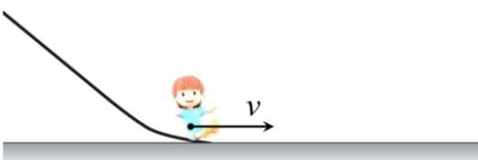

## 讲解

### 是什么

冲量描述一个力在指定时间段内的累积作用，是过程量、矢量，单位N·s。恒力作用Δt时

$$\vec I=\vec F\Delta t$$

F用N，Δt用s，方向与恒力同向。这里I是冲量，不是电流。冲量与沿力方向是否位移无关；力不做功也可有非零冲量。

### 怎么来的

把一个过程分成很短时间段，每段用FΔt近似它的冲量，再按方向相加。恒力时各小段总和给F乘总时间；变力时应取按时间平均的力，不能用任意一时刻或只取最大力。

在一维F-t图上，小时间段的矩形面积FΔt代表该段冲量；横轴以上为正、以下为负，所有有符号面积相加得到总冲量。只有力随时间线性变化，端值算术平均才等于时间平均。

合力冲量是各个力冲量的矢量和，恒力且作用时段相同时也可先求合力再乘时间。例题支持力与重力的冲量非零且反向抵消，竖直合冲量为0。

### 什么时候能用

必须说清哪一个力、哪段时间。力的冲量不自动等于物体动量变化，只有合外力冲量才等于Δp；单个支持力、摩擦力要分别算。

静止物体在平衡力作用下各力冲量可以非零，合冲量为0；循环中正负冲量也可能抵消。求变力冲量用时间平均或图像有符号面积，不能把力与位移的乘积误作冲量。

## 例题

> 题目与解析：高二上物理第一章  动量守恒定律·基础通关卷（解析版）.docx，来源ID S13，第29—38段。分段选取时保留该子问的完整题干、答案与解析；题目背景和原资料标注照录。

3．在翁牛特旗的玉龙沙湖景区，滑沙项目备受欢迎。如图，质量为m 的游客刚滑至水平沙地时的速度为v ，之后在水平沙地上沿直线运动，经过时间t 停止滑行。以水平速度v 的方向为正方向，该游客在水平沙地上滑行的过程中（     ）

A．动量变化量为0

B．动量变化量为mv

C．合力的冲量为0

D．支持力的冲量大小为mgt

**原资料答案：** D

**原资料详解：** ABC．游客初动量为$mv$，停止时末动量为$0$，因此动量变化量为$\Delta p=0-mv=-mv$

由动量定理，合力的冲量为$I=\Delta p=-mv$，故ABC错误；

D．游客竖直方向做匀速直线运动，支持力与重力平衡，支持力大小$N=mg$

支持力为恒力，冲量大小$I_N=Nt=mgt$，故D正确。

故选D。

### 顺着本题再看清一步

游客末动量0，初动量+mv，变化−mv，A把变化写0、B漏负号都错；合力冲量同为−mv，C的0错。竖直位置保持不变，重力与支持力平衡，但各力冲量并不为0：支持力mgt向上、重力mgt向下，合起来抵消，所以D正确。

原解析“竖直方向做匀速直线运动”在这里实际是竖直方向速度恒为0；并不意味着游客竖直移动。支持力不做功，是因为竖直位移为0，与其冲量非零不矛盾。

## 易错

冲量与功的变量不同：时间对位移；合力为0不代表每个力冲量0；N·s不是N/s。
