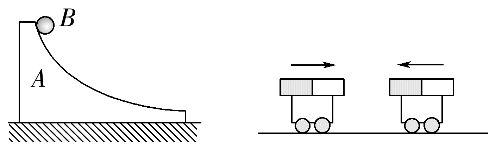
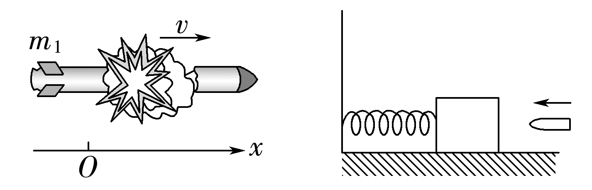

## 讲解

### 是什么

一个选定系统的总动量是各组成物体动量的矢量和。当系统合外力始终为0时，总动量在整个过程中不变；若只某方向外力合量为0，则仅该方向守恒。

$$m_1\vec v_1+m_2\vec v_2=m_1\vec v_1'+m_2\vec v_2'$$

初末物体必须是同一批质量，速度相对同一惯性参考系。内力、外力取决于系统边界，不由力名称决定。

### 怎么来的

取两物体为系统。物体1受到外力F外1和内力F₂₁，物体2受到F外2和F₁₂。将各自动量定理相加，牛顿第三定律给F₂₁＝−F₁₂，同一时间的内冲量相互抵消，得到

$$\Delta(\vec p_1+\vec p_2)=\vec I_{\text{外},1}+\vec I_{\text{外},2}$$

所以改变总动量的是外冲量；没有外冲量时初末总动量相同。两物体仍可各自动量改变，只是变化等大反向。

全过程每时刻合外力0才保证全过程守恒；若外力先正后负、整个时段冲量抵消，只能说这段首末总动量相等，不保证中间保持。

### 什么时候能用

水平光滑面上通常水平无外力，竖直重力和支持力是否抵消还需看竖直运动。小球滑动槽面有竖直加速度时，不可把完整矢量守恒当成水平分量守恒。

短时碰撞或爆炸可近似忽略外冲量，近似程度要按时段与所求精度看；爆炸后长时间飞行重力持续累积，不能继续用原近似。碰撞有无弹性不决定动量条件，动能可另行增加或减少。

## 例题

> 题目与解析：第一章 动量守恒定律（知识清单）（教师版）.docx，来源ID S06，第199—207段。分段选取时保留该子问的完整题干、答案与解析；题目背景和原资料标注照录。

1.关于系统动量守恒的条件，下列说法正确的是(　　)

A.静止在光滑水平面上的斜槽顶端有一小球，小球由静止释放，在离开斜槽前小球和斜槽组成的系统的动量守恒

B.在光滑的水平地面上有两辆小车，在两小车上各绑一个条形磁铁，他们在相向运动的过程中动量不守恒

C.一枚在空中飞行的火箭在某时刻突然炸裂成两块，在炸裂前后系统动量不守恒

D.子弹打进木块的瞬间子弹和木块组成的系统动量守恒

**原资料答案：** D

**原资料解析：** 离开斜槽前小球和斜槽组成的系统竖直方向所受合力不为零，动量不守恒，故A错误；两小车相向运动的过程中系统所受合外力为零，系统动量守恒，故B错误；火箭炸裂前后系统内力远大于外力，系统动量守恒，故C错误；子弹打进木块的瞬间子弹和木块组成的系统内力远大于外力，系统动量守恒，故D正确。

### 顺着本题再看清一步

A斜槽与小球系统只有水平方向可守恒，竖直合外力不总为0，所以完整动量不守恒；B光滑水平面两磁性小车的磁相互作用是内力，总外力抵消，动量守恒，因此B说不守恒错。

C火箭爆炸的极短时段可忽略重力冲量，原C说不守恒错；D子弹短时打入自由木块通常可忽略外冲量，近似守恒，符合原题答案D。**C、D中的“守恒”按短时近似理解，不能推广到爆炸后全部飞行或固定木块受约束的情况。**是否近似应比较外冲量对各部分动量变化的影响，不只看“内力很大”四字。

## 易错

先选系统再判内外力；首末相等不代表全过程；水平守恒不等于全部方向守恒；原题短时守恒为近似。
