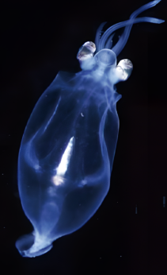

## 讲解

### 是什么

一个系统内部相互作用使一部分喷出或分离，其余部分速度发生相应变化，称反冲。喷气火箭、喷水运动都可据此分析，推力来自两部分的相互作用，不要求借空气“蹬一下”。

初始系统静止、外冲量可忽略时，两部分末动量等大反向，通常沿相反方向运动；系统原本在运动时，两部分对地速度却可能同向，反冲不以对地速度必须反向为条件。

### 怎么来的

把原本连在一起的物体与将喷出的物质都纳入同一系统。内部作用力的冲量等大反向，所以没有显著外冲量时总动量不变；剩余物体的质量必须扣除已喷出的部分。

初静止系统总质量M，喷出质量m向后，剩余M−m向前。用有符号对地速度写

$$0=(M-m)V+m u_{\text{喷出}}$$

u喷出为负，使剩余V为正。速度相对运动主体给出时，应先用速度相加换成同一地面参考系，不能把相对喷速直接放进上述式。

动量守恒不供给喷射所需动能：化学能、肌肉做功或原先储能可转成动能，因而机械能一般另列。喷水后两部分能量不能凭初始静止就认作仍为0。

### 什么时候能用

每次喷射选该时段参与交换的封闭系统；不能把只含剩余火箭的变质量系统直接当作动量守恒。持续喷射若题目未给细节，本条只作短时间反冲，不补造完整火箭速度公式。

短时忽略水阻或重力冲量才可近似使用。原例按题目理想模型和数值计算，40 m/s不作为真实乌贼运动能力的证据；被喷出水的质量已包含在初总质量2 kg里。

## 例题

> 题目与解析：第一章 动量守恒定律（专项训练）（解析版）.docx，来源ID S02，第525—530段。分段选取时保留该子问的完整题干、答案与解析；题目背景和原资料标注照录。

39．（24-25高二下·福建·期中）乌贼靠自身的漏斗状体管喷射海水推动身体运动，被称为“水中火箭”。如图所示，一只悬浮在水中的乌贼，当外套膜吸满水后，它的总质量为2kg，遇到危险时，通过短漏斗状的体管在极短时间内将水向后高速喷出，从而以40m/s的速度迅速逃窜，喷出水的质量为0.5kg，则喷出水的速度大小为（　　）

A．80m/s

B．120m/s

C．160m/s

D．200 m/s

**原资料答案：** B

**原资料详解：** 由题意可知，乌贼逃命时的速度达到$v_1=40\,\mathrm{m/s}$，则乌贼和喷出的水组成的系统动量守恒，设乌贼喷射出水的速度为$v_{2}$，取乌贼向前逃窜的方向为正方向，由动量守恒定律可得$(m-m_0)v_1-m_0v_2=0$

解得$v_2=\frac{m-m_0}{m_0}v_1=\frac{2-0.5}{0.5}\times40\,\mathrm{m/s}=120\,\mathrm{m/s}$

### 顺着本题再看清一步

剩余乌贼质量2−0.5＝1.5 kg，向前动量1.5×40＝60 kg·m/s；水质量0.5 kg须有向后动量−60，所以速度−120 m/s，大小120，B正确。A的80、C的160、D的200分别给水动量大小40、80、100，均不能抵消60。这里求的是题目初始静止参考系下水速度。

## 易错

总质量是否含喷出物先看题干；对地与相对速度分清；初总动量不为0时不能强迫两部分都对地反向。
