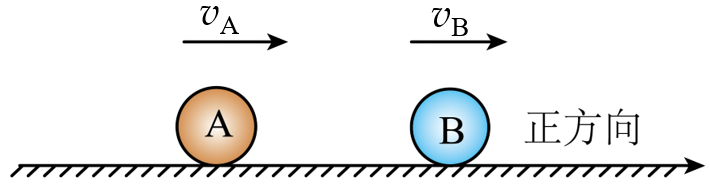

## 讲解

### 是什么

碰撞按碰前、碰后相互作用完成时的总动能分类：弹性碰撞总动能不变，普通非弹性碰撞总动能减少，完全非弹性碰撞两物体最终同速或粘在一起。

在外冲量可忽略时，各类碰撞都满足系统动量守恒；弹性才额外满足动能守恒。碰撞过程中弹簧或形变可暂存势能，不能要求每一瞬间动能都不变。

### 怎么来的

弹性一维碰撞同时写动量式和动能式。令碰后速度u₁、u₂，动量式移项得m₁(v₁−u₁)＝m₂(u₂−v₂)；动能式两边乘2，再用平方差因式分解得

$$m_1(v_1-u_1)(v_1+u_1)=m_2(u_2-v_2)(u_2+v_2)$$

有实际速度交换时，除以动量式两侧相同的非零项，得到v₁+u₁＝u₂+v₂，即碰前接近相对速度等于碰后分离相对速度。与动量式联立才得到碰后速度。

若v₂＝0，由u₂＝v₁+u₁代回m₁v₁＝m₁u₁+m₂u₂，得(m₁−m₂)v₁＝(m₁+m₂)u₁，因此

$$u_1=\frac{m_1-m_2}{m_1+m_2}v_1,\qquad u_2=v_1+u_1=\frac{2m_1}{m_1+m_2}v_1$$

完全非弹性令u₁＝u₂＝V，直接由动量式得V＝(m₁v₁+m₂v₂)/(m₁+m₂)，再计算初末动能差。固定初始动量、质量和速度，最终同速时动能损失最大。

### 什么时候能用

“普通碰撞动能不增加”限定无化学能、弹簧储能等额外释放；爆炸或超弹性碰撞不能套这个限制。是否守恒要先检查外冲量，并非见“碰撞”就无条件写两守恒。

一维碰撞后还要能分离：本例A在后、B在前，完成碰撞应u_A≤u_B；否则仍互相接近，不能当作相互作用已经结束的两球状态。穿透、碎裂等其他模型需题干说明。

## 例题

> 题目与解析：第一章 动量守恒定律（知识清单）（教师版）.docx，来源ID S06，第264—271段。分段选取时保留该子问的完整题干、答案与解析；题目背景和原资料标注照录。

2.（2024-2025·湖北武汉高一下期末）如图所示两个小球$A$、$B$，在光滑水平面上沿同一直线同向做匀速直线运动，已知它们的质量分别为${m}_{A}=2kg$，${m}_{B}=4kg$，$A$球的速度是$5\,\mathrm{m/s}$，$B$球的速度是$2\,\mathrm{m/s}$，则它们发生正碰后，其速度可能分别为(  )

A.${{v}_{A}}^{′}=1\,\mathrm{m/s}$，${{v}_{B}}^{′}=4\,\mathrm{m/s}$

B.${{v}_{A}}^{′}=4\,\mathrm{m/s}$，${{v}_{B}}^{′}=2.5\,\mathrm{m/s}$

C.${{v}_{A}}^{′}=2\,\mathrm{m/s}$，${{v}_{B}}^{′}=3\,\mathrm{m/s}$

D.${{v}_{A}}^{′}=-1\,\mathrm{m/s}$，${{v}_{B}}^{′}=5\,\mathrm{m/s}$

**原资料答案：** A

**原资料解析：** 碰前总动量为${p}_{1}={m}_{A}{v}_{A}+{m}_{B}{v}_{B}=18kg⋅\frac{m}{s}$；碰前总动能为${E}_{1}=\frac{1}{2}{m}_{A}{v}_{A}^{2}+\frac{1}{2}{m}_{B}{v}_{B}^{2}=33J$，若发生正碰后两小球速度分别为${{v}_{A}}^{′}=1\,\mathrm{m/s}$，${{v}_{B}}^{′}=4\,\mathrm{m/s}$，则碰后总动量为${p}_{2}={m}_{A}{{v}^{′}}_{A}+{m}_{B}{{v}^{′}}_{B}=18kg⋅\frac{m}{s}$，碰后总动能为${E}_{2}=\frac{1}{2}{m}_{A}{v}_{A}^{′2}+\frac{1}{2}{m}_{B}{v}_{B}^{′2}=33J$，A正确；碰后主动球的速度应小于被碰球的速度，若${{v}_{A}}^{′}=4\,\mathrm{m/s}$，${{v}_{B}}^{′}=2.5\,\mathrm{m/s}$，则${v}_{A}^{′}>{{v}_{B}}^{′}$不符合实际，B错误；若发生正碰后两小球速度分别为${{v}_{A}}^{′}=2\,\mathrm{m/s}$，${{v}_{B}}^{′}=3\,\mathrm{m/s}$，则碰后总动量为${p}_{2}={m}_{A}{{v}^{′}}_{A}+{m}_{B}{{v}^{′}}_{B}=16kg⋅\frac{m}{s}$，总动量不守恒，C错误；若发生正碰后两小球速度分别为${{v}_{A}}^{′}=-1\,\mathrm{m/s}$，${{v}_{B}}^{′}=5\,\mathrm{m/s}$，则碰后总动量为${p}_{2}={m}_{A}{{v}^{′}}_{A}+{m}_{B}{{v}^{′}}_{B}=18kg⋅\frac{m}{s}$，碰后总动能为${E}_{2}=\frac{1}{2}{m}_{A}{v}_{A}^{′2}+\frac{1}{2}{m}_{B}{v}_{B}^{′2}=51J>{E}_{1}$，动能增加，不可能，D错误。故选A。

### 顺着本题再看清一步

初总动量2×5+4×2＝18 kg·m/s，初动能2×5²/2+4×2²/2＝33 J。A末动量2×1+4×4＝18、动能2×1²/2+4×4²/2＝33，且后方A速度1小于前方B速度4，能分离，正确。

B虽动量18、动能28.5 J，但后方A仍4 m/s追前方B的2.5 m/s，不能作为碰撞结束已分离的状态；C末动量16，不守恒；D末动量18但动能51 J大于33 J，不符合本题无释能的普通碰撞。三个检查各有用途，不把它们缩成只验一个等式。

## 易错

动量守恒与动能守恒分别检查；普通碰撞不释能；碰撞过程中动能可转成形变势能；同速并不等于都静止。
