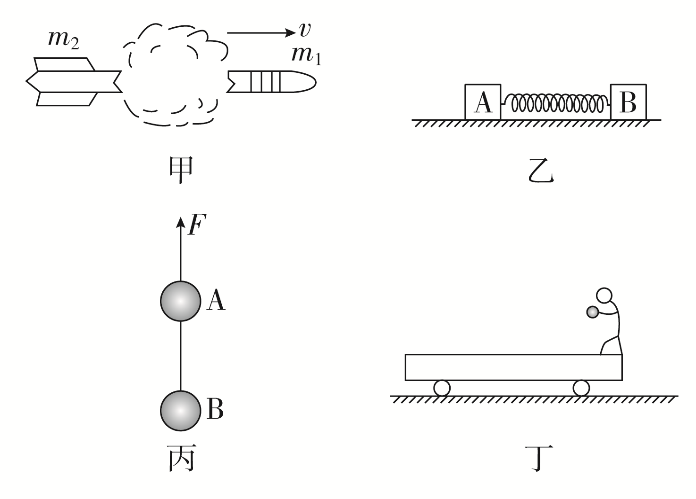

## 讲解

### 判据

先列系统包含哪些物体、哪段过程，再查每个方向的合外力或外冲量。“光滑”“爆炸瞬间”“水平抛出后”“细线断裂后”分别约束不同方向、不同时间段。

内力等大反向只能使内部交换总和抵消；它不能自动消除重力、拉力、地面作用等外部影响。

### 流程

1. **画系统边界。** 甲取所有爆炸碎块；乙取A、B及轻弹簧；丙取两球；丁取车、人、小球。系统外物体施力为外力，球之间的线张力属于内力。

2. **逐方向看。** 乙水平光滑且竖直平衡，合外力0，所以总动量守恒。丁抛出后水平无外力，因此水平分量守恒；球在空中向下加速，竖直合外力不为0，总矢量不守恒。

3. **区分短时近似。** 甲爆炸极短时重力冲量相对内部交换可忽略，近似守恒；之后飞行受重力不能保持总动量。原题“爆炸瞬间”不能删掉。

4. **丙合并外力。** 原先两球匀速上升，恒F等于两球总重力。断线后F仍按题作用在上球，系统合外力F−总重力仍0，虽然两球分别加速，总动量仍守恒。

5. **最后评价完整命题。** 甲、乙成立；丙“动量不守恒”错误；丁若只写水平守恒正确，但选项声称系统整个动量守恒，不成立。

## 例题

> 题目与解析：第一章 动量守恒定律（知识清单）（教师版）.docx，来源ID S06，第213—220段。分段选取时保留该子问的完整题干、答案与解析；题目背景和原资料标注照录。

3.以下关于四幅图的说法，正确的是(　　)

A.图甲中火箭爆炸的瞬间动量守恒

B.图乙中A、B用压缩的轻弹簧连接放于光滑的水平面上，释放后A、B与弹簧组成的系统动量守恒

C.图丙中用恒力F拉着两球匀速上升，细线断裂后两球继续运动的过程中，两球组成的系统动量不守恒

D.图丁中小车位于光滑的水平面上，人将小球水平向左抛出后，车、人和小球组成的系统动量守恒

**原资料答案：** AB

**原资料解析：** 图甲中火箭爆炸的瞬间，外力可以忽略，所以系统动量守恒，故A正确；图乙中A、B用压缩的弹簧连接放于光滑的水平面上，释放后A、B与弹簧组成的系统所受合外力为0，系统动量守恒，故B正确；图丙中用恒力F拉着两球匀速上升，细线断裂后两球继续运动的过程中，两球组成的系统所受合外力为0，系统动量守恒，故C错误；图丁中小车位于光滑的水平面上，人将小球水平向左抛出后，车、人和小球组成的系统在水平方向不受外力，在竖直方向小球有加速度，即所受合外力不为0，故在水平方向动量守恒，在竖直方向动量不守恒，故系统动量不守恒，故D错误。

### 顺着本题再看清一步

原题答案AB。丙上球受F、重力，下球断线后受重力；两球各自Δp并不为0，其和却为0。丁的正确结论是水平动量守恒，球的下落使竖直总动量持续变化。甲爆炸则明确为外冲量可忽略的近似，原解析的简写已在正文补条件。

## 易错

某方向与完整矢量区分；断内绳不等于外力变化；恒力是否继续作用看题图与过程；短时近似不扩展到飞行全过程。
