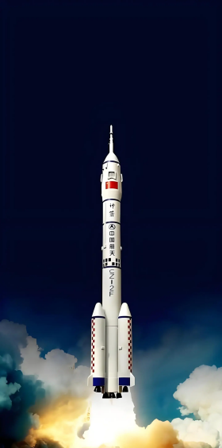

## 讲解

### 判据

喷出质量已包含在原总质量里，或喷速相对火箭/小船给出时，用“固定一批质量＋统一参考系”的系统动量法。初始在运动时初总动量非零，不能套静止系统0＝两末动量。

题目明确燃气相对“喷气前”的火箭速度，不等于相对喷气后的火箭速度；读到哪个时刻，速度换算就用哪个时刻。

### 流程

1. **选该时段固定系统。** 初总质量M，后分成剩余M−m与喷出的m。外重力冲量在极短时段按题近似忽略，不能在碰后还给剩余火箭质量M。

2. **换成对地速度。** 向上为正，喷气前火箭v₀；燃气相对此前火箭向后速率v，所以燃气对地u气＝v₀−v。题给v＜v₀，故燃气仍向上，不能因为“向后喷”就强行写−v。

3. **列首末总动量。**

$$Mv_0=(M-m)v_1+m(v_0-v)$$

4. **逐步求剩余速度。** 将m(v₀−v)移到左边，Mv₀−mv₀+mv＝(M−m)v₁；合并前两项为(M−m)v₀，所以v₁＝v₀+mv/(M−m)，对应B。

5. **核方向与数量级。** v＞0使v₁＞v₀，火箭受反冲加速；m趋于0时v₁趋于v₀；两部分对地可以同向，但动量增量等大反向。若求之后升高，应另用重力阶段，不把喷射近似守恒延续下去。

## 例题

> 题目与解析：第一章 动量守恒定律（专项训练）（解析版）.docx，来源ID S02，第558—566段。分段选取时保留该子问的完整题干、答案与解析；题目背景和原资料标注照录。

42．（25-26高二上·湖南·期中）2025年4月24日，神舟二十号载人飞船通过长征系列运载火箭发射升空，并成功将航天员乘组送入中国空间站。长征系列运载火箭的成就，不仅是我国航天技术进步的体现，更是国家综合实力的象征。已知某时刻总质量为$M$（含燃料）的火箭以相对于地面为$v_0$的速度向上飞行，在极短的时间内向后喷出燃料气体的质量为$m$，向后喷出的气体相对火箭喷气前的速度大小为$v$，且$v<v_0$，则喷气后火箭的速度为（　　）

A．$\frac{(M-m)v_0-mv}{M-m}$

B．$\frac{(M-m)v_0+mv}{M-m}$

C．$\frac{(M-m)v_0-mv}{M+m}$

D．$\frac{(M-m)v_0+mv}{M+m}$

**原资料答案：** B

**原资料详解：** 由题意可知在极短时间内火箭系统动量守恒，进行反冲运动，根据题目条件，规定火箭运行方向为正方向，可知燃料气体的速度方向与火箭飞行方向相同，且大小为$v_0-v$

由动量守恒定律可得$Mv_0=(M-m)v_1+m(v_0-v)$

解得$v_1=\frac{(M-m)v_0+mv}{M-m}$

故选B。

### 顺着本题再看清一步

A把+mv误成−mv，得到减速，与喷气动量增量反向的关系不符；C、D把喷气后剩余质量写成M+m，错误。B的分母M−m、分子(M−m)v₀+mv均符合固定系统与统一参考系。原题背景照录，不将理想短时模型当成真实飞船全部推进过程。

## 易错

相对喷气前与喷气后速度不能混用；喷气后剩余质量M−m；初动量Mv₀不能省；向后是相对方向不是必然对地负号。
