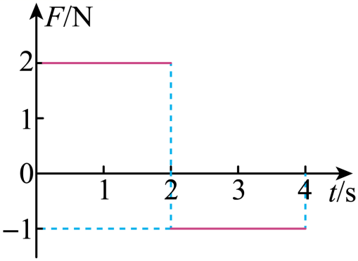

## 讲解

### 判据

有力、作用时间、F-t图或初末速度，可以从“力的时间累积”或“状态差”两端求冲量。F-t面积给图示这个力的冲量；初末动量差给合外力冲量，先确认两者是否同一个对象。

图上正、负面积必须作代数和。一维先定正方向，I＝p末−p初；遇反弹不能把有符号速度换成速率。

### 流程

1. **读图示力。** 本题说F为合力，所以F-t有符号面积直接等于水平Δp。若F只是拉力，还应加摩擦等冲量。

2. **分段算面积。** 0—2 s力+2 N，冲量+4 N·s；2—4 s力−1 N，冲量−2 N·s。总冲量+2 N·s，不是把两个面积大小相加成6。

3. **由初状态求末状态。** 初静止p₀＝0，2 s末p₂＝4 kg·m/s、v₂＝4 m/s；4 s末p₄＝2 kg·m/s、v₄＝2 m/s。后段负力只是减速，没有在4 s前反向。

4. **若问位移另算运动。** 前段匀加速位移(0+4)×2/2＝4 m，后段(4+2)×2/2＝6 m，总10 m；F-t面积不能当位移。

5. **单个重力另算。** 重力恒定向下，4 s内冲量mgt＝40 N·s；支持力等大向上，使竖直合冲量为0，不使重力自身冲量消失。

## 例题

> 题目与解析：第一章 动量守恒定律（专项训练）（解析版）.docx，来源ID S02，第107—122段。分段选取时保留该子问的完整题干、答案与解析；题目背景和原资料标注照录。

7．（25-26高二上·湖北·期末）在光滑的水平轨道上，一质量为1kg的物体在合力F的作用下由静止开始沿直线运动，F随t的变化如图所示，$g=10\,\mathrm{m/s^2}$，下列说法正确的是（　　）

A．4s末物体速度为0

B．2s末物体的动量大小为2kg·m/s

C．0-4s内物体的位移大小为2m

D．0-4s内物体所受重力的冲量大小为40N·s

**原资料答案：** D

**原资料详解：** 

A．由题意，根据$F-t$图像围成的面积表示物体动量的变化量，对物体0-4s内有$2\times2\,\mathrm{N\cdot s}-1\times(4-2)\,\mathrm{N\cdot s}=1\,\mathrm{kg}\times v_4-0$

得4s末物体速度为$v_4=2\,\mathrm{m/s}$，A错误；

B．由$F-t$图像围成的面积可得，2s末物体的动量大小为$p_2=Ft=2\times2\,\mathrm{N\cdot s}=4\,\mathrm{kg\cdot m/s}$，B错误；

C．0-2s内物体做匀加速直线运动，2s末物体的速度大小为$v_2=\frac{p_2}{m}=4\,\mathrm{m/s}$

0-2s内位移为$s_1=\frac{v_2t}{2}=4\,\mathrm m$

2-4s内物体继续向前做匀减速直线运动，位移为$s_2=\frac{(v_2+v_4)t}{2}=6\,\mathrm m$

则0-4s内物体的位移大小为$s=s_1+s_2=10\,\mathrm m$，C错误；

D．0-4s内物体所受重力的冲量大小为$I_G=mgt=40\,\mathrm{N\cdot s}$，D正确。

故选D。

### 顺着本题再看清一步

A错，4 s末仍向前2 m/s；B错，2 s末动量4而非2 kg·m/s；C错，位移10而非2 m；D正确，重力冲量大小40 N·s。原图和完整计算保留，可同时核水平合冲量与竖直单力冲量。

## 易错

有符号面积与几何面积大小不同；负力不等于负速度；F-t面积不是位移或功；单个重力冲量可以非零。
