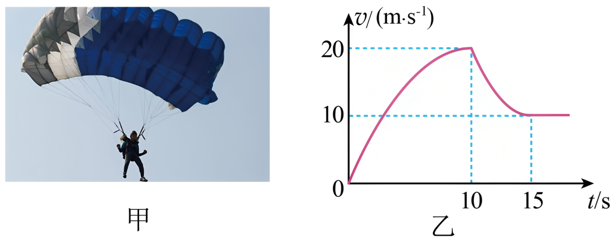

## 错法

只看到“往下落”就令a=g、v₀=0，用h=gt²/2算到底。下降描述速度方向，自由落体还要求本段从静止开始、仅受重力；速度与加速度是不同量。

跳伞员向下运动时，阻力可以使他加速越来越慢、匀速，甚至减速；如果a=g恒定，v-t图线应为斜率g的直线，与图中的曲线不符。

## 正解

先查初速度和受力条件，再观察图像。向下为正时v>0说明下降；a由斜率判定。v正而斜率负，说明向下运动正在减速，加速度向上。斜率为零而v非零，说明匀速下降，不是静止。

原题0—10 s正斜率逐渐变小，是速度增大、加速度大小变小；10—15 s斜率负而逐渐接近零，是向下减速、加速度向上且大小减小；15 s以后水平线，是非零向下匀速。

负斜率从很负变得接近零，a的代数值增大、|a|减小。原解析说“斜率在减小”时须按图澄清，不能把大小与有向值混在一起。

## 例题

> 题目与解析：第二章  匀变速直线运动的研究（知识清单）（答案版）.docx，来源ID S06，第444—450段。题目背景与原资料标注照录。

4.“钓鱼岛事件”牵动着军民爱国之心，我国空军某部为捍卫领土完整，举行了大规模的跳伞保岛演练，图甲是战士从悬停在高空的直升机中无初速度跳下后运动过程中的画面，图乙是战士从跳离飞机到落地过程中的$v-t$图像，若规定竖直向下为正方向，忽略水平方向的风力作用，关于战士的运动过程，下列说法正确的是(　　)

A. $0∼10\,\mathrm{s}$内做加速度逐渐增大的加速运动

B. $0∼15\,\mathrm{s}$内做自由落体运动，$15\,\mathrm{s}$末开始做匀速直线运动

C. 在$10\,\mathrm{s}$末打开降落伞，随后做匀减速运动至$15\,\mathrm{s}$末

D. $10∼15\,\mathrm{s}$内加速度方向竖直向上，加速度的大小逐渐减小

**原资料解析：** v-t图像的斜率表示加速度，根据图像可知0~10s内图线的斜率在减小，说明战士做加速度逐渐减小的加速运动，10~15s由于图像的斜率在减小，战士做加速度减小的减速运动，由上可知$0-15\,\mathrm{s}$加速在变化，故ABC错误；根据图像可知10s~15s内速度一直为之方向，即竖直向下，又因为加速度为负，即加速度方向竖直向上，战士在该段时间内加速度的大小在逐渐减小，故D正确。

### 顺着本题再看清一步

**答案：D。** A把曲线越来越平读成a越来越大，应为减小；B在0—15 s把有阻力的曲线段当a恒定g，错误；C开伞后曲线不是直线，不能称匀减速；D此段速度正、斜率负且绝对值减小，故向上加速度大小逐渐减小。原解析“速度一直为之方向”是文字误排，图意为速度始终取正、向下，正文按此解释。
