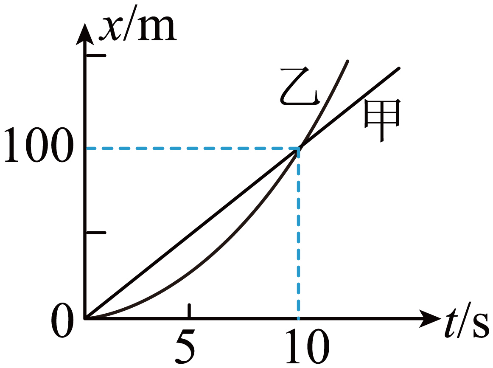

## 错法

记住静止起步匀加速“位移比1:4:9”，便把前三个相等时间段分别走的距离也写1:4:9。错在没有区分“到每个时刻累计走了多少”和“只在这一段走了多少”。

累计值从同一起点量起，后一累计值包含此前全部位移；分段值要把此前已经发生的部分扣掉。这与纸带从A量出的d₁、d₂、d₃不能直接当相邻间距是同一种错误。

## 正解

从静止、a恒定，令K=aT²/2。到T、2T、3T累计位移为K、4K、9K；各段用差求：

$$\Delta x_1=K-0=K,\quad\Delta x_2=4K-K=3K,\quad\Delta x_3=9K-4K=5K$$

所以累计比1:4:9，分段比1:3:5。读题时把“前n个T”与“第n个T内”写到量名上再列式，避免只记比例不记对象。

若初速度不为零，每段还含相同的v₀T项，分段比通常不再是奇数比；若a改变，累计平方比也失效。

## 例题

> 题目与解析：第二章  匀变速直线运动的研究（知识清单）（答案版）.docx，来源ID S06，第398—403段。题目背景与原资料标注照录。

【例11】甲、乙两车在同一平直公路的两条平行车道上同时$(t=0)$并排出发，甲车做匀速直线运动，乙车从静止开始做匀加速运动，它们的位移-时间图像如图所示，比较两车在0~10s内的运动，以下说法正确的是(　　)

A. 乙车的加速度为$2 m/{s}^{2}$

B. $t=10 s$时，乙车的速度是甲车的3倍

C. $t=5\,\mathrm{s}$时，甲、乙两车相距最远

D. 甲乙两车出发后只能相遇一次

**原资料解析：** 根据匀变速直线运动的规律$x=\frac{1}{2}a{t}^{2}$，将交点的数据代入公式，可得乙车的加速度为$a=\frac{2x}{{t}^{2}}=\frac{2\times 100}{{10}^{2}}m/{s}^{2}=2\,\mathrm{m}/{s}^{2}$，A正确；$t=10 s$时，乙车的速度${v}_{乙}=at=20\,\mathrm{m/s}$，甲的速度${v}_{甲}=\frac{100}{10}m/s=10\,\mathrm{m/s}$，乙车的速度是甲车的2倍，B错误；$t=5\,\mathrm{s}$时，乙车的速度${v}_{乙}=at=10\,\mathrm{m/s}={v}_{甲}$，此时甲、乙两车相距最远，C正确；x-t图像的交点表示相遇，两图像有一个交点，可知甲乙两车出发后只能相遇一次，D正确。故选ACD。

### 顺着本题再看清一步

**答案：ACD。** 乙车a=2 m/s²，0—5 s累计x₅=25 m，0—10 s累计x₁₀=100 m，比1:4；分段0—5 s走25 m，5—10 s走100−25=75 m，比1:3。题中C所说5 s最远，另需看甲车与乙车的相对速度，不能只靠这个比例判断。A正确；B10 s末速乙20、甲10，为2倍而非3；D在持续模型中t²=10t仅有出发后10 s一次相遇。
