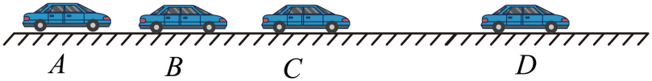

## 讲解

### 是什么

沿直线运动，且加速度的大小、方向都不变，叫匀变速直线运动。“匀”的是速度每经过相同时间的变化量，而不是速度大小。选定直线上的正方向后，速度v、初速度v₀和加速度a用带正负的数表示，单位分别是m/s、m/s²；时间t以s计。

$$v=v_0+at$$

若v、a同号，速度大小增加；若异号，速度大小减小。不能只凭a正负判断加速还是减速，必须把它和当时的v比较。

### 怎么来的

加速度定义为速度变化量除以经历时间。a恒定时，任一时间段都有同一个比值，所以从计时起点到t时刻有：

$$a=\frac{v-v_0}{t},\qquad v-v_0=at,\qquad v=v_0+at$$

第一步是定义，第二步两边乘t把“每秒改变多少”变成“这段时间共改变多少”，第三步加回初速度。结果说明v与t是一次函数，v-t图像为直线，斜率是a。a=0时是匀速这一特殊情形。

同一恒定a能让物体先减速到零、再反向加速，例如忽略空气阻力的竖直上抛。速度零的瞬间并不要求加速度也为零。

### 什么时候能用

必须同时满足直线、加速度恒定，并且所选时间内没有改变运动规律。玩具车从水平段转到斜面时，方向、加速度条件改变，应分段。汽车刹停后若保持静止，就不能把停车前的a继续外推。实际有阻力、发动机调速的运动能否近似匀变速，应由题设或实验判断，不能看到“加速”就套式。

## 例题

> 题目与解析：第二章  匀变速直线运动的研究（知识清单）（答案版）.docx，来源ID S06，第276—283段。题目背景与原资料标注照录。

【例3】如图所示，一辆汽车沿着平直公路从A点由静止开始做匀加速直线运动，汽车通过BC段与通过CD段所用时间均为1s，测得B、C之间距离为10m，C、D之间距离为20m，求：

(1)汽车经过B、C两点时的瞬时速度大小之比；

(2)A、B两点之间的距离。

**原资料解析：** （1）根据题意汽车通过$BC、CD$所用时间均为$T=1\,\mathrm{s}$，根据平均速度的推论可知汽车经过$C$点的速度${v}_{C}=\frac{BC+CD}{2T}=15\,\mathrm{m/s}$，根据位移差公式$\Delta x=a{T}^{2}$，可得加速度$a=\frac{CD-BC}{{T}^{2}}=10\,\mathrm{m}/{s}^{2}$，汽车经过$B$点的速度为：${v}_{B}={v}_{C}-aT=5\,\mathrm{m/s}$

所以汽车经过B、C两点时的瞬时速度大小之比$\frac{{v}_{B}}{{v}_{C}}=\frac{1}{3}$

（2）设$A、B$之间的距离为${x}_{AB}$，因为汽车在$A$点的初速度为零，根据匀变速直线运动的速度与位移的关系，有${v}_{B}^{2}-0=2a{x}_{AB}$

解得A、B两点之间的距离${x}_{AB}=\frac{{v}_{B}^{2}}{2a}=\frac{{5}^{2}}{2\times 10}m=1.25\,\mathrm{m}$

### 顺着本题再看清一步

**原题结果：** vB:vC=1:3，AB=1.25 m。看到“各1 s”先想到等时间段；两段平均速度分别10 m/s、20 m/s，每段的中间时刻相隔1 s，因此速度增加10 m/s，加速度是10 m/s²。C是这两段合起来的中间时刻，取总位移30 m除2 s得15 m/s，再向前退1 s得B点5 m/s。A到B的时间题目没直接给，改用不含时间的速度—位移式，依据A点从静止启动求出AB。

## 易错

- 例题的“通过BC、CD各1 s”不是“从A出发经过1 s、2 s”。先确定是哪段时间，再算速度。
- 恒定加速度不等于每秒位移相同；本题相邻两秒走10 m、20 m，正是速度持续增大的结果。
- a与v异号时只是当下减速；若作用继续且允许反向，过零后可能加速。
