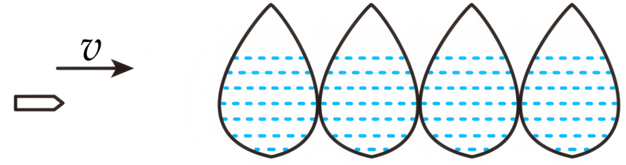

## 讲解

### 是什么

平均速度永远按有向位移除以时间定义。对于匀变速直线运动，还有一条便于计算的结论：

$$\bar v=\frac{x}{t}=\frac{v_0+v}{2}=v_{t/2}$$

v₀、v是这一时间段两端的速度，vₜ/₂是这一段中间时刻的瞬时速度；单位均为m/s。这里“中间”按时间划分，不能把位移中点与时间中点混为一谈。若反向，带符号的平均速度仍成立，但它的大小不等于平均速率。

### 怎么来的

速度随时间线性变化。由v=v₀+at，中间时刻速度为v₀+at/2；端点算术平均也为[v₀+(v₀+at)]/2，两者相同。另一方面，v-t图线是直线，梯形的有向面积为(v₀+v)t/2。把面积给出的位移除以t，就得到上面的平均速度。

$$v_{t/2}=v_0+\frac12at=\frac{v_0+(v_0+at)}2=\frac{v_0+v}2$$

这条结论之所以可用，是因为整个时间段速度线性变化，而非因为“有初速度、有末速度”就能取平均。速度变化更快的部分持续多久，会影响总面积；仅给端点一般不足以决定平均速度。

### 什么时候能用

整段为恒定a的直线运动才能严格取端点平均。两个各自匀变速、但a不同的阶段拼起来，不能只取全过程端点平均；应把各段位移相加，再除总时间。用于纸带时，目标点前后须取等时间区间；一般变速运动只能用很短对称区间近似估计。

## 例题

> 题目与解析：第二章  匀变速直线运动的研究（知识清单）（答案版）.docx，来源ID S06，第270—275段。题目背景与原资料标注照录。

【例2】《国家地理频道》通过实验证实四个水球就可以挡住子弹。如图所示，四个完全相同的水球紧挨在一起水平排列，一颗子弹以速度$v$水平射向水球，假设子弹在水球中沿水平方向做匀变速直线运动，恰好能穿出第四个水球。已知子弹在每个水球中运动的距离均为$d$，则可以判定（　　）

A. 子弹穿过第二个水球时的瞬时速度为$\frac{v}{2}$

B. 子弹穿过前三个水球所用的时间为$\frac{2d}{v}$

C. 子弹在第四个水球中运动的平均速度为$\frac{v}{4}$

D. 子弹从左向右通过每个水球的时间之比为${t}_{1}:{t}_{2}:{t}_{3}:{t}_{4}=1:(\sqrt{2}-1):(\sqrt{3}-\sqrt{2}):(2-\sqrt{3})$

**原资料解析：** 子弹在水球中沿水平方向做匀变速直线运动，恰好能穿出第四个水球，逆向思维可看成反向初速度为零的匀加速直线运动，根据匀变速直线运动的规律${v}^{2}=2ax$，解得$v\propto \sqrt{x}$，可知子弹穿过第二个水球的瞬时速度为$\frac{\sqrt{2}}{2}v$，故A错误：由A可知，子弹穿过第三个水球的瞬时速度为$\frac{v}{2}$，根据平均速度的定义$\bar v=\frac{x}{t}$知，子弹在前三个水球中运动的时间为$t=\frac{3d}{\frac{v+\frac{v}{2}}{2}}=\frac{4d}{v}$，故B错误；由A可知，子弹进入第四个水球的瞬时速度为$\frac{v}{2}$，则子弹在第四个水球中运动的平均速度为$v=\frac{\frac{v}{2}+0}{2}=\frac{v}{4}$，故C正确；逆向思维，根据匀变速直线运动的规律$x=\frac{1}{2}a{t}^{2}$，解得$t\propto \sqrt{x}$，子弹依次穿过4个水球的时间之比为${t}_{1}:{t}_{2}:{t}_{3}:{t}_{4}=(2-\sqrt{3}):(\sqrt{3}-\sqrt{2}):(\sqrt{2}-1):1$，故D

### 顺着本题再看清一步

**答案：C（原解析逐项判定）。** 原DOCX的D项末句“错误”被排到后一题结束之后，提取范围内只剩“故D”；这里依据原解析已经给出的正确时间比补明D错误。

A把等位移中点当成等时间中点：用v²随剩余穿行距离变化，第二球末速度为v/√2，不是v/2。B先求第三球末速度v/2，前三球的端点平均为3v/4，用位移3d除平均速度才得4d/v。C第四球的两端速度v/2、0，平均恰为v/4。D子弹越走越慢，相同距离用时越来越长；题中比例正好把实际次序倒过来了。

## 易错

- 子弹减速过程的平均速度仍用两端速度相加除2，不能把“减速”理解成两速度相减除2。
- 水球等厚提供等位移，不提供等时间；平均速度的中间时刻结论不能按“第二个球末端是全程中点”使用。
- 全程有停车静止段时，不能把初速度和最终零速度平均当全过程平均速度。
