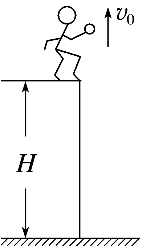

## 讲解

### 是什么

物体具有竖直向上的初速度，离手后只受重力的运动叫竖直上抛。选抛出点为位移零点、向上为正，v₀>0、a=−g；y是相对抛出点的有向位移，单位m。整个过程有：

$$v=v_0-gt,\qquad y=v_0t-\frac12gt^2$$

上升时v>0，最高点v=0，下降时v<0；a始终向下。最高点的零速度只是换向的一瞬间，不能当成物体此后停在空中。

### 怎么来的

从匀变速基本式出发，把a=−g代入就得到上式。最高点令v=0：0=v₀−gt上，故t上=v₀/g。把v=0、a=−g代入v²−v₀²=2ay，再两边除−2g：

$$H_{\max}=\frac{v_0^2}{2g}$$

下降重新经过抛出点时y=0，把位移式写成t(v₀−gt/2)=0，除了初始t=0，还得到t回=2v₀/g。因此回到相同高度的总时间是上升到顶时间的2倍，回到抛出点速度为−v₀。对于任一相同高度，由v²=v₀²−2gy知道上、下两次速度大小相同、方向相反。

### 什么时候能用

忽略空气阻力、g近似恒定。对称性比较的是同一高度的两次经过；落地若低于抛出点，下降时间就大于上升时间，不能把到地面时间写成2v₀/g。可以全过程用向上为正统一计算，也可在最高点拆成上抛和自由落体两段，但两段位移基准及正方向要说明，不能混合符号。

## 例题

> 题目与解析：第二章  匀变速直线运动的研究（知识清单）（答案版）.docx，来源ID S06，第368—376段。题目背景与原资料标注照录。

【例9】如图所示，一同学从一高为H＝10 m的平台上竖直向上抛出一个可以看成质点的小球，小球的抛出点距离平台的高度为$h_{0}$＝0.8 m，小球抛出后升高了h＝0.45 m到达最高点，最终小球落在地面上。g＝10 m/$\mathrm{s}^{2}$，不计空气阻力，求：

(1)小球抛出时的初速度大小$v_{0}$；

(2)小球从抛出到落到地面的过程中经历的时间t。

**原资料解析：** (1)上升阶段，由0－$v_{0}^{2}$＝－2gh得：

$v_{0}$＝$\sqrt{2gh}$＝3 m/s。

(2)设上升阶段经历的时间为$t_{1}$，则：0＝$v_{0}$－$gt_{1}$，

自由落体过程经历的时间为$t_{2}$，则：$h_{0}$＋h＋H＝$\frac12gt_{2}^{2}$，

又t＝$t_{1}$＋$t_{2}$，

联立解得：t＝1.8 s。

### 顺着本题再看清一步

**原题结果：** 初速度3 m/s，总时间1.8 s。用顶点v=0和上升位移0.45 m：v₀=√(2×10×0.45)=3 m/s。上升时间3/10=0.3 s。最高点离地是平台10 m、抛出点高出平台0.8 m、再上升0.45 m的和11.25 m。下降从顶点静止开始，t₂=√(2×11.25/10)=1.5 s，总时间0.3+1.5=1.8 s。这里每次相加都在比较同一竖直高度基准。

## 易错

- 原题地面不在抛出点：抛出点高于地面10.8 m，总时间不能用2v₀/g。
- 抛后升高0.45 m是相对抛出点，不是最高点到地面的高度。
- 最高点a=−g仍成立；选向下为正时a应改为+g，不能只改速度符号。
