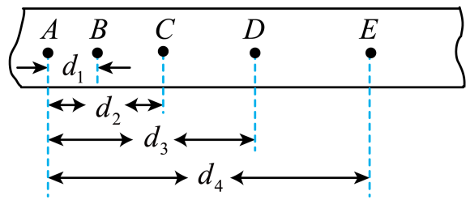

## 讲解

### 判据

题目给连续几个相等时间段内的位移，或纸带计数点间距，且运动可按恒加速度处理时，位移作差能消去初速度。先确认“等时间”和“同一匀变速段”，再使用差值规律。

### 流程

**确定真正的计数间隔T。** 打点周期为0.02 s、相邻计数点间还有4个未画点，则两计数点跨5个打点间隔，T=0.10 s。“未画4点”不是间隔4次。

**把累计刻度换成分段位移。** 若d₂表示A到C的距离，d₄表示A到E的距离，CE=d₄−d₂；不能把d₂、d₄当作相邻等时段距离直接作差。比较AC与CE时，每段都历时2T。

**选择相邻或等长大段差。** 相邻段用a=(x₂−x₁)/T²；两连续2T大段用：

$$a=\frac{x_{CE}-x_{AC}}{(2T)^2}$$

依据是每段起始速度比上一段多a×段时长，乘段时长便让位移多a×段时长²。取多段逐差、平均，可以使用更多测量值减小偶然误差；分母必须与所选两段的时间长度一致。

**先统一单位，再代值。** 纸带距离cm先乘10⁻²变m，T用s，才能得到m/s²。差值带符号；若只问加速度大小，最后取绝对值。

**回查数据是否支持模型。** 各相邻段差应近似相等；严重不一致先查段号、读数和运动阶段，而非强行宣称a恒定。

## 例题

> 题目与解析：第二章  匀变速直线运动的研究（知识清单）（答案版）.docx，来源ID S06，第409—415段。题目背景与原资料标注照录。

【例12】某同学在用电火花打点计时器和纸带做“研究匀变速直线运动规律”的实验时，得到一条打下的纸带如图所示，并在上面取了A、B、C、D、E五个计数点，相邻两个计数点间还有4个点(图中没有画出)，打点计时器所用电源为频率50Hz的交流电源，即打点周期为T=0.02s。

(1)电火花打点计时器的工作电压为　　　V；

(2)计算打下D点的瞬时速度v的公式为$v=$　　　　(选用题中所给的物理量T、${d}_{1}$、${d}_{2}$、${d}_{3}$、${d}_{4}$等字母表示)；

(3)实验测得${d}_{1}=1.20cm$、${d}_{2}=3.15cm$、${d}_{3}=5.85cm$、${d}_{4}=9.30cm$，则物体的加速度大小为$a=$　　　${m/s}^{2}$(结果保留两位有效数字)。

**原资料解析：** (1)电火花打点计时器一种使用交流电源的计时仪器，其工作电压为$220V$

(2)根据匀变速直线运动中，某段时间内的平均速度等于中间时刻的瞬时速度，打下某点时的瞬时速度用这点前后两点间的平均速度来代替，所以计算打下D点的瞬时速度v的公式为$v=\frac{{d}_{4}-{d}_{2}}{10T}$

(3)根据匀变速直线运动的逐差法$\Delta x=a{T}^{2}$，计算物体的加速度大小$a=\frac{{x}_{CE}-{x}_{AC}}{{(10T)}^{2}}=\frac{({d}_{4}-{d}_{2})-{d}_{2}}{{(10T)}^{2}}=\frac{((9.30-3.15)-3.15)\times {10}^{-2}}{{(10\times 0.02)}^{2}}\mathrm{m/s^2}=0.75\mathrm{m/s^2}$

### 顺着本题再看清一步

**原题答案：** (1)220 V；(2)vD=(d₄−d₂)/(10T)；(3)0.75 m/s²。原式最后的单位现以m/s²理解。

AC=3.15 cm，CE=9.30−3.15=6.15 cm。它们各跨10个打点间隔，即0.20 s，差是3.00 cm=0.0300 m，所以a=0.0300/0.20²=0.75 m/s²。不能把两大段的时间误写0.10 s，否则会放大到4倍。D点恰为CE段的时间中点，因此vD=0.0615/0.20=0.3075 m/s。

## 易错

- 原题d₁到d₄都是从A量起的累计距离，不是四段的间距。
- 原解析把加速度单位误排成(m/s)²，物理单位应为m/s²；两者量纲不同。
- 中间点速度式分母10T中的T是打点周期0.02 s；若改用计数周期，分母应写2×0.10 s。
