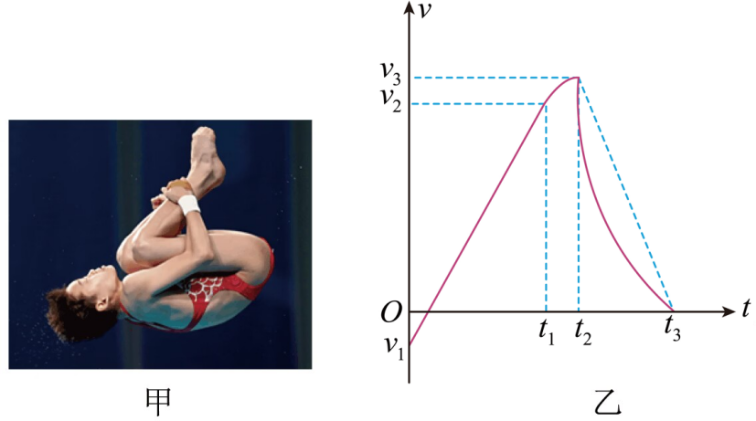

## 讲解

### 判据

给定速度—时间图像，要求位移、路程、平均速度，或比较不同时间段的位置变化时，关注图线与时间轴之间的面积。先确认纵轴是速度v，不能把x-t面积或a-t面积也当位移。

### 流程

**先读正方向与速度符号。** 图线在时间轴上方表示沿正方向，在下方表示反方向；斜率正负表示加速度，不能替代速度正负判断运动方向。原例向下为正，开始的负速度表示向上运动。

**在过零及运动规律改变处分段。** 过零前后位移符号可能不同，直线与曲线阶段也要分开读。最高点对应第一次v=0；水面接触对应受力及加速度改变，通常不是v=0时刻。

**算有向面积。** 上方面积取正，下方取负，位移为代数和；路程把每块面积的大小相加。矩形用底×高，三角形用底×高/2，直线梯形用两端速度平均×时间。曲线不能无依据套梯形，可比较其与直线所围面积，或按题设另求。

$$\Delta x=S_+-S_-,\qquad s=S_++S_-,\qquad \bar v=\frac{\Delta x}{\Delta t}$$

其中S₊、S₋为时间轴上、下两部分的正面积大小，单位均为m。若求末位置，再将有向位移加到初位置；图线相交只代表速度相等，不直接代表相遇。

**用同一时间比较平均速度。** 时间相同，平均速度大小取决于有向位移。原题入水后实际速度曲线低于端点连线，所以面积小于对应梯形，平均速度也小于端点平均；不需要虚构曲线方程。

## 例题

> 题目与解析：高一上物理第二章  单元测试·提升卷（解析版）.docx，来源ID S14，第29—38段。题目背景与原资料标注照录。

3．如图甲为跳水运动员离开跳台开始下落的瞬间，整个过程速度随时间变化的情况如图乙所示，选向下为正方向，下列结论正确的是（　　）

A．在$t_2$时刻运动到最高点

B．在$0\text{—}t_2$时间内，加速度先减小后增大

C．在$t_2\text{—}t_3$时间内，平均速度小于$\frac{v_3}{2}$

D．运动员在$t_3$时刻与水面接触

**原资料答案：** C

**原资料详解：** 

A．由$v\text{-}t$图像面积意义可知，当速度第一次为0时，运动员达到最高点，在$t_2$时刻不是最高点，故A错误；

B．$v\text{-}t$图像的斜率表示加速度，在$0\text{—}t_1$时间内，图像斜率恒定，即加速度恒定，$t_1\text{—}t_2$时间内，图像斜率减小，即加速度减小，故B错误；

C．$v\text{-}t$图像与坐标轴所围的面积表示位移，由图像可以看出，实际图线在$t_2\text{—}t_3$时间内围的面积小于虚线（匀减速到零）所围面积，平均速度等于位移与所用时间的比值，所以此段时间内的平均速度小于此段时间内匀减速到零的平均速度$\frac{v_3}{2}$，故C正确；

D．从运动员离开跳台开始计时，取竖直向下为正方向，由$v\text{-}t$图像可读出$0\text{—}t_2$时间内速度先为负值，后为正值，则速度方向先向上后向下，$t_1$时刻与水面接触，故D错误。

故选C。

### 顺着本题再看清一步

**答案：C。** A最高点在最先过零处，图中t₂处速度v₃>0、已经向下，所以错误。B在0—t₁图线斜率恒定，不是先减小；t₁—t₂正斜率逐渐变小，故题述先减小后增大不符。C在t₂—t₃，速度从v₃降到0且曲线位于虚线下方，正面积小于v₃(t₃−t₂)/2，除同一时长就得平均速度小于v₃/2。D在t₁处图线斜率开始改变，表示接触水后受力改变；t₃是随后速度减到零的时刻。原图以过渡区示意接触过程，这一定位沿用原解析。

## 易错

- 全程含负速度，直接把各面积都相加会得到路程，而非位移。
- 速度曲线弯曲不代表运动路径弯曲；纵轴描述速度值，不是空间位置。
- 原解析B项“斜率减小”讨论入水过渡前的正斜率；负斜率若靠近零，代数值反而增大，需分清a和|a|。
