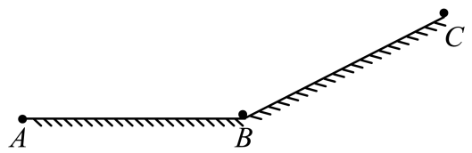

## 讲解

### 判据

题目明确直线运动且某一段a恒定，并给速度、时间、位移中的若干量，要求其余量时，先选合适基本式。若含匀速、加速、减速、停车等多个阶段，要先拆段：每段能用哪些式子，由该段条件决定。

### 流程

**先定义这一段的起点与正方向。** 把v₀、v、a、x、t各归到同一段；加速度用带符号的数。题目给“加速度大小”时，方向须另判，不能直接把正值填进一切公式。

**列已知、未知，选能消去无关量的式子。** 求末速度且已知a、t，用v=v₀+at；求位移且已知v₀、a、t，用x=v₀t+at²/2；没给时间、给两速度和a，用v²−v₀²=2ax；两端速度已知但a未知，恒加速度条件允许用x=(v₀+v)t/2。这些式子来自同一组规律，选择的目的在于少引入未知量。

**把阶段衔接量传过去。** 前段末速度是后段初速度的依据，前后方向不同时要重新说明正方向；位移总和也要区分有向位移与题设的路径长度。原例水平加速段先求vB，再把这个速度大小用于斜面减速段。

**解后检查公式是否越界。** 速度若算成负值，先判断实际运动允许反向还是已经停车。开方求速度有正负两支，应由方向决定。最后看单位及数量级：位移式的两项都应以m计，a乘t得到m/s。

不能仅根据“没给某量”机械选式。例如a=0时速度—位移式只剩v²=v₀²，无法由它求位移；应回到匀速关系。

## 例题

> 题目与解析：第二章  匀变速直线运动的研究（知识清单）（答案版）.docx，来源ID S06，第285—292段。题目背景与原资料标注照录。

【例4】如图所示，一可视为质点的玩具小汽车，在路面ABC上运动，小汽车从A点由静止启动，在水平段AB做加速度大小为${a}_{1}=2\,\mathrm{m}/{s}^{2}$的匀加速直线运动，运动时间${t}_{1}=6\,\mathrm{s}$；在斜面段BC，做匀减速直线运动，到达C点的速度恰好为零。假设经过B点前后瞬间，小汽车的速度大小不变。已知：ABC总长度为${x}_{0}=60\,\mathrm{m}$。求：

(1)小汽车经过B点速度大小；

(2)小汽车在斜面BC段的运动时间。

**原资料解析：** (1)小汽车经过B点速度大小为${v}_{B}={a}_{1}{t}_{1}=2{m/s}^{2}\times 6\,\mathrm{s}=12\,\mathrm{m/s}$

(2)AB长度为${x}_{AB}=\frac{1}{2}{a}_{1}{t}_{1}^{2}=\frac{1}{2}\times 2\times {6}^{2}m=36\,\mathrm{m}$

${x}_{BC}={x}_{0}-{x}_{AB}=60\,\mathrm{m}-36\,\mathrm{m}=24\,\mathrm{m}$BC段的平均速度为${\bar v}_{BC}=\frac{0+{v}_{B}}{2}=\frac{0+12}{2}m/s=6\,\mathrm{m/s}$

小汽车在斜面BC段的运动时间为${t}_{BC}=\frac{{x}_{BC}}{{\bar v}_{BC}}=\frac{24}{6}s=4\,\mathrm{s}$

### 顺着本题再看清一步

**原题结果：** (1)12 m/s；(2)4 s。AB阶段有a₁和t₁，直接用vB=a₁t₁；AB长度另由xAB=a₁t₁²/2算出。BC长度来自总路径减去AB，不需要另设一个未知加速度。看到BC末速度零，且本段匀减速，可取端点平均速度vB/2；用24 m除6 m/s求4 s。若把整个ABC当单一匀变速段，起末速都是0，却有60 m路径，错误就出在忽略了阶段条件。

## 易错

- AB与BC的加速度不相同，也不沿同一方向，必须分段。
- 原题只说经过B点速度大小不变，应以这个大小作后段的初始条件，不能说整个矢量方向不变。
- 全程平均速度不由0、0两端速度相加除2得到，阶段中明显走过非零路径。
