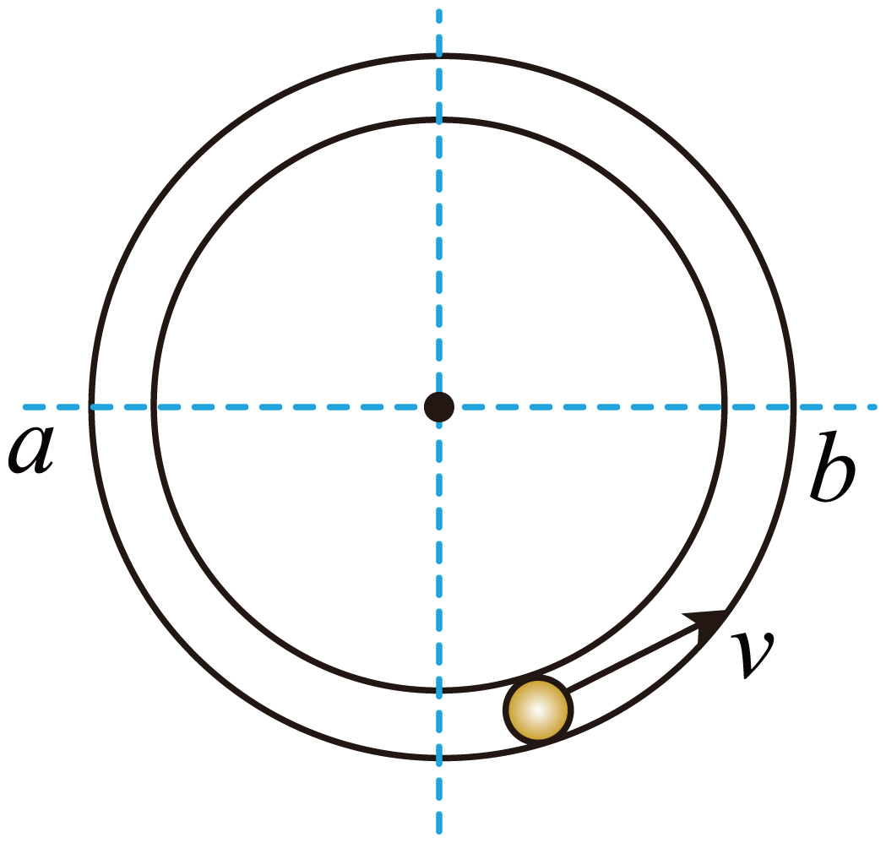

## 错法

无论轻绳、轻杆还是圆管，都在最高点令弹力为零，得到最小速度√(gr)。错误发生在没有检查约束允许的力方向，就使用同一临界条件。

轻绳不能向上推球，所以速度太小时会松弛；杆或内侧管壁却能向上作用，抵消部分向下重力，仍允许较小的径向合力。

## 正解

最高点向下为正，约束力Q取有符号值：

$$mg+Q=m\frac{v^2}{r}$$

绳要求Q≥0，因此v²≥gr。杆、窄管允许Q为负，所以可以在v²<gr时给向上的作用。Q＝0对应v＝√(gr)，它是作用方向切换的位置，并不必然是杆管速度的下限。

管道最高点的弹力大小是|mv²/r−mg|。低于√(gr)时，随速度增大，向上支持的大小减小；等于该速度时为零；再增大则换向内的作用，大小增大，所以“速度越大弹力一定越大”也错。

原资料称杆管最高点最小速度可以为0，应理解为局部约束允许的临界下限；不能因此保证物体真的以零速在有限时间连续越过最高点。要判断完整绕行，仍需核验初始条件和整个运动过程。

## 例题

> 题目与解析：第六章 圆周运动（知识清单）（答案版）.docx，来源ID S06，第310—319段。题目背景与原资料标注照录。

【针对训练5】如图所示，小球在竖直放置的光滑圆形管道内做半径为$r$的圆周运动，小球直径略小于管道内径，ab为过圆心的水平线，已知重力加速度为g。则小球（　　）

A．经最高点的最小速度为$\sqrt{gr}$

B．经最高点的速度越大，对管壁的弹力一定越大

C．在ab上方运动时，对内侧管壁可能有作用力

D．在ab下方运动时，对内侧管壁可能有作用力

**原资料答案：** C

**原资料详解：** AB．在最高点，当速度$v<\sqrt{gr}$时，内壁对小球有支持力，根据牛顿第二定律可得$mg-F_N=m\frac{v^2}{r}$，解得$F_N=mg-m\frac{v^2}{r}$当速度越大时，支持力越小，结合牛顿第三定律可知，对管壁的弹力越小。当$mg=F_N$时，速度有最小值0，故AB错误；

C．小球在过圆心的水平线$ab$上方运动时，小球的速度如果比较小，靠重力和内侧管壁的支持力提供向心力，C正确；

D．在$ab$下方运动时，受到的向心力指向圆心，而重力沿半径方向的分力背离圆心，故小球还必须受到外壁的支持力，对内侧管壁没有作用力，D错误。故选C。

### 顺着本题再看清一步

原题答案C。A的√(gr)来自单向向内约束，管道可换侧壁，错。B忽略低速区弹力随速度增大反而减小，错。C：在上半圆低速时，内侧壁可向外支持以抵消部分重力径向分量，对。D：在下半圆重力径向分量向外，需要外侧壁向内推，不能由内侧壁向外推提供，错。
