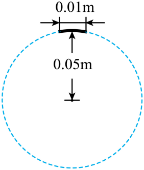

## 讲解

### 是什么

向心力是按作用效果命名的径向向内的力。匀速圆周运动中，物体合外力全部指向圆心，它就是向心力；非匀速圆周运动中，只有合外力的径向分量提供向心作用，切向分量还会改变速率。

向心力不是与重力、弹力、摩擦力并列的一种新力。它可以由一个真实力、几个真实力的合力，或这些力的径向分量提供。

### 怎么来的

圆周轨迹要求速度方向持续转动，对应向内的径向加速度v²/r。将这个径向加速度代入第二定律，得到所需径向合力：

$$F_{\mathrm{径向合}}=m\frac{v^2}{r}=m\omega^2r$$

m单位kg、v单位m/s、r单位m，结果单位N。“所需”是由当前速度和半径决定的要求；能否实际保持圆周运动，还要看真实外力能否提供。

最高点的轻绳小球，圆心在下方，重力与绳拉力都指向圆心，所以mg+T＝mv²/r。最低点圆心在上方，则是T−mg＝mv²/r。正负来自当地点的径向方向，不来自固定的“重力总要减”。

### 什么时候能用

先画真实受力图，确定圆心和半径，再将各真实力向径向投影。写“哪些力合起来等于mv²/r”，不在受力图里再画一个独立向心力。

水平弯道可由静摩擦提供向心作用；拱桥顶端可由重力减支持力提供；圆锥摆由绳拉力的水平分量提供。重力是否全部参与，要看它与径向的关系。

速度随时间变化时仍可在瞬时写径向方程，但不能认为合外力只有径向分量。绳只能拉、接触面只能推，求出的径向条件还要满足这些真实约束。

## 例题

> 题目与解析：高一下物理第六章  单元测试·基础卷（解析版）.docx，来源ID S10，第73—86段。题目背景与原资料标注照录。

7．某同学用不可伸长的轻质细线系一个质量为0.1kg的小球，使它在竖直面内绕一固定点做圆周运动。在小球经过最高点附近时拍摄了一张照片，曝光时间为0.02s。如图，由于小球运动，在照片上留下了一条长度约等于0.01m的径迹。圆周的半径在照片中的长度为0.05m，实际长度为0.2m。忽略空气阻力，重力加速度g取10m/$\mathrm{s}^{2}$。则小球过最高点时（　　）

A．速度约为10m/s

B．仅受重力

C．所需的向心力约为1N

D．受到细线的拉力约为1N

**原资料答案：** D

**原资料详解：** 

A．圆周的半径在照片中的长度为0.05m，实际长度为R=0.2m，令长度约等于0.01m的径迹实际长度为x，则有$\frac{x}{0.01\,\mathrm m}=\frac{0.2\,\mathrm m}{0.05\,\mathrm m}$

小球过最高点的速度约为$v=\frac{x}{\Delta t}$

解得v=2m/s，故A错误；

B．结合上述，小球在最高点所需向心力$m\frac{v^2}{R}=2\,\mathrm N>mg=1\,\mathrm N$

可知，小球在最高点受到重力与细线的拉力，故B错误；

C．结合上述可知，所需的向心力约为2N，故C错误；

D．小球在最高点时，根据牛顿第二定律有$mg+T=m\frac{v^2}{R}$

解得T=1N，故D正确。

故选D。

### 顺着本题再看清一步

照片半径0.05 m对应实际0.2 m，比例4倍，0.01 m径迹对应实际约0.04 m；除以曝光时间0.02 s得v约2 m/s。所需径向合力0.1×2²/0.2＝2 N，重力为1 N，最高点mg+T＝2 N，得T＝1 N。A速度10 m/s错误；B只受重力错误；C把合力写1 N错误；D拉力约1 N正确。这个速度是短曝光估计，原题也使用“约”。

## 易错

原题C把所需向心力2 N和绳拉力1 N混同；B漏绳力。照片上的长度不是实际长度，先按半径比例换算，曝光期间近似用小段径迹估计最高点速率。
