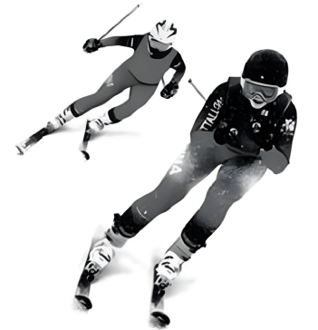

## 讲解

### 是什么

向心加速度是圆周运动加速度朝圆心的径向分量，记a_n，单位m/s²。匀速圆周运动没有切向加速度，总加速度就是向心加速度；大小不变，但方向随着位置一直改变。

非匀速圆周运动除径向分量，还存在改变速率的切向分量。不能只写a_n就把它当成全部加速度大小。

### 怎么来的

取两个很近时刻，匀速圆周运动的速度大小都为v，两条速度方向随半径转过同一小角。把速度矢量尾端重合，速度变化量是两个箭头端点之间的短边；速度三角形与相应的半径小角三角形相似。

因此很短时间内，速度变化量大小与v之比，近似等于通过弧长与r之比。两边乘v，再除以同一时间间隔：

$$\frac{|\Delta\vec v|}{\Delta t}\approx\frac vr\frac{\Delta s}{\Delta t}$$

时间间隔趋于零时，右边的弧长变化率趋于v，速度变化方向趋向圆心，于是

$$a_n=\frac{v^2}{r}=\omega^2r$$

第二个等号是把v＝ωr代入v²/r，得到ω²r²/r＝ω²r。这说明加速度并不要求速率改变，方向改变本身也会产生加速度。

### 什么时候能用

比较a_n与半径时先看固定量：固定v，a_n与r成反比；固定ω，a_n与r成正比。两个式子不矛盾，因为改变半径时保持的运动条件不同。

同轴固定转动的点ω相同，离轴越远a_n越大；同速率在不同弯道转弯，半径越小a_n越大。质量不出现在运动学表达式里，但提供同样加速度所需的力随质量变化。

匀变速运动要求加速度矢量恒定。匀速圆周虽然a_n大小恒定，方向持续变，不属于匀变速运动，不能把直线恒加速度式用于整段圆周位移。

## 例题

> 题目与解析：高一下物理第六章  单元测试·提升卷（解析版）.docx，来源ID S14，第6—13段。题目背景与原资料标注照录。

1．赤峰市喀喇沁旗的美林谷滑雪场被誉为“东方雪源圣地”，为游客们带来前所未有的滑雪体验。如图为游客滑雪的精彩瞬间，游客在匀速率通过圆弧弯道的过程中（　　）

A．速度不变

B．加速度不变

C．所受合力为零

D．所受合力不为零

**原资料答案：** D

**原资料详解：** 

A．运动员做匀速圆周运动，速度沿切线方向，速度大小不变，但方向一直改变，故A错误；

B．运动员做匀速圆周运动，合外力提供向心力，方向指向圆心，故合外力不是恒力。由牛顿第二定律可知，合力方向变化，加速度方向也变化，故B错误；

CD．运动员做匀速圆周运动，合外力提供向心力，大小不变，方向指向圆心，故合外力不为$0$，故C错误；D正确；

故选D。

### 顺着本题再看清一步

运动员匀速率绕圆弧，速度沿切线且切线方向变，所以A错；加速度沿指向圆心的半径且方向变，所以B错；a_n＝v²/r非零，固定质量下合力非零，C错、D对。原题答案D。

## 易错

原题A把速率不变写成速度不变；B把加速度大小恒定写成加速度矢量不变；C把有向心加速度的运动写成合力为零。D才正确。
