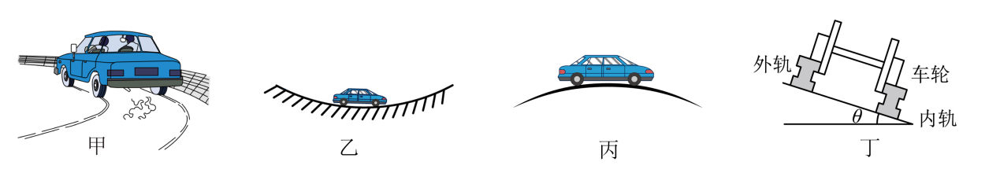

## 讲解

### 是什么

离心运动是原来做圆周运动的物体，在向心约束突然消失或不足后，沿切线飞出或逐渐远离原圆心的运动。本条在地面惯性系近似下分析，不把“离心力”另列为物体受到的真实外力。

如果所有外力突然消失，物体保留当时切线速度做匀速直线运动；如果仍有重力等力，之后轨迹由剩余真实力决定，可能是抛物线，不能说所有离心运动都全程走直线。

### 怎么来的

要维持半径r、速率v的圆周轨迹，需要径向合力mv²/r。静摩擦、绳拉力等提供的是实际可达到的约束力。转速增加，所需径向力增加；实际作用达不到要求，就无法继续保持原圆周轨迹。

水平路面匀速转弯，忽略其他水平力时，静摩擦承担向心作用。若最大静摩擦为μ_smg，可保持原轨迹的条件是：

$$m\frac{v^2}{r}\leq\mu_smg$$

先约去m，再乘r，得到v²≤μ_sgr。超出这个条件，轮胎与地面发生滑动，实际运动不能再沿原设定的圆弯道分析。

### 什么时候能用

判断转弯侧滑、圆盘物体滑动、绳断后的去向，先分清“需要多少径向力”和“真实力最多能提供多少”。失去约束的第一瞬间速度仍沿原轨迹切线，不沿半径向外突然跳变。

脱水、离心分离利用不同物体对共同转动约束的响应差异；具体效果还受装置和材料条件影响，不需要假定地面惯性系中有一个新增的外向力。

道路题同时可能包含拱桥、凹桥。压力大小由竖直径向受力决定，不是看到“速度快”就统一判压力增大：凹桥最低点支持力增大，拱桥最高点支持力减小。

## 例题

> 题目与解析：高一下物理第六章  单元测试·基础卷（解析版）.docx，来源ID S10，第59—72段。题目背景与原资料标注照录。

6．我国公路、铁路里程均居世界前列，下列关于汽车、火车行驶中的实例分析，说法正确的是（　　）

A．图甲中，汽车在水平弯道上转弯时发生侧滑，是因为受到的离心力过大

B．图乙中，汽车通过凹形桥最低点的速度越大，越容易发生“爆胎”

C．图丙中，汽车通过拱桥顶端的速度越大，汽车对桥面的压力就越大

D．图丁中，火车以大于规定速度经过外轨高于内轨的弯道，火车对内轨有侧压力

**原资料答案：** B

**原资料详解：** 

A．汽车在水平弯道上转弯时发生侧滑，是因为弯道提供向心力不足，汽车做离心运动，不是受到离心力，故A错误；

B．根据向心力公式$F_N-mg=m\frac{v^2}{R}$

汽车通过凹形桥最低点的速度越大， 轮胎受到的支持力越大，即越容易发生“爆胎”，故B正确；

C．根据向心力公式$mg-F_N=m\frac{v^2}{R}$

汽车通过拱桥顶端的速度越大，汽车受到的支持力越小，即对桥面的压力就越小，故C错误；

D．火车以大于规定速度经过外轨高于内轨的弯道，火车对外轨有侧压力，故D错误。

故选B。

### 顺着本题再看清一步

A：侧滑是可提供的向心作用不足，错。B：最低点N−mg＝mv²/r，v越大N越大，轮胎受力更大，对。C：最高点mg−N＝mv²/r，v越大N越小，错。D：大于无侧压的设计速度时，需要更多向内作用，火车挤压外轨以取得额外向内力，不是内轨，错。故选B。

## 易错

原题A错误在地面惯性系里另造离心力；C把拱桥顶端支持力与速度的关系弄反；D把超过规定速度的侧向挤压对象弄反。B在题设模型内因最低点支持力增大而增加爆胎可能性，不等于必然爆胎。
