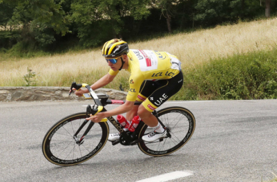

## 讲解

### 是什么

线速度描述物体沿轨迹运动的快慢和方向。圆周运动中，速度方向沿圆周在该点的切线，大小用v表示，单位m/s；切线方向随所在位置改变。

一段时间里通过的弧长Δs除以Δt，是该段的平均速率。匀速圆周运动时速率恒定，这个比值就等于线速度大小；一般变速圆周运动要取很短时间间隔的极限，才能得到瞬时线速度大小。

“匀速圆周”中的匀速指速率不变，不是速度矢量不变。方向一直转，所以仍有加速度。

### 怎么来的

圆周上两个邻近位置之间的位移沿短弦，时间间隔很小时，短弦方向趋近切线；对应弧长与短弦长度也趋于相同。因此瞬时速度沿切线，其大小由很短时间内通过的弧长决定。

匀速圆周运动一周走过2πr，时间为周期T，所以

$$v=\frac{2\pi r}{T}$$

r是到转轴的距离，单位m，T单位s。若用角速度ω表示，弧长等于半径乘弧度角，同一时间内相除得到v＝ωr。

### 什么时候能用

题给匀速圆周运动的弧长和时间，可直接求v；题给周期、半径，可用一周路程求v。不要把一周的位移为零当成一周速率为零：平均速度和平均速率不同。

同轴刚性转动的点角速度相同，半径大则线速率大；不打滑皮带带动的两个轮缘，接触处线速率相同，角速度则要除以各自半径。比较线速率时必须先确认固定的是哪一个量。

若把一段圆弧的首尾直线距离代替弧长，会低估该段路程；只有很短弧段估计瞬时速度时，才可近似用短弦。

## 例题

> 题目与解析：高一下物理第六章  单元测试·基础卷（解析版）.docx，来源ID S10，第182—192段。题目背景与原资料标注照录。

13．（8分）一质量为m运动员在水平弯道上训练骑行，可将其运动视为匀速圆周运动，自行车骑行转弯半径为R，在骑行的时间t内走过的圆弧长为l，自行车质量为M，不计空气阻力。

（1）运动员做圆周运动的线速度大小；

（2）地面对自行车摩擦力大小。

**原资料答案：** （1）$\frac lt$；（2）$\frac{(M+m)l^2}{Rt^2}$

**原资料详解：** （1）运动员在水平弯道上做匀速圆周运动，在骑行的时间t内走过的圆弧长为l，则运动员的线速度大小为

$v=\frac lt$

（2）根据牛顿第二定律可得

$f=(M+m)\frac{v^2}{R}$

联立解得地面对自行车摩擦力大小为

$f=\frac{(M+m)l^2}{Rt^2}$

### 顺着本题再看清一步

第(1)问由匀速率和路程定义得到v＝l/t。第(2)问以人和车为整体，地面水平静摩擦提供向心作用：

$$f=(m+M)\frac{v^2}{R}=(m+M)\frac{l^2}{Rt^2}$$

代入的是实际沿弯道的线速率，而不是角速度；重力和支持力在竖直方向平衡，没有再各加一个“向心力”。

## 易错

原题给的是圆弧长l，可用l/t；不是把起终点直线距离除以t。摩擦力需要提供运动员和车整体的向心作用，所以质量用m+M，不能只用运动员m。
