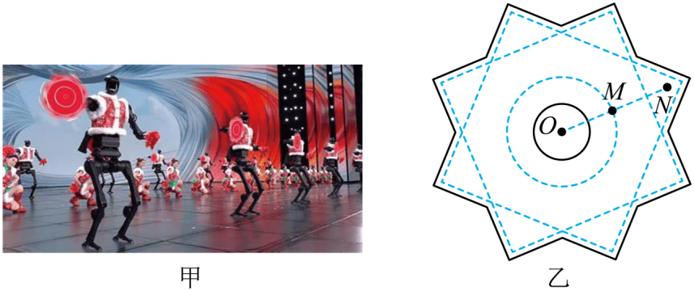

## 讲解

### 是什么

角速度描述半径转动的快慢。以ω表示，大小是半径在单位时间内转过的弧度角，单位rad/s。匀速圆周运动可用任意时间段的Δθ/Δt；非匀速转动则需取很短时间的极限得到瞬时值。

同一个刚性转盘上的各点，每段时间转过相同角度，因此角速度相同；不同半径的点走过的弧长不同，所以线速度大小一般不同。位于转轴上的点位置不动，v为零，但刚体仍有整体角速度。

### 怎么来的

弧度角的定义是弧长除以半径，故Δs＝rΔθ。把两边同时除以相同时间Δt，得到

$$v=r\omega$$

这里角度必须用弧度；若给度数，先将整周360°对应到2π rad，不能把数值360直接代进v＝ωr。

一周转过2π rad，用时T，所以ω＝2π/T。若转速n以每秒圈数表示，一秒转n圈，每圈2π rad，于是ω＝2πn。角速度不是每秒圈数本身，两者相差2π。

### 什么时候能用

同轴且刚性连接的点，以相同角速度比较线速度：v与r成正比；皮带传动无滑动，先用轮缘线速度相同，再得角速度与轮半径成反比。

说角速度相同，一般先比较大小；转动方向也要单独看图。同轴固定转动方向相同，外啮合齿轮则方向相反。不打滑开放式皮带与交叉皮带的转向也不同，不能只记“皮带一定同向”。

若物体之间可以相对转动，只是几何上同轴而未固定连接，不能据此保证角速度相同。本条高中平面题主要使用角速度大小，轴向矢量的完整表述不在这里展开。

## 例题

> 题目与解析：高一下物理第六章  单元测试·基础卷（解析版）.docx，来源ID S10，第28—33段。题目背景与原资料标注照录。

3．如图甲，2025蛇年春节联欢晚会上，人机共舞节目《秧BOT》中转手绢的环节吸引了无数观众的目光。如图乙，手绢上O、M、N三点共线，M为ON的中点，若手绢绕中心O点匀速转动，则M、N两点的线速度大小之比为（　　）

A．1∶2

B．1∶3

C．1∶4

D．1∶5

**原资料答案：** A

**原资料详解：** 手绢绕中心O点匀速转动起来，M、N两点的角速度相等，根据$v=\omega r$可知，M、N两点的线速度大小之比为$1:2$。

故选A。

### 顺着本题再看清一步

原题答案A。同一手绢绕O整体转动，M、N同时间转过同角度；先确定ω相同，再用v＝ωr。约去相同ω，v_M/v_N＝OM/ON＝1/2。先判断固定量，再比较半径，才能知道使用正比还是反比。

## 易错

原题M是ON中点，半径比1∶2，角速度相同而线速率比1∶2。B、C、D的其他比例没有依据；不能因所有点都随手绢一起转，就令线速度大小相等。
