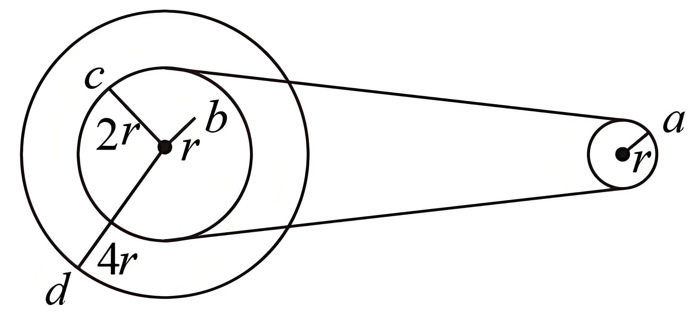

## 讲解

### 判据

先辨认连接方式：刚性固定同轴转动，角速度相同；无滑动皮带接触的轮缘，线速率相同；外啮合齿轮节圆接触处线速率相同，但两轮转向相反。

关键不是“这些点都在轮子上”，而是某两点间究竟由哪种约束连接。一个系统内可能同时存在同轴和皮带两类关系，须分两步传递。

### 流程

1. **标每个点的实际半径。** 本例a距右轴r，b距左轴r，c距左轴2r，d距左轴4r。b不在小轮边缘，不能把它和带接触点c混同。
2. **先找皮带直接连接的轮缘。** 不打滑给出v_a＝v_c；并不是右轮与左大轮d的线速率相同。
3. **再找同轴固定的点。** b、c、d都随左轮轴一起转，所以ω_b＝ω_c＝ω_d。它们线速率分别与各自半径成正比。
4. **用v＝ωr传播到目标。** 先由c半径是b两倍得v_c＝2v_b，再接上v_a＝v_c，得到v_a＝2v_b。a、b半径相同，才进一步得到ω_a＝2ω_b。
5. **比较加速度时重新代式。** d半径是a的4倍，但ω_d是ω_a的一半；a_n＝ω²r同时含平方和半径，不能只用半径比或角速度比中的一个。
6. **另查转向。** 开放皮带通常使两轮同向，交叉皮带反向；题只问大小时，仍不要把方向相同作为无滑动的唯一条件。

同轴关系依赖固定连接，皮带关系依赖不打滑。约束改变，原等式也要改变。

## 例题

> 题目与解析：第六章 圆周运动（知识清单）（答案版）.docx，来源ID S06，第146—155段。题目背景与原资料标注照录。

【例2】如图所示为一皮带传动装置，右轮的半径为r，a是它边缘上的一点，左侧是一套轮轴，大轮的半径为4r，小轮的半径为2r。b点在小轮上，到小轮中心的距离为r。已知c点和d点分别位于小轮和大轮的边缘上，若在传动过程中皮带不打滑，则以下判断正确的是（　　）

A．a点与b点的线速度大小相等

B．a点与b点的角速度大小相等

C．a点与c点的线速度大小相等

D．a点的向心加速度是d点的4倍

**原资料答案：** C

**原资料详解：** AC．由于$a$、$c$两点是皮带传动两轮子边缘上的两点，则a点与c点的线速度大小相等，$b$、$c$两点为共轴的轮子上两点，则b点与c点的角速度相等，根据$v=r\omega$可得$v_c=2v_b$（因为$r_c=2r_b$），因此$v_a=2v_b$，故A错误，C正确；

B．以上分析可知$v_a=2v_b$，则有$r_a\omega_a=2r_b\omega_b$又因为$r_a=r_b$联立解得$\omega_a=2\omega_b$，故B错误；

D．由于$b$、$d$两点是共轴轮子上的两点，则b点与d点的角速度相等，因为$\omega_a=2\omega_b$，则有$\omega_a=2\omega_d$，而$r_d=4r_a$，根据公式$a=r\omega^2$可得$a_a=a_d$，故D错误。故选C。

### 顺着本题再看清一步

原题答案C。A：v_a＝v_c＝2v_b，非相等；B：r_a＝r_b但v_a＝2v_b，故ω_a＝2ω_b，非相等；C：a、c正是皮带连接轮缘，正确。

D用同轴关系ω_d＝ω_b＝ω_a/2和r_d＝4r_a：

$$a_d=\left(\frac{\omega_a}{2}\right)^2(4r_a)=\omega_a^2r_a=a_a$$

所以a点加速度是d点的1倍，非4倍。传动问题中同一个字母a既可指点名也常指加速度，正文下标用来明确所指位置。

## 易错

原题A把b误当皮带接触点；B只看a、b半径相同而忽略角速度不同；D只看半径比，漏掉角速度平方。C才是无滑动直接给出的等速率关系。
