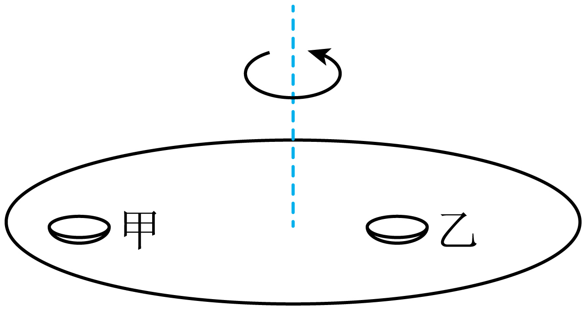

## 讲解

### 判据

物体相对水平转盘静止、只由静摩擦提供水平向心作用时，比较所需mω²r与最大静摩擦。相对盘静止不等于相对地面静止，摩擦也不因“相对静止”而为零。

先确认物体没有其他水平拉力，转盘在所分析时刻近似匀速；若有明显角加速度，摩擦还需提供切向作用，不能只用径向需求判断全部摩擦。

### 流程

1. **选地面参考系看运动。** 盘子随桌旋转，对地做圆周运动；竖直无加速度，N＝mg，水平静摩擦朝圆心。
2. **先求需要的摩擦。** 在随盘匀速转动阶段，f＝mω²r。静摩擦随需求调节，不是从开始就等于μmg。
3. **求可提供的上限。** 题设最大静摩擦等于滑动摩擦，记共同系数μ，则f最大＝μmg。比较时不要把实际f与上限混同。
4. **列保持相对静止条件。** mω²r≤μmg。约去共同质量m，再除以r，得到ω²≤μg/r；临界角速度ω_c＝√(μg/r)。
5. **同材料比较谁先滑。** 其他条件相同，半径越大ω_c越小；同一桌面ω相同，外侧盘先达到临界。质量在这个简化模型中约掉，不意味着任何摩擦问题都与质量无关。
6. **越过临界后更换模型。** 一旦相对滑动，不能继续强行让物体角速度等于桌面角速度；摩擦应按相对运动方向判断，轨迹也不再固定为原圆。

原题逐渐提高转速的标准解采用逐时刻近似匀速的临界分析。若提速很快，应把静摩擦承担的切向作用一起计入，径向判据不能单独决定临界。

## 例题

> 题目与解析：第六章 圆周运动（知识清单）（答案版）.docx，来源ID S06，第275—286段。题目背景与原资料标注照录。

【例4】7．如图所示，材料相同的甲、乙两个盘子放置在匀速旋转的餐桌上，并相对餐桌保持静止，其中甲盘比乙盘距离餐桌中心远。已知最大静摩擦力等于滑动摩擦力，下列说法正确的是（　　）

A．若甲、乙两个盘子的质量相等，则两盘受到的摩擦力大小相等

B．甲、乙两个盘子的线速度大小相等

C．盘子的质量越小，越容易相对餐桌滑动

D．若餐桌的转速逐渐增加，甲盘先相对餐桌滑动

**原资料答案：** D

**原资料详解：** 

A．盘子做匀速圆周运动，甲、乙角速度ω相同，甲的转动半径r更大，分析可知二者的静摩擦力提供向心力，则有$f=m\omega^2r$可知若二者质量相等，甲受到的摩擦力更大，故A错误；

B．根据线速度$v=\omega r$由于甲的转动半径更大，所以甲的线速度更大，故B错误；

C．当盘子即将滑动时，最大静摩擦力提供向心力，即$\mu mg=m\omega_0^2r$解得临界角速度$\omega_0=\sqrt{\frac{g\mu}{r}}$

可见临界角速度与质量m无关，因此盘子是否容易滑动与质量无关，故C错误；

D．因为临界角速度$\omega_0=\sqrt{\frac{g\mu}{r}}$可知转动半径r越大，临界角速度越小。甲的转动半径更大，所以当餐桌转速逐渐增加时，甲先达到临界角速度，先相对餐桌滑动，故D正确。故选D。

### 顺着本题再看清一步

原题选D。A：质量相同时f与r成正比，甲受摩擦更大，错。B：共同ω下v＝ωr，甲更快，错。C：mω_c²r＝μmg中m约掉，质量不决定本模型的临界角速度，错。D：r甲较大，ω_c甲较小，逐渐增速时甲先达到临界，对。

## 易错

原题A忽略半径不同导致摩擦不同；B把同角速度当同线速率；C没有在所需与上限比较中约去相同质量。D对应外侧盘临界角速度更小。
