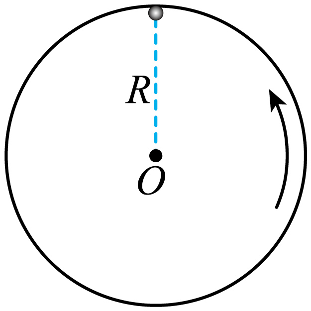

## 讲解

### 判据

最高点先看约束能提供哪个方向的力。轻绳只能向圆心拉；单侧内轨只能向圆心推；轻杆可拉可推；窄管可由不同侧壁给向内或向外的接触力。

必须先检查约束，再谈“最高点最小速度”。同一径向式中，允许的约束力正负不同，速度边界也不同。

### 流程

1. **最高点取向下为径向正向。** 重力mg为正。把约束力用有符号量Q表示，向下为正，径向式为mg+Q＝mv²/r。
2. **轻绳检查Q≥0。** 绳不能向上推小球；令Q＝0得到v²＝gr，所以绷紧绳模型要求v≥√(gr)。单侧内轨也由支持力非负得到同类边界。
3. **杆、管允许Q为负。** 若v²<gr，所需向下合力小于重力，约束必须向上作用来抵消一部分重力。杆可推、管内侧壁可推，均不需要绳模型的正速度下界。
4. **分速度区间看受力方向。** v<√(gr)，约束向上；v＝√(gr)，约束力为零；v>√(gr)，约束向下。若问力的大小，应取有符号Q的绝对值，而不是让“大小”成为负数。
5. **检查题问到达还是越过。** 教材所说杆、管最高点最小速度为0，是可处于最高点的临界下限；不能只凭v＝0保证实际能在有限时间连续越过最高点。完整运动还要满足其他位置的能量和约束条件。
6. **上、下半圆分别看重力径向分量。** 下半圆重力径向分量背离圆心，必须再有向内支持；上半圆重力有向内分量，低速时可以需要内侧壁给向外支持。

最高点条件只是局部可行条件。起点到最高点是否真的能达到，还须按全程条件核验，不能只列最高点一个式子就宣布全程可行。

## 例题

> 题目与解析：第六章 圆周运动（知识清单）（答案版）.docx，来源ID S06，第310—319段。题目背景与原资料标注照录。

【针对训练5】如图所示，小球在竖直放置的光滑圆形管道内做半径为$r$的圆周运动，小球直径略小于管道内径，ab为过圆心的水平线，已知重力加速度为g。则小球（　　）

A．经最高点的最小速度为$\sqrt{gr}$

B．经最高点的速度越大，对管壁的弹力一定越大

C．在ab上方运动时，对内侧管壁可能有作用力

D．在ab下方运动时，对内侧管壁可能有作用力

**原资料答案：** C

**原资料详解：** AB．在最高点，当速度$v<\sqrt{gr}$时，内壁对小球有支持力，根据牛顿第二定律可得$mg-F_N=m\frac{v^2}{r}$，解得$F_N=mg-m\frac{v^2}{r}$当速度越大时，支持力越小，结合牛顿第三定律可知，对管壁的弹力越小。当$mg=F_N$时，速度有最小值0，故AB错误；

C．小球在过圆心的水平线$ab$上方运动时，小球的速度如果比较小，靠重力和内侧管壁的支持力提供向心力，C正确；

D．在$ab$下方运动时，受到的向心力指向圆心，而重力沿半径方向的分力背离圆心，故小球还必须受到外壁的支持力，对内侧管壁没有作用力，D错误。故选C。

### 顺着本题再看清一步

A错：管道内侧壁可向上支持，0作为最高点速度临界下限，不能套√(gr)。B错：低于√(gr)时支持力大小mg−mv²/r随速度增大而减小；超过该值后换外侧壁，支持力大小mv²/r−mg再增大。C对：上半圆低速时可以作用于内侧管壁。D错：下半圆需要外侧壁向内推。故选C。

### 同章另一原题：单侧圆环内轨

> 来源：S06，第299—309段，同章知识清单答案版。用它与上面的双侧管道比较。

【例5】如图所示，质量为m的小球在竖直平面内的光滑圆轨道上做圆周运动。圆半径为R，小球经过圆环最高点时刚好不脱离圆轨。则其通过最高点时（　　）

A．小球对圆环的压力大小等于 mg

B．小球受到的向心力大于 mg

C．小球的线速度大小等于$\sqrt{Rg}$

D．小球的向心加速度小于g

**原资料答案：** C

**原资料详解：** 

A．小球经过圆环最高点时刚好不脱离圆轨，可知，通过最高点时，小球对圆环的压力大小等于0，故A错误；

B．结合上述可知，通过最高点时，小球受到的向心力等于 mg，故B错误；

C．结合上述有$mg=m\frac{v^2}{R}$解得$v=\sqrt{Rg}$，故C正确；

D．结合上述，根据牛顿第二定律可知，通过最高点时，小球的向心加速度等于g，故D错误。故选C。

此题“刚好不脱离”意味着内轨支持力为零，仅重力提供径向作用，a_n＝g、v＝√(Rg)，不是杆或双侧管道的零速度下限。

## 易错

原题A把管道套成绳；B忽略接触壁可能改变，最高点弹力大小先减小到零、再增大，非单调；D把下半圆所需向内支持误认为来自内侧壁。
