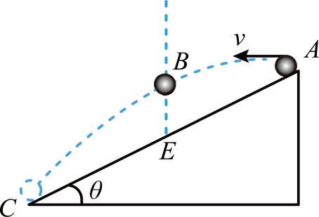

## 错法

“水平初速度大，飞得远，所以飞行时间一定长。”错误发生在把水平射程的变化，直接当作竖直下落时间变化。

另一个相反的错误是记住“时间与初速无关”后，对落在斜面上的所有平抛也这样判断。此时初速度改变落点高度，时间可能随之改变，原结论的固定落差条件已经变了。

## 正解

落在同一水平地面、落差h固定时，竖直分运动先给出：

$$h=\frac12gt^2,\qquad t=\sqrt{\frac{2h}{g}}$$

水平速度不在这个关系里；增大v₀只是让相同时间内水平位移v₀t增大。

若从斜面顶端抛出后落在斜面上，取沿抛出方向水平位移x、竖直向下位移y，斜面满足y＝x tanθ。把x＝v₀t、y＝gt²/2代入：

$$\frac12gt^2=v_0t\tan\theta,\qquad t=\frac{2v_0\tan\theta}{g}\quad(t>0)$$

最后一步约去非零飞行时间t；t＝0是出发点，不是再次落到斜面的时刻。这里飞行时间依赖v₀，因为落差也变了。还要检查所求落点在实际斜面长度内，不能越过底端后继续套无限斜面关系。

判断时间前，先问“终点在哪个面上、落差是否仍相同”，再选择式子。

## 例题

> 题目与解析：高一下物理第五章  单元测试·基础卷（解析版）.docx，来源ID S10，第69—87段。题目背景与原资料标注照录。

7．如图所示，一斜面体固定在水平地面上，在斜面顶端A把一小球水平抛出，小球刚好落在斜面底端C、E点是斜面AC的中点，小球运动轨迹上的B点在E点的正上方，不计空气阻力，小球可视为质点，下列说法正确的是（　　）

A．小球从A运动到B的时间大于从B运动到C的时间

B．增大小球平抛的初速度，小球会落在水平地面上，所用时间比从A运动到C的时间长

C．小球运动轨迹上各点，B点离斜面的距离最远

D．减小小球平抛的初速度，小球落到斜面上时速度与水平方向夹角比落在C处时的小

**原资料答案：** C

**原资料详解：** 

A．由平抛运动知识$x=v_0t$

其中$x_{AB}=x_{BC}$

可知小球从A运动到B的时间等于从B运动到C的时间，故A错误；

B．增大小球平抛的初速度，小球会落在水平地面上，根据$h=\frac12gt^2$可知所用时间等于从A运动到C的时间，故B错误；

C．当速度方向与斜面平行时，小球距离斜面最远，根据$\tan\theta=\frac{gt_1}{v_0}$

其中$\tan\theta=\frac yx=\frac{\frac12gt_{AC}^2}{v_0t_{AC}}=\frac{gt_{AC}}{2v_0}$

可知$t_1=\frac{t_{AC}}2$

由选项A可知$t_{AB}=\frac{t_{AC}}2$

故小球运动轨迹上各点，B点离斜面的距离最远，故C正确；

D．设小球落在斜面上时的速度方向与水平方向的夹角为$\alpha$，根据平抛运动的推论$\tan\alpha=2\tan\theta$

故减小小球平抛的初速度，$\theta$不变，则小球落到斜面上时的速度方向与水平方向夹角$\alpha$不变，故D错误。

故选C。

### 顺着本题再看清一步

原题答案C。A：E是斜面中点，B在它正上方，所以A到B、B到C的水平距离相等，水平匀速给相同时间，错。B：初速增大后越过斜面底端落在水平地面，落差仍是A到地面的固定高度，时间与原来落到C相同，错。C：速度与斜面平行时，垂直斜面的分速度为零，离斜面最远；原解析由时间关系说明正是B，对。D：落在同一斜面时，速度倾角满足tanα＝2tanθ，斜面θ固定，所以倾角不因减小初速改变，错。
