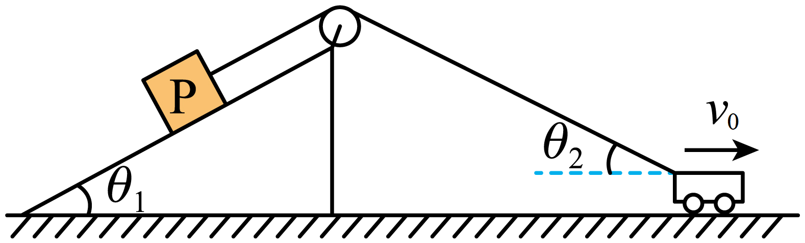

## 错法

看到两个物体由不可伸长的绳连接，就令v_A＝v_B；只要绳不伸长，便认为不管各自运动方向怎样，两端实际速率都一样。

错误发生在把“不改变绳长的约束”，扩成“两个物体全部运动效果都一样”。绳端还可以有垂直于绳的速度，改变绳的方向而不直接改变它的长度。

## 正解

先看绳是否绷紧，再看每个物体的实际速度与所在绳段的夹角。长度增加或减少由沿该绳段的速度投影决定；固定滑轮两段绳的长度变化率大小相等。

本题物块沿绳，车速水平但斜绳不水平，故

$$v_P=v_0\cos\theta_2$$

右边是车速沿车端绳方向的投影，不是把物块速度沿水平方向反投影。θ₂是车端绳与水平夹角，斜面角θ₁在这个速度投影式里没有位置。

车继续远离滑轮时θ₂减小，投影增大，物块加速；小车匀速不能推出物块匀速。求拉力时再用物块的加速度写沿斜面受力式，不能先把加速度设为零。

动滑轮和多段绳要对总长度分别计入各段变化率；刚杆应令两端相对速度沿杆的分量为零。上述关系都不是不看模型的“绳连接必同速”。

## 例题

> 题目与解析：第五章 抛体运动（知识清单）（答案版）.docx，来源ID S06，第256—267段。题目背景与原资料标注照录。

【例4】质量为m的物块P置于倾角为$\theta_1$的固定光滑斜面上，轻质细绳跨过光滑定滑轮分别连接着物块P与小车，物块P与滑轮间的细绳平行于斜面，小车以速率$v_0$水平向右做匀速直线运动。当小车与滑轮间的细绳和水平方向成夹角$\theta_2$时，重力加速度为g，下列判断正确的是（　　）

A．物块P的速率为$v_0\sin\theta_2$

B．物块P的速率为$v_0\cos\theta_1$

C．细绳对物块P的拉力恒为$mg\sin\theta_1$

D．细绳对物块P的拉力大于$mg\sin\theta_1$

**原资料答案：** D

**原资料详解：** 

A．细绳相连的物体，沿绳子方向速度相等，把不沿绳子的小车速度分解为沿绳子方向和垂直于绳子方向，物块$P$速度沿绳子，即物块$P$速度$v_P=v_0\cos\theta_2$，A错误；

Ｂ．由上分析，B错误；

C．小车向右运动，细绳和水平方向的夹角$\theta_2$减小，物块$P$的速度$v_P=v_0\cos\theta_2$在增大，物块$P$加速度沿斜面向上，由牛顿第二定律$F_T-mg\sin\theta_1=ma$，可知细绳拉力大于$mg\sin\theta_1$，C错误;

D．由上分析，D正确。

故选D。

### 顺着本题再看清一步

A的v₀sinθ₂把沿绳、垂直绳投影混淆，错；B的v₀cosθ₁使用了另一端斜面角，错；C忽略角度随时间改变，物块在加速，拉力不等于静止平衡值，错；D符合F_T＝mg sinθ₁+ma且a向上，对。故选D。
