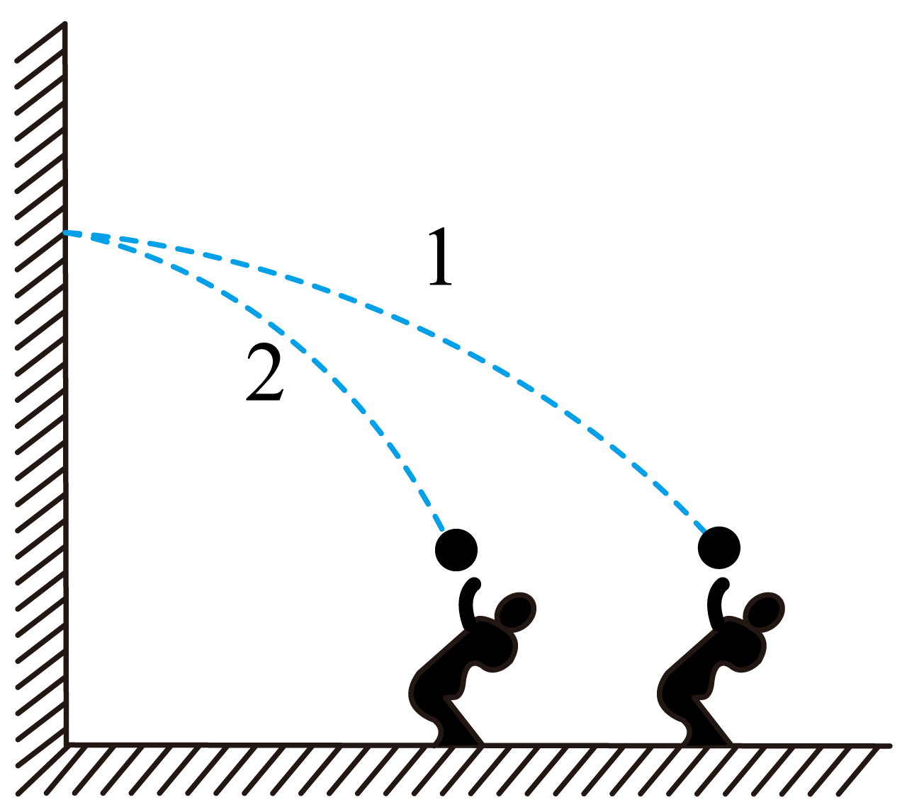

## 讲解

### 是什么

斜抛运动是初速度斜向上或斜向下，随后只受重力的抛体运动。它与平抛的主要区别是竖直初速度不再为零。

取x轴水平向右，y轴竖直向上；斜向上初速v₀与水平夹角为θ，水平初速度v₀cosθ、竖直初速度v₀sinθ。角度和正方向必须同时交代，不能把“sin”“cos”脱离对应的投影方向记忆。

### 怎么来的

先把初速度按直角三角形投影到两轴。受力仍只有竖直重力，故a_x＝0、a_y＝−g。每个方向分别代入给定初速度：

$$x=v_0\cos\theta\,t,\quad y=v_0\sin\theta\,t-\frac12gt^2$$

再用初速度加加速度乘时间，得到当前速度分量：

$$v_x=v_0\cos\theta,\qquad v_y=v_0\sin\theta-gt$$

到最高点，竖直分速度变为零，所以v₀sinθ−gt顶＝0，得到t顶＝v₀sinθ/g。此刻水平分速度仍保留，速度一般不为零；重力仍在，加速度仍向下。

把t顶代入y式，两项分别是v₀²sin²θ/g与v₀²sin²θ/(2g)，相减得到最高点相对发射点高度v₀²sin²θ/(2g)。高度来自竖直初速度，水平初速度影响横向位置。

### 什么时候能用

最高点前的上升段可以逆向看成从最高点水平抛出的运动；这依赖恒重力、无空气阻力和速度反向的理想模型，是同一条轨迹的逆向分析，不表示真实重力方向翻转。

发射点与落点等高时，竖直运动具有对称性，总时间为上升时间的两倍；落点不同高时，就应把实际落点高度代入竖直位移式，不能套“两倍”结论。

斜向下抛也可用相同的分运动思路，只需把竖直初速度的符号写对。纯竖直上抛的水平分速度为零，是特殊直线情形，不能把最高点水平速度非零推广到它。

## 例题

> 题目与解析：第五章 抛体运动（复习讲义）（解析版）.docx，来源ID S04，第389—403段。题目背景与原资料标注照录。

【例9】如图所示，网球运动员训练时在同一高度的前后两个不同位置，将球斜向上打出，球恰好能垂直撞在竖直墙上的同一点，不计空气阻力，则

A．两次击中墙时的速度相等

B．沿1轨迹打出时的初速度大

C．沿1轨迹打出时速度方向与水平方向夹角小

D．从打出到撞墙，沿2轨迹的网球在空中运动时间长

**原资料答案：** BC

**原资料详解：** AB．由于两次都垂直撞在竖直墙上的同一点，说明两次撞到墙上时竖直方向的速度均为零，可以逆向将原运动看成从同一地点以不同速度将球两次水平抛出，则抛出时的初速度即是两次击中墙时球的速度，由于两球击出时的高度相同，因此球两次在空中运动的时间相等，由于水平方向的位移$x_1>x_2$，根据$v_x=\frac xt$可知，沿1轨迹打出时的初速度大，两次击中墙时的速度不相等，故A错误，B正确；

C．设球打出时速度方向与水平方向夹角为$\theta$，则有$\tan\theta=\frac{v_y}{v_x}$

两次竖直方向的速度$v_{y1}=v_{y2}$

水平方向的速度$v_{x1}>v_{x2}$

故有$\tan\theta_1<\tan\theta_2$

即沿1轨迹打出时速度方向与水平方向夹角小，故C正确；

D．根据上述分析可知，从打出到撞墙，两球在空中运动时间相等，故D错误。

故选BC。

### 顺着本题再看清一步

先从“垂直撞竖直墙”读出撞墙速度水平，故撞墙处都是最高点。最高点和击球点之间的高度相同，竖直初速和上升时间相同；图中轨迹1水平距离更大，同时间下水平速度更大，因此初速也更大。故A错、B对。相同竖直初速除以更大水平初速，tanθ₁更小，C对；两次时间相等，D错，合选BC。

## 易错

原题D把水平距离更短误认为飞行时间更长；两次竖直上升高度相同、到墙时竖直速度都为零，所以时间相同。A把最高点竖直速度为零误当总速度相同；总速度仍由各自水平分量决定。
