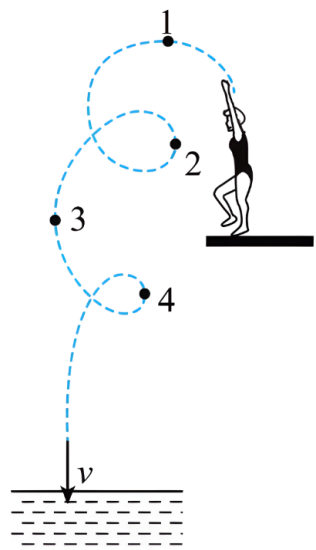

## 讲解

### 是什么

曲线运动是质点轨迹为曲线的运动。瞬时速度沿轨迹在该点的切线，指向实际运动的前进方向；切线只给一条直线，运动方向还要用题干中的先后位置判定。

速度包含大小和方向。即使速率恒定，只要方向改变，速度就改变，因此曲线运动一定是变速运动，但不一定是速率增大的运动。

### 怎么来的

取轨迹上前后两个很近的位置，位移沿连接它们的短弦。把时间间隔不断缩短，短弦方向趋近该点切线，得到瞬时速度的切线方向。

加速度描述速度改变。沿当前速度方向的分量可以改变速率；垂直于当前速度的分量使速度方向改变。质量固定时，合力与加速度同向，因此有垂直于速度的合力分量，就会让轨迹弯曲。

对于速度非零的光滑轨迹，合力的法向分量指向轨迹的凹侧；合力还可以有切向分量，所以不能把“指向凹侧”误读为“必须垂直于速度”或“必须指向某个圆心”。

### 什么时候能用

判断速度方向，用轨迹切线和运动先后；判断合力可能方向，检查其法向分量能否使轨迹按图弯曲；判断速率增减，再检查合力的切向分量。

速度与合力夹锐角，速率在该瞬间增大；夹钝角，速率减小；垂直时，该瞬间合力只改变方向。要断定全程匀速率，须全程都满足相应条件。

“曲线运动是变速运动”不能推出“加速度一定变化”。只受恒定重力的平抛运动是曲线运动，加速度却恒定。瞬时速度为零时切线判据要谨慎，不能把“初速度必须非零”扩成所有曲线运动都必须从非零速度开始。

## 例题

> 题目与解析：高一下物理第五章  单元测试·基础卷（解析版）.docx，来源ID S10，第6—11段。题目背景与原资料标注照录。

1．2024年巴黎奥运会上，全红婵获得女子单人跳水10 m跳台金牌，成为中国奥运史上最年轻的三金得主。如图所示，虚线描绘的是她某次跳水运动的过程中头部运动轨迹，最后沿竖直方向以速度v入水。在图中标注的1、2、3、4四个位置中，头部速度方向与v方向相同的是（　　）

A．1

B．2

C．3

D．4

**原资料答案：** C

**原资料详解：** 速度方向应沿轨迹的切线方向，1位置速度方向水平向左，2位置速度方向竖直向上，3位置方向竖直向下，4位置速度方向竖直向上，所以头部速度方向与v方向相同的是3位置的速度方向。

故选C。

### 顺着本题再看清一步

原题选C，即位置3。位置1切线水平向左，位置2和4切线沿运动方向竖直向上，位置3竖直向下，才与入水速度方向一致。即使位置2、3的切线都竖直，速度的向上、向下也不相同。

## 易错

原题讨论的是头部这一个点的轨迹，不是整个运动员重心的轨迹。四个位置都要看局部切线，再结合头部运动次序，不能把各点连向水面的方向当速度方向。
