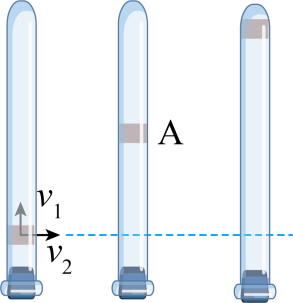

## 讲解

### 是什么

合运动是研究对象相对于指定参考系实际发生的运动；分运动是从选定方向或不同运动贡献来描述这个运动。合成与分解处理的是位移、速度、加速度这些矢量，遵循平行四边形定则。

同一物体在同一时间里的分运动，同时发生。把水平、竖直分量相加得到合矢量，不是把两段不同时间发生的运动拼起来。分运动各自经历的时间等于合运动时间，不把它们相加。

### 怎么来的

以同一个起点为原点，物体实际位置可以用x、y两个坐标唯一确定。把位移分别投影到水平、竖直方向，两分量之和就是实际位移；对相同时间的位移变化作比较，也得到速度分量的合成关系。

正交分量之间用勾股关系：

$$v=\sqrt{v_x^2+v_y^2}$$

这里v是合速度大小，v_x、v_y是有符号分量。一般不垂直的两个分速度则需按矢量夹角合成，不能一概使用平方和开根号；相反方向的两个分速度甚至可能相互抵消。

两个方向都匀速时，x＝v_xt、y＝v_yt。若v_x非零，先由x式得t＝x/v_x，再代入y式：

$$y=\frac{v_y}{v_x}x$$

两速度分量都固定，斜率固定，轨迹是直线。不是“同时向两个方向运动”就一定形成曲线。

### 什么时候能用

选择坐标的目的，是让每个方向都能写出简单、可解释的关系。蜡块上升和玻璃管水平平移，题设已给两个固定分速度；改变水平速度不改变题设的竖直速度，所以到管顶时间只由竖直距离和竖直速度决定。

“独立性”在这里表示各方向按对应分量规律计算，共享同一个时间；实际受力规律若耦合各分量，例如复杂空气阻力，就不能假设改变一个方向的速度永远不影响另一个方向。

判断合运动曲直，要比较合速度与合加速度；判断是否匀变速，要看合加速度是否恒定。不要把某一个分运动的性质直接复制给合运动。

## 例题

> 题目与解析：高一下物理第五章  单元测试·基础卷（解析版）.docx，来源ID S10，第30—43段。题目背景与原资料标注照录。

4．如图所示，封闭的玻璃管中注满清水，内有一个红蜡块A能在水中以速度$v_{1}$匀速上升。在红蜡块从玻璃管底端匀速上升的同时，使玻璃管以速度$v_{2}$水平匀速向右运动，下列说法正确的是（　　）

A．红蜡块相对地面的运动轨迹为一条曲线

B．若速度$v_{2}$增大，则红蜡块上升的速度$v_{1}$也增大

C．若速度$v_{2}$增大，则红蜡块的合速度也增大

D．若速度$v_{2}$增大，则红蜡块上升到玻璃管顶端的时间变长

**原资料答案：** C

**原资料详解：** 

A．红蜡块在水平方向和竖直方向的运动都是匀速运动，可知合运动为直线运动，则相对地面的运动轨迹为一条直线，选项A错误；

B．两个方向分运动互不影响，即若速度$v_{2}$增大，则红蜡块上升的速度$v_{1}$不变，选项B错误；

C．合速度为$v=\sqrt{v_1^2+v_2^2}$

则若速度$v_{2}$增大，则红蜡块的合速度也增大，选项C正确；

D．红蜡块上升到玻璃管顶端的时间由竖直速度$v_{1}$决定，即$t=\frac h{v_1}$

则若速度$v_{2}$增大，则红蜡块上升到玻璃管顶端的时间不变，选项D错误。

故选C。

### 顺着本题再看清一步

竖直方向给出t＝h/v₁，水平移动速度v₂不在这个式子里，故D错；题设保持v₁，所以B错。两个固定分速度合成后方向固定，轨迹直线，A错。正交合成的v＝√(v₁²+v₂²)，增大v₂使v增大，故C对。

## 易错

原题A以为两个方向运动必成曲线；B、D以为加大水平速度会改变竖直上升速度和时间。C的合速率增大依赖两个正交分速度及竖直分速度固定的题设，不能扩成一般任意角度合成的结论。
