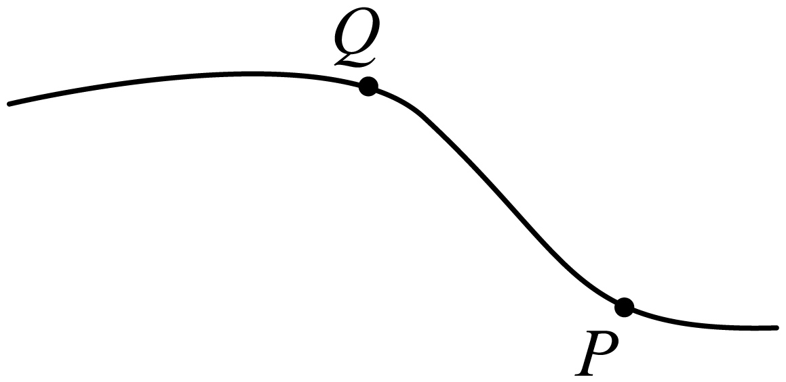

## 讲解

### 判据

图给轨迹并问速度、合力、加速度可能方向时，先用几何读局部切线，再用动力学检查弯曲方向。速度沿切线且沿运动前进方向；合力的法向分量须指向轨迹凹侧，切向分量再决定速率增减。

不要把起点与终点连线当成起点的瞬时速度，也不要把整段轨迹的总体方向当作每一点的速度方向。

### 流程

1. **读运动先后。** 本题从P到Q，P在右下、Q在左上，所以P处沿切线的速度向左。原详解写“向右”是方向笔误；速度沿切线这条依据正确，B项仍然错误。
2. **作局部切线。** P点的速度在当地切线上，P到Q的连线是整段位移，两者不能替代。Q点也必须单独作切线，不沿用P的方向。
3. **读局部凹侧。** 想象很短一段轨迹相对切线偏向哪边，这就是速度方向正在转向的一侧；合力必须具有朝这一侧的法向分量。
4. **逐个检查候选合力或加速度。** 合力、加速度同向，所以任意一个方向若把轨迹弯向相反侧，就可排除。可以带切向分量，不必恰好垂直切线。
5. **区分“可能”与“唯一”。** 轨迹曲率只给方向限制，没有质量和速率变化等信息时，一般不能唯一确定全部合力大小、方向。题问可能方向，只需它不违反局部弯曲。
6. **再看速度是否变化。** 曲线运动中方向改变，速度一定变化；若只问速率，则需要切向作用的信息，不能从弯曲直接推出速率必增大。

题目忽略重力，不意味着烟尘无外力：它仍可能受空气作用。不能以“飘在空中”代替受力分析。

## 例题

> 题目与解析：第五章 抛体运动（知识清单）（答案版）.docx，来源ID S06，第120—130段。题目背景与原资料标注照录。

【针对训练1】利用风洞实验室测试装备的风阻性能在我国已被大量运用。我们可以借助丝带和点燃的烟线辅助观察来类比研究风洞里的流场环境，在某次实验中获得一烟尘颗粒从P点到Q点做曲线运动的轨迹，如图所示，不计烟尘颗粒的重力，下列说法正确的是（　　）

A．烟尘颗粒飘在空中速度不变

B．P点处的速度方向从P点指向Q点

C．P点处的合力方向可能斜向右下方

D．Q点处的加速度方向可能竖直向下

**原资料答案：** D

**原资料详解：** 

A．烟尘颗粒做曲线运动，速度方向发生变化，可知烟尘颗粒飘在空中速度在变化，故A错误；

B．P点处的速度方向沿该点的切线方向向右，故B错误；

C．烟尘颗粒做曲线运动，合力方向指向轨迹内侧，可知P点处的合力方向不可能斜向右下方，故C错误；

D．烟尘颗粒做曲线运动，合力方向指向轨迹内侧，即加速度方向指向轨迹内侧，可知Q点处的合力方向可能竖直向下，加速度方向可能竖直向下，故D正确。故选D。

### 顺着本题再看清一步

A：轨迹弯曲，速度方向在变，错。B：从P指向Q是位移方向，P处实际速度沿当地切线向左，错。C：斜向右下的法向作用会让P处轨迹弯向错误一侧，错。D：Q处轨迹向下弯，竖直向下的加速度可以具有相应法向分量，属于可能方向，对。故选D。

## 易错

原题A把速率和速度混淆；B用整段位移方向代替局部切线；C所给合力方向不符P点凹侧。原详解B的“向右”明确更正为沿P到Q运动方向向左，D和原题答案不变。
