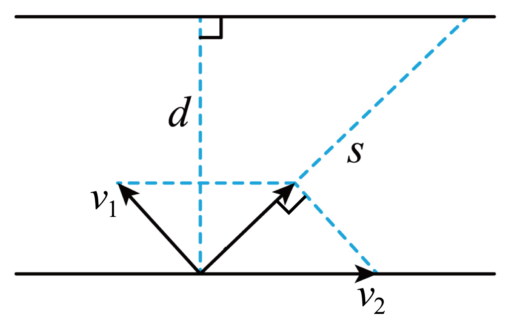

## 讲解

### 判据

先分三种速度：船相对水的速度u，水相对岸的速度w，船相对岸的实际速度。实际速度是前两者的矢量和；船头方向对应相对水的速度，实际航向对应相对岸的合速度。

最短时间要求垂直河岸的速度最大；最短位移要求实际航线最接近垂直河岸。二者一般不是同一个船头方向。

### 流程

1. **取沿岸和过河方向为两轴。** 水流沿岸，只贡献沿岸分速度。若船头与河岸夹角为θ，过河分速度大小是u sinθ，时间d/(u sinθ)，d为河宽。
2. **求最短时间。** sinθ最大为1，所以船头垂直河岸。此时t最短＝d/u，沿岸漂移w d/u；实际航线仍可能斜向下游。
3. **求最短位移先比速度。** 若u大于w，可把船头偏向上游，用相对水速度的沿岸分量抵消水流，合速度垂直河岸，位移最小为河宽d。这时过河分速度为√(u²−w²)，时间通常大于d/u。
4. **若u小于w，不能完全抵消水流。** 以水流速度矢量端点为圆心、u为半径作速度圆，原点向圆作切线，对应合速度与河岸的最大夹角。由直角三角形，sinφ最＝u/w。
5. **由航线方向求最短位移。** 位移的过河分量为d，所以s sinφ＝d。代入最大sinφ得到s最＝dw/u，大于河宽。最短位移不要求最短时间，两个极值应分别算。
6. **处理相等边界。** u＝w时，要完全抵消水流就只能船头直指上游，过河分速度为零，不能渡到对岸。位移可以趋近河宽，但有限时间内不能达到这个下限，不能直接套u大于w时的正对岸结论。

上述模型假定河宽固定、水流均匀、相对水速率恒定、船头保持选定方向。水速随位置改变时，航线和最值须重新分析。

## 例题

> 题目与解析：第五章 抛体运动（知识清单）（答案版）.docx，来源ID S06，第227—238段。题目背景与原资料标注照录。

【针对训练3】2025年1月11日，国际冬泳世界挑战赛在济南大明湖风景名胜区开赛。比赛前某运动员练习时要匀速横渡一条宽$d=270\,\mathrm m$的河，运动员在静水中的速度为$v_1=1.5\,\mathrm{m/s}$，水流速度为$v_2=2\,\mathrm{m/s}$，则（　　）

A．该运动员可能垂直河岸到达正对岸

B．该运动员渡河的时间可能小于180s

C．该运动员以最短时间渡河时，它沿水流方向的位移大小为360m

D．该运动员以最短位移渡河时，位移大小为320m

**原资料答案：** C

**原资料详解：** 

A．因为运动员在静水中的速度小于河水的流速，由平行四边形定则求合速度不可能垂直河岸，运动员不可能垂直河岸到达正对岸，A错误；

B．当运动员在静水中的速度垂直河岸渡河时时间最短，最短时间$t_{\min}=\frac d{v_1}$，$t_{\min}=180\,\mathrm s$最短时间为180s，所以渡河时间不可能小于180s，B错误；

C．运动员以最短时间180s渡河时沿水流方向的位移大小$x=v_2t_{\min}$，$x=360\,\mathrm m$，C正确；

D．如图所示

由三角形的相似得$\frac{v_2}{v_1}=\frac sd$，则最短位移大小为$s=\frac{v_2}{v_1}d=\frac2{1.5}\times270\,\mathrm m=360\,\mathrm m$，D错误。故选C。

### 顺着本题再看清一步

本例u＝1.5 m/s、w＝2 m/s、d＝270 m。A：水流快于相对水速，无法抵消沿岸水流，错。B：最短时间270/1.5＝180 s，不能更短，错。C：最短时间下沿岸漂移2×180＝360 m，对。D：最短总位移270×2/1.5＝360 m，非320 m，错，故选C。最短时间航行的总位移还要合成河宽270 m和漂移360 m，为450 m；这个数不是原题新增题目，只是区别两种“位移”的同题核验。

## 易错

原题A忽略u小于w，不能合成出垂直河岸速度；B小于理论最短时间；D的320 m不符合最短位移。最短时间时下游位移与本例最短总位移恰好同为360 m，是数值巧合，含义、船头方向都不同。
