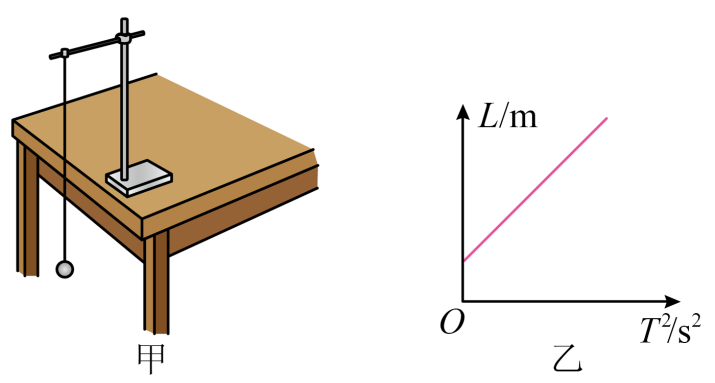

## 错法

看到单摆就把尺子读出的线长代入周期公式，或把“悬点到球底端”也当成摆长。混淆来自把装置上能量到的长度，与运动所需要的圆弧半径当成同一个量。

摆球在圆弧上运动，球心的轨道半径才是有效摆长。线长不含球半径；到球底端的总距离又多含了一个半径，两种误差方向恰好相反。

## 正解

先标悬点和球心。线长s、球半径r时，l=s+r；若量到球底端的距离是L，则l=L−r。长度单位统一为m，再用：

$$g=\frac{4\pi^2l}{T^2}.$$

漏加半径使所用摆长偏小，直接计算的g偏小；把球底端距离直接使用则使g偏大。若改为多组图像法、半径固定且允许截距自由拟合，固定长度偏差可以表现为截距而不改变斜率。

本题纵轴L、横轴T²，用l=L−r代入周期公式，得到 $L=gT^2/(4\pi^2)+r$，正纵截距就是多量的半径。反过来若纵轴T²、横轴L，纵截距会为负；不能脱离坐标轴判断正负。

此外，摆长只解决长度口径，不能替代小角度、细线不伸长、球尺寸小等模型条件。多个误差同时出现时应分别分析，不能只凭一个错误就武断判断净偏差。

## 例题

> 题目与解析：高二上物理第二章  机械振动·基础通关卷（解析版）.docx，来源ID S13，第124—145段。分段选取时保留该子问的完整题干、答案与解析；题目背景和原资料标注照录。

11．（6分）某研究性学习小组设计了如图甲所示的实验装置，利用单摆测量当地的重力加速度。

(1)以下是实验过程中的一些做法，其中正确的有_____（填字母）。

A．为了使单摆的周期大一些，以方便测量，开始时拉开摆球，使摆线相对平衡位置时有较大的偏角

B．摆球尽量选择质量较大、体积较小的

C．摆线要选择较轻、无伸缩性，并且摆线越长越准确

(2)测量单摆周期时，在摆球某次通过最低点时，按下秒表开始计时，同时数“0”，当摆球再次通过最低点时数“1”，依此类推，当他数到“50”时，秒表停止计时，读出这段时间$t$，则该单摆的周期为_____。

(3)改变摆线长度，测量出多组周期$T$、摆长$L$的数据后，画出$L-T^2$图像如图乙所示，测得此图像斜率为$k$，则当地重力加速度$g=$_____。

(4)$L-T^2$图像不过坐标原点的原因可能是_____。

**原资料答案：** (1)B；(2)$\frac{t}{25}$；(3)$4\pi^2k$；(4)$L$为悬点到小球下端的距离，有效摆长应为悬点到球心的距离，二者相差小球半径$r$，故图像在纵轴有截距，不过原点。

**原资料详解：** （1）

A．单摆做简谐运动的条件是摆角较小（一般不超过5°），较大偏角会使周期公式不成立，A错误；

B．摆球质量较大、体积较小可减小空气阻力影响，B正确；

C．摆线需轻且无伸缩性，但并非越长越准确，过长会导致摆动不稳定，C错误；

故选B。

（2）摆球从最低点开始计时，每次通过最低点计数一次，数到“50”时共经历50次通过最低点。单摆周期是完成一次全振动的时间，而相邻两次通过最低点的时间间隔为半个周期，故总时间$t=50\times\frac{T}{2}$

解得$T=\frac{t}{25}$

（3）单摆周期公式为$T=2\pi\sqrt{\frac{l}{g}}$

其中摆长$l$为悬点到小球重心的距离。设小球半径为$r$，则悬点到小球下端距离$L=l+r$

联立得$L=\frac{g}{4\pi^2}T^2+r$

$L-T^2$图像斜率$k=\frac{g}{4\pi^2}$

故$g=4\pi^2k$

（4）略。

### 顺着本题再看清一步

本题第（3）（4）问直接展示了错误口径：量到球底端，L=l+r，图像L轴截距为r。原题答案没有把L直接代入单次g式，而是用斜率排除固定偏移。第（1）（2）问保留完整操作和计时解析，提醒长度正确并不保证周期计数正确。
