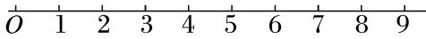

## 错法

看见波峰向右移动，就认为原来位于波峰的那颗质点也向右移到下一个波峰；用波传播距离vΔt当质点的位移或路程。图中移动的形状很容易使人误认同一物体在向前走。

另一个误解是后方质点起振晚，所以它振动较慢。晚开始描述时间延迟，频率描述每秒重复次数，是不同量。

## 正解

给某一介质质点做标记，在理想横波中，它只在自己的平衡位置上下振动。前进的波峰由不同质点在不同时刻达到同样正最大位移组成，不是一颗标记点的运动轨迹。

波经过一个周期向前传播λ；已稳定做简谐振动的质点同期累计走4A、净位移零。纵波中的质点虽沿传播轴往返，也不等于持续随波向前迁移。

本题O先振动，O首次达到正端点时2刚开始振动，因此O→2的传播时间是T/4。每个相等的质点间隔对应T/8，1与9隔8格，对应完整T延迟，所以9起振后与1同相。

## 例题

> 题目与解析：第三章 机械波（知识清单）（教师版）.docx，来源ID S06，第152—158段。分段选取时保留该子问的完整题干、答案与解析；题目背景和原资料标注照录。

1.如图所示，O、1、2、…、9为介质中间隔相等的若干连续质点，t＝0时刻，O点从平衡位置开始向上做简谐运动，当O点第1次达到正向最大位移处时，质点2开始振动．下列说法正确的是(　　)

A.质点2开始振动的方向向下

B.经过一段时间，质点1运动到质点5的位置

C.质点9开始振动后，其振动情况与质点1完全相同

D.质点O的振动频率大于后面所有点的振动频率

**原资料答案：** C

**原资料解析：** 质点的振动方向与波源的起振方向相同，O点从平衡位置开始向上运动，故质点2开始振动的方向向上，A错误；各质点在平衡位置上下振动，不会左右迁移，质点1不会运动到质点5的位置，B错误；当质点O第1次达到正向最大位移处时，质点2开始振动，可知质点O到质点2的相位差为$\frac\pi2$，各点间的间隔相等，故质点9与质点1的相位差为2π，则质点9开始振动后，其振动情况与质点1完全相同，C正确；所有质点的振动频率都与波源的频率相同，故D错误．

### 顺着本题再看清一步

A错：2刚受到扰动，重复源最初向上的运动。B错：1不会横向搬到5。C对：1与9的间隔正好一个波长、同相。D错：各点起振后频率都等于源频率，起振晚不等于频率低。
