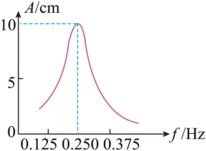

## 讲解

### 是什么

固有振动指没有外界周期驱动时系统按自身性质振动，固有频率记作 $f_0$。这不意味着系统不受力：弹力、重力等仍提供回复作用。

受迫振动是系统在周期性驱动力作用下的振动。经过初始暂态、振动稳定后，其频率等于驱动力频率 $f_{\text{驱}}$，不要求等于固有频率。频率单位Hz，振幅单位m。

共振是驱动频率接近固有频率时出现较大响应振幅的现象。高中题通常采用弱阻尼模型，将共振条件写成：

$$f_{\text{驱}}=f_0.$$

### 怎么来的

自由振动的周期由系统自身决定。理想弹簧振子 $T_0=2\pi\sqrt{m/k}$，小角度单摆 $T_0=2\pi\sqrt{l/g}$；把周期取倒数就得到固有频率。

驱动持续给系统输入能量，阻力持续消耗能量。稳定受迫振动中，每周期输入与损耗平均平衡，系统跟随外界的周期重复；若驱动节奏接近系统自然摆动的节奏，能量积累更有效，响应就更大。

共振曲线横轴是驱动力频率，纵轴是稳定振幅。峰所在横坐标表示共振频率；曲线上任一点的横坐标都表示当前驱动频率，不能把峰的频率强加给所有点。

以小角度单摆为例，把周期公式取倒数：

$$f_0=\frac{1}{2\pi}\sqrt{\frac{g}{l}}.$$

同一地点缩短摆长会增大固有频率，共振峰向频率较高的一侧移动。仅改变外界驱动频率，并没有改变原系统的固有频率。

### 什么时候能用

“受迫频率等于驱动频率”要有稳定状态这个前提；刚开始驱动时，原自由振动成分还可能存在。共振时振幅与阻尼、驱动强度有关，不是“频率相等就无限大”。

资料中把峰值频率严格写成固有频率，按高中弱阻尼近似使用。更一般的有限阻尼模型，位移振幅峰值可偏离无阻尼固有频率；不把简化条件扩成所有实际装置的精确结论。这个边界由[受迫振动方程与幅度表达式](https://openstax.org/books/university-physics-volume-1/pages/15-6-forced-oscillations)核对，正文仅保留高中判断所需的近似条件。

## 例题

> 题目与解析：高二上物理第二章  机械振动·基础通关卷（解析版）.docx，来源ID S13，第87—104段。分段选取时保留该子问的完整题干、答案与解析；题目背景和原资料标注照录。

9．一个单摆在地面上做受迫振动，其共振曲线（振幅A与驱动力频率f的关系）如图所示，重力加速度$g=10\,\mathrm{m/s^2}$，则（　　）

A．此单摆的摆长约为1m

B．此单摆的摆长约为4m

C．若摆长适当减小，共振曲线的峰将向右移动

D．若摆长适当减小，共振曲线的峰将向左移动

**原资料答案：** BC

**原资料详解：** AB．当驱动力频率等于单摆固有频率时，单摆振幅最大。由图像可知当驱动力频率为0.250Hz时单摆振幅最大，故单摆固有频率为0.250Hz，故

$T=\frac1f=4\,\mathrm{s}$

又因为

$T=2\pi\sqrt{\frac{L}{g}}$

联立可得摆长为

$L\approx4\,\mathrm{m}$

故A错误，B正确；

CD．由单摆周期公式可知

$T=2\pi\sqrt{\frac{L}{g}}=\frac1f$

故若摆长适当减小，则固有频率变大，共振曲线的峰将向右移动，C正确，D错误。

故选BC。

### 顺着本题再看清一步

本题原式取 $g=10\,\mathrm{m/s^2}$，$T=1/0.250=4\,\mathrm{s}$。由 $T^2=4\pi^2L/g$，得到 $L=gT^2/(4\pi^2)=40/\pi^2\,\mathrm{m}\approx4.05\,\mathrm{m}$，因此B正确、A错误。缩短摆长会增大固有频率，所以C正确、D错误。

## 易错

- 峰值对应0.250Hz，这是本题的固有频率；稳定受迫频率在曲线其余点仍等于各自的驱动频率。
- 先f变T，再由T求摆长；不能把0.250直接当周期代入。
- 缩短摆长使固有频率增大，所以峰向右移；不要把“周期减小”误当“频率减小”。
