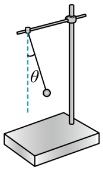

## 讲解

### 是什么

回复力是使物体返回平衡位置的力的作用名称。它可由某一个实际力充当，也可由若干实际力的合力或合力在振动方向的分量充当。它不是在重力、弹力之外再多出来的一种力。

简谐运动要求振动方向的回复力满足：

$$F_{\text{回}}=-kx.$$

$x$ 是相对平衡位置的位移，单位m；$k>0$ 是回复力系数，单位N/m；回复力单位N。这里的 $k$ 在一般模型中不一定等于某一根弹簧的劲度系数，须由实际受力推出来。

### 怎么来的

水平弹簧振子：重力和支持力相互平衡，沿杆方向只有弹簧力，因此回复力就是弹簧弹力。

竖直弹簧振子：取向下为正，静止伸长量为 $\Delta l_0$，平衡条件 $mg=k\Delta l_0$。再向下偏离平衡位置 $x$，实际伸长量变成 $\Delta l_0+x$。沿竖直方向相加：

$$F_{\text{回}}=mg-k(\Delta l_0+x).$$

把平衡条件代入，先抵消 $mg-k\Delta l_0$，留下 $F_{\text{回}}=-kx$。所以竖直振子在平衡位置仍有重力和弹力，两者合为零；弹簧通常并未恢复原长。

单摆：线的拉力沿半径方向，在切线上没有分量；重力的切向分量把球拉回最低点。取偏角和弧长的正方向一致：

$$F_{\text{切}}=-mg\sin\theta.$$

小角度时用弧度计，$\sin\theta\approx\theta$，弧长 $x=l\theta$，于是 $F_{\text{切}}\approx-(mg/l)x$。这里回复力是切向合力；径向合力负责改变速度方向。

### 什么时候能用

先画真实受力，再选振动方向，最后判断哪部分负责回复。直线简谐振动的回复力通常就是合力；单摆曲线运动的总合力同时有切向与法向分量，二者不可混淆。

单摆经过最低点时切向回复力为零，速率最大，径向加速度仍为 $v^2/l$，拉力大于重力。端点时速率为零、径向加速度为零，而切向回复力大小最大。竖直直线弹簧振子没有向心运动，在平衡位置总加速度确为零。

## 例题

> 题目与解析：高二上物理第二章  机械振动·基础通关卷（解析版）.docx，来源ID S13，第40—51段。分段选取时保留该子问的完整题干、答案与解析；题目背景和原资料标注照录。

5．将一小球（可视为质点）悬挂于O点，拉开一个小角度（$\theta<5^\circ$）后静止释放，不计空气阻力，下列说法正确的是（　　）

A．小球质量越大，摆动周期越大

B．拉开角度越小，摆动周期越小

C．小球在最高点时所受回复力最大

D．小球在最低点时加速度为零

**原资料答案：** C

**原资料详解：** AB．由单摆的周期公式$T=2\pi\sqrt{\frac{l}{g}}$

在偏角$\theta<5^\circ$时，单摆的周期跟摆球的质量、振幅都无关，故AB都错误；

C．因回复力为$F_{\text{回}}=mg\sin\theta$，故小球在最高点时所受回复力最大，故C正确；

D．小球在最低点时，回复力为零，其产生的加速度为零，但向心加速度不为零，故（合）加速度不为零，故D错误。

故选C。

### 顺着本题再看清一步

C项说的是回复力大小，在两端摆角最大时成立；D项把切向加速度为零误当总加速度为零。A、B项则违背本题小角度周期公式。原解析的回复力公式使用大小，正文用带负号的切向分量表达，两者口径一致。

## 易错

- 单摆最高点并不是合力恒为零的“静止平衡”，只是瞬时速率为零的折返点。
- “回复力为零”只能推出振动方向加速度为零，不能直接推出曲线运动总加速度为零。
- 原教师资料S06第250、254段对“合力提供向心力”和竖直弹簧振子的描述有误；本条按切向/径向分开，例题选用已核对的单摆原题。
