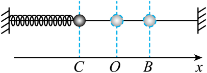

## 讲解

### 是什么

振幅 $A$ 是振动物体离开平衡位置的最大距离，是非负的长度量，单位m。物体在两端之间的活动范围为 $2A$；振幅既不是两端间距离，也不是某一时刻的带符号位移。

周期 $T$ 是完成一次全振动所需的时间，单位s。一次全振动结束，物体不仅回到同一位置，还要回到同一运动方向。频率 $f$ 是单位时间内完成全振动的次数，单位Hz；角频率 $\omega$ 表示相位变化快慢：

$$f=\frac1T,\qquad \omega=2\pi f=\frac{2\pi}{T}.$$

### 怎么来的

从正端点开始，一个全振动的路线是“正端点→平衡位置→负端点→平衡位置→正端点”。对理想简谐运动，四段时间相等，每段用时 $T/4$、路程 $A$。一个周期的路程是 $4A$，但末位置与初位置相同，净位移是零。

从平衡位置开始，下一次经过平衡位置时方向相反，只经过了半个周期；再一次同方向经过，才是一个周期。相邻两个同类波峰、相邻两个同类波谷的时间差都等于周期，波峰到紧邻波谷的时间差为半周期。

理想弹簧振子由 $ma=-kx$ 得角频率平方为 $k/m$。将它代入 $T=2\pi/\omega$：

$$T=2\pi\sqrt{\frac{m}{k}}.$$

周期由振子质量和回复力系数决定，振幅由初始拉开距离、释放速度等初始状态决定。加大振幅会加大运动范围和最大速率，在理想线性模型内不会改变周期。

### 什么时候能用

“周期与振幅无关”适用于理想线性简谐振子；单摆只在小角度近似下这样处理，大角度摆动不能沿用这句话。弹簧也须在弹性范围内，且接触、质量和约束保持不变。

求长时间路程时，先拆出整数个周期，每周期计 $4A$，剩余时间再按起始状态画路线。只有明确从端点或平衡位置起算的四分之一周期，才可直接用路程 $A$；其他起点要按实际运动累加距离。

## 例题

> 题目与解析：高二上物理第二章  机械振动·基础通关卷（解析版）.docx，来源ID S13，第15—20段。分段选取时保留该子问的完整题干、答案与解析；题目背景和原资料标注照录。

2．如图所示，弹簧振子的平衡位置为O点，在相距0.2m的B、C两点间做简谐运动。小球经过C点时开始计时，0.5s时首次到达B点，则1.25s内小球的路程为（　　）

A．0.25m

B．0.5m

C．1.0m

D．1.25m

**原资料答案：** B

**原资料详解：** 振子振动的振幅A=0.1m，周期为T=1s，则$1.25\,\mathrm{s}=1\frac14T$可知，1.25s内小球的路程为$s=5A=0.5\,\mathrm{m}$

故选B。

### 顺着本题再看清一步

A项0.25m等于用活动范围和时间机械相乘，缺少运动规律的依据；C项1.0m相当于把0.2m误作振幅；D项1.25m把时间数值当作路程，没有速度依据。这里只有B项符合已知振幅、周期与起始位置。

## 易错

- 图中BC=0.2m是两端间距，所以A=0.1m。把BC当振幅会让路程大一倍。
- 从一个端点首次到另一端是T/2，不是T。本题0.5s对应半周期，T=1s。
- 1.25s是1个周期加1个四分之一周期，起点C为端点，因此路程4A+A=0.5m；初末位置差不能代替累计路程。
