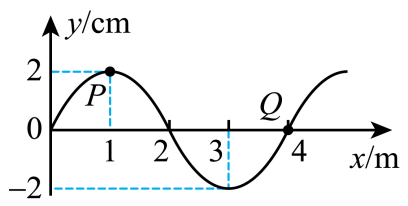

## 讲解

### 是什么

波形图记录同一时刻、传播方向上许多质点的位移，是一张空间“快照”。横坐标x表示各质点的平衡位置，纵坐标y表示该时刻各点偏离平衡位置的位移；两者通常都是长度单位，须各自读清m或cm。

振动图则固定一个质点，横坐标为时间t，记录它在不同时刻的位移。波形图读空间周期λ，振动图读时间周期T，不能因为曲线都像正弦就互换横轴。

### 怎么来的

在某时刻给绳上的各点拍照，依次标出平衡位置和实际偏移，再把这些点连起来，就得到波形图。理想右行简谐波可写为：

$$y(x,t)=A\sin\left(\omega t-\frac{2\pi}{\lambda}x+\varphi_0\right).$$

固定t，各点位移随x呈正弦规律；固定x，某一点随t做简谐振动。A单位m，λ单位m，ω单位rad/s。传播方向不同会改变空间相位项的符号。

同一快照上相邻波峰、相邻波谷间隔为一个波长；峰与紧邻谷相隔半波长。两点仅有相同位移，还不能保证同相位，必须同时有相同振动方向。

### 什么时候能用

单幅波形可读位移、振幅、波长和相位关系；若没有时间信息，不能单独求周期、波速。若没有传播方向或某个点的振动方向，也不能唯一判断全部质点的速度方向。

已知传播方向后，将波形沿该方向微小平移，再在固定的质点横坐标处比较新旧高度，判断它下一刻向上还是向下。平移的是波形状态，质点只作振动，不沿横轴搬到新波峰位置。

波形图的空间斜率是位移随位置变化率，不能直接当质点速度；振动图的时间斜率才是速度。这个轴的区别，比记曲线长相更重要。

## 例题

> 题目与解析：第三章 机械波（专项训练）（解析版）.docx，来源ID S02，第90—101段。分段选取时保留该子问的完整题干、答案与解析；题目背景和原资料标注照录。

6．（25-26高二下·北京通州·期末）一列沿x轴传播的简谐横波，其周期T=0.20s，在t=0时的波形图像如图所示。其中P、Q是介质中平衡位置分别处在x=1.0m和x=4.0m的两个质点，若此时质点P在正向最大位移处，质点Q通过平衡位置向下运动，则（     ）

A．该波沿x轴负方向传播

B．该波的传播速度为2.0m/s

C．经过0.50 s，质点Q通过的路程为10cm

D．当质点Q到达波谷时，质点P位于平衡位置且向下运动

**原资料答案：** D

**原资料详解：** 

A．由题意可知，t=0时刻质点Q通过平衡位置向下运动，由同侧法可知，该波沿x轴正方向传播，故A错误；

B．由图可知，该波波长为4m，则波速$v=\frac{\lambda}{T}=20\,\mathrm{m/s}$，故B错误；

C．由图可知，该波振幅A为2cm，经过0.5s（即经过$2.5T$），质点Q通过的路程$s=\frac{2.5T}{T}\times4A=20\,\mathrm{cm}$，故C错误；

D．经过四分之一周期，质点Q到达波谷，此时质点P位于平衡位置且向下运动，故D正确。

故选D。

### 顺着本题再看清一步

原题C的路程可以拆成两个周期8A和半周期2A，这两段的累计路程都不受起始相位影响，合计10A。不能把原式s=(t/T)4A推广到任意不足半周期的时间。D中Q从平衡位置向下，T/4后到负端点；P从正端点出发，T/4后过平衡位置向下。

## 易错

- 本题波长4m、周期0.20s，波速20m/s，B的2.0m/s错。
- Q处波形沿x增加而上升，Q此刻向下，所以是右行波，A错。
- 0.50s为2.5T，累计路程10A=20cm，不是10cm；D的四分之一周期位置关系正确。
