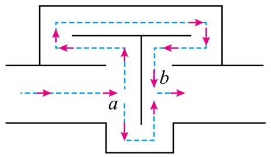

## 讲解

### 是什么

几列波在同一介质中重叠时，某点的实际位移等于各波单独作用时位移的和。能稳定形成某些位置振幅大、某些位置振幅小的分布，叫干涉。

形成稳定干涉需频率相同、相位差恒定，振动方向相同或有能够叠加的共同分量。仅“两个波碰上了”可发生叠加，不一定有固定的加强、减弱图样。

### 怎么来的

同方向两波在某点的位移记为y₁、y₂，在线性小振幅模型中：

$$y=y_1+y_2.$$

若两波到达该点同相，正最大与正最大、负最大与负最大同步，总振幅为A₁+A₂；若反相，一个向上时另一个向下，总振幅为|A₁−A₂|。只有振幅也相等，反相点才能始终静止。

相位差取决于源的初始相位和传播延迟。传播一个波长相位变化2π，多走半波长相位多延迟π；因此同相源到某点的路径差为整波长时加强，奇数个半波长时减弱。

$$|r_2-r_1|=n\lambda\text{（同相源加强）},\qquad |r_2-r_1|=(2n+1)\frac\lambda2\text{（同相源减弱）}.$$

n为非负整数，r₁、r₂、λ单位m。反相源的初始相位差已是π，上述加强、减弱条件互换。

### 什么时候能用

先确认两波都已到达研究点，再判断稳定干涉。减弱不等于完全静止；振幅不等时仍有残余振动。加强也不等于该点每一刻都处在最大位移，它照样过平衡位置。

干涉改变能量的空间分布，不能把局部抵消解释成总能量凭空消失。消声管等题是针对特定频率、相位和路径的理想模型，不能凭一条固定路径差宣称所有噪声都完全消掉。

## 例题

> 题目与解析：高二上物理第三章  机械波·基础通关卷（解析版）.docx，来源ID S13，第95—101段。分段选取时保留该子问的完整题干、答案与解析；题目背景和原资料标注照录。

9．消除噪声污染是当前环境保护的一个重要课题。如图所示的消声器可以用来削弱高速气流产生的噪声，波长为λ的声波沿水平管道自左向右传播，在声波到达a处时，分成上下两束波，这两束声波在b处相遇时可削弱噪声。设两束波由a到b处过程中通过的路程分别为$r_1$和$r_2$，其路程差$\Delta r=r_2-r_1$，则下列说法中正确的是（　　）

A．该消声器工作原理是利用声波的干涉

B．该消声器工作原理是利用声波的衍射

C．$\Delta r$是半波长$\frac\lambda2$的偶数倍

D．$\Delta r$是半波长$\frac\lambda2$的奇数倍

**原资料答案：** AD

**原资料详解：** 该消声器工作原理是利用声波的干涉，两列波的路程差等于半波长奇数倍时，即$\Delta r$是半波长$\frac\lambda2$的奇数倍，两列波叠加后减弱，从而达到削弱噪音的目的。

故选AD。

### 顺着本题再看清一步

原图两路从同一分流点出发，忽略额外反射相位改变，两路长度差提供相位差。若差为偶数个半波长，就是整波长，波到b同相加强，与削弱目标相反；奇数个半波长则反相减弱。选AD并不等于该消声器能对任意频率达到同样效果。

## 易错

- 本题同一声波在a处分流，两路初始同相；到b时要相互削弱，路径差应为奇数个半波长，D对、C错。
- 工作依据两路叠加干涉，A对、B把绕障碍的衍射当原理而错。
- 原资料仅合并解析，本条补足A、B、C、D各自依据；未另造题。
