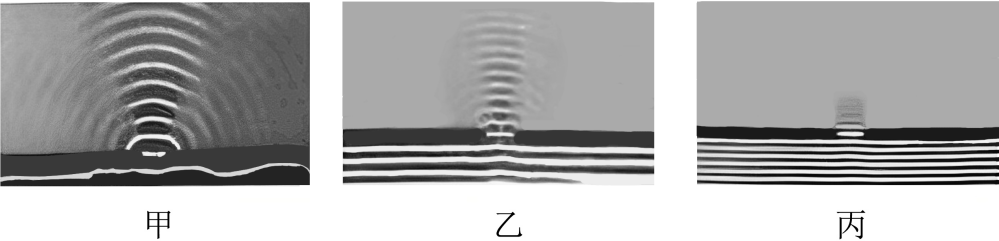

## 讲解

### 是什么

波经过小孔、狭缝或障碍物边缘后，传播进入按几何直线传播本应被挡住的区域，叫衍射。波前会在开口或边缘之后展开，不是只把开口正前方的形状原封不动向前搬。

波长λ和狭缝宽度a都用长度单位。判断衍射明显程度，关键是尺寸相对于波长的大小，而不是只问孔看起来大或小。

### 怎么来的

可把开口内各部分看成继续向后传播扰动的区域。各部分贡献在不同方向叠加，使通过开口后的波不只沿正前方传播。这是用波前与叠加理解衍射的方式；不是介质颗粒绕着障碍物整体流过去。

当a与λ相近或更小时，出射波向侧面的扩展明显；当a远大于λ时，大部分传播接近原方向，边缘的绕射范围相对较小，几何直线传播是较好近似。

高中判断条件可记为比较a/λ：该比值不大时容易观察到明显衍射。它没有一个所有装置都通用的绝对临界数值，观察尺度也会影响是否容易看清。

### 什么时候能用

固定开口，增大波长一般使衍射更明显；固定波长，缩小开口一般使展宽更明显。在题目给定波速近似不变时，λ=v/f，所以降低频率能增大波长。

干涉强调相干波叠加产生稳定强弱分布；折射强调跨介质引起传播方向变化；衍射强调经过边缘、孔缝进入阴影区。实际现象可涉及多个过程，选择题应抓图中正在比较的特征。

“不明显”是量级判断，不是“完全没有”。狭缝很窄时透过能量还可能减少，不能把衍射更明显等同于任何位置都一定测到更强振动。

## 例题

> 题目与解析：高二上物理第三章  机械波·基础通关卷（解析版）.docx，来源ID S13，第44—51段。分段选取时保留该子问的完整题干、答案与解析；题目背景和原资料标注照录。

5．在水槽中放两块挡板，中间留一个狭缝，观察水波通过狭缝后的传播情况，保持狭缝的宽度不变，改变水波的波长，得到三幅照片如甲、乙、丙所示，对应的水波波长分别为$λ_{1}$、$λ_{2}$、$λ_{3}$，下列说法正确的是（　　）

A．对应的波长关系为$λ_{1}$>$λ_{2}$>$λ_{3}$

B．对应的波长关系为$λ_{1}$<$λ_{2}$<$λ_{3}$

C．这是水波的干涉现象

D．这是水波的折射现象

**原资料答案：** A

**原资料详解：** AB．随着波长的减小，当波长与狭缝宽度相比非常小时，水波将沿直线传播，衍射现象变得不明显，所以对应的波长关系为$\lambda_1>\lambda_2>\lambda_3$，故A正确，B错误；

CD．水波在传播过程中遇到狭缝后都会发生衍射现象，当发生衍射时，水波就会传播到本该是“阴影”的区域，不再沿直线传播，故CD错误。

故选A。

### 顺着本题再看清一步

图甲、乙、丙不是按波峰高度比较振幅，也不是按图幅大小比较能量；要看通过同一宽度缝后，波前向两侧张开的程度。甲最显著，对应波长最大；丙最不显著，对应波长最小。

## 易错

- 原题缝宽固定，甲向侧面展宽最多，丙近似直线最多，所以λ₁>λ₂>λ₃，A对、B错。
- 只有单个狭缝后的展开，C没有抓到稳定双源强弱图样，D没有抓到跨介质界面，因此均错。
- 原解析“沿直线传播”按几何近似理解，丙仍存在边缘衍射。
